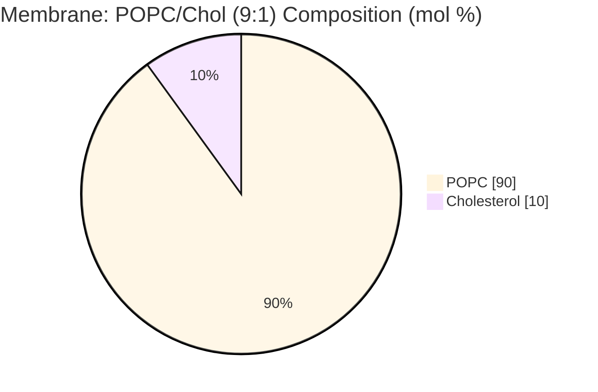
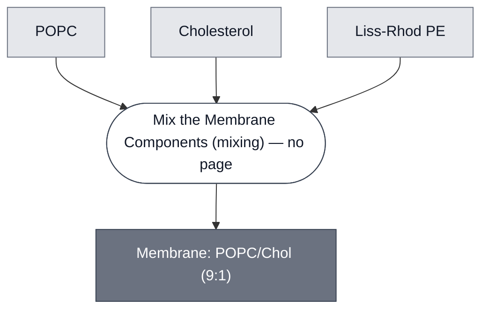

# Overview

<!-- gen:position -->
**Position.** Refines [`membrane`](../membrane/spec.md). Refined by nothing on this branch.
<!-- /gen:position -->

This membrane is a 90:10 POPC:cholesterol phospholipid bilayer. Compare to [Membrane: POPC/Chol (7:3)](../membrane-popc-chol/spec.md), which uses more cholesterol, and [Membrane: POPC](../membrane-popc/spec.md), which uses none. Optionally, this membrane can include 0.1 mol% fluorescently tagged lipids to facilitate visualization.

:::{attention} 🚧 Draft
This page is a work in progress and not yet ready for use.
:::

# Reference Composition

:::::{tab-set}

<!-- gen:composition-diagram -->
::::{tab-item} Module Dependencies

::::
<!-- /gen:composition-diagram -->

::::{tab-item} Bilayer

:::{table} Membrane: POPC/Chol (9:1) Composition.
:label: comp-membrane-popc-chol-base

| Component               | Target Percentage (%) | Molecular Weight (g/mol) | Stock concentration (mg/mL) |
| ----------------------- | --------------------- | ------------------------ | --------------------------- |
| POPC                    | 89.9                  | 760.076                  | 25                          |
| Cholesterol             | 10                    | 386.7                   | 50                          |
| (Optional) Liss Rhod PE | 0.1                   | 1301.71                  | 1                           |

:::

::::

::::{tab-item} Preparation

:::{table} Preparations of the Chicago base membrane.
:label: comp-membrane-popc-chol-preps

| Route | POPC (µL) | Cholesterol (µL) | Liss-Rhod PE (µL) |
| ----------- | --------- | ---------------- | ----------------- |
| [Inverted-emulsion phase transfer](../../processes/assemble-base-cell/main.md), at 0.5 mM total lipid | 41 | 1.16 | 1.952 |
| [Lipid-film hydration and extrusion](../../processes/encapsulate-suv/main.md) | 208.51 | 6.00 | - |
:::

::::

:::::

# Expected Behavior

This membrane closes around an aqueous interior and holds it apart from the solution outside. It takes both routes above, so one formulation serves a micron-scale synthetic cell and a sub-micron SUV alike, and a payload meets the same bilayer in either. Cholesterol at 10 mol% stiffens the bilayer against the 7:3 formulation. The optional Liss Rhod PE is a label and not a functional component; two populations carrying it cannot be told apart in the Rhodamine channel.

# Implementations

- [aTc Demo](../../implementations/devstudio-atc-demo/main.md): its membrane — around the synthetic cells.
- [pH Demo](../../implementations/devstudio-ph-demo/main.md): its membrane — with 0.1 mol% Liss Rhod PE, on both the synthetic cells and the LUVs.

# Processes

Synthetic cells are prepared using [inverted-emulsion (lipid-in-oil) phase-transfer method](../../processes/assemble-base-cell/main.md). SUVs are prepared using [lipid-film hydration and extrusion](../../processes/encapsulate-suv/main.md).

# Credits

Developed by the Chicago Node (Kamat Lab and Liu Lab, Northwestern).

:::{attention} Credits are draft
Contributor attribution on this page has not been confirmed with the Node. Assign each credit explicitly before this page is merged to `main`.
:::
