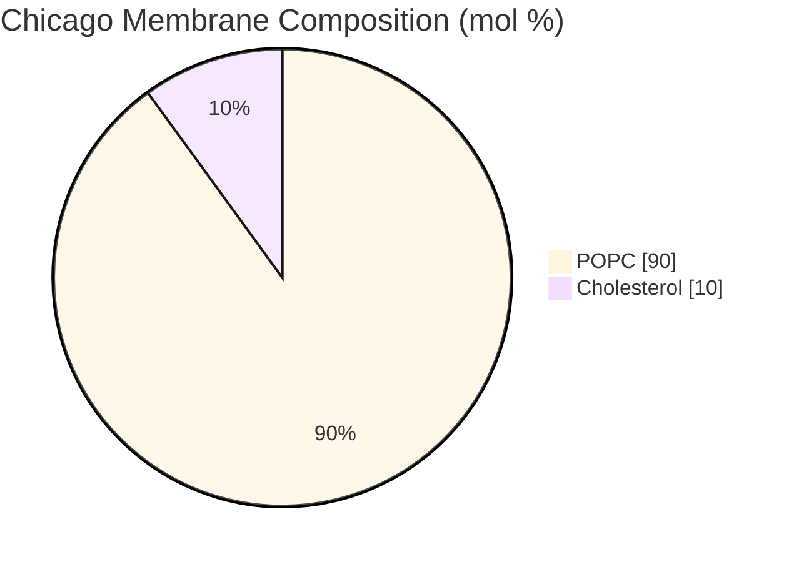

# Overview

The Chicago Membrane is a 90:10 POPC:cholesterol phospholipid bilayer used in every liposome in the Chicago DevStudio demo (@Claude: link to Chicago Demo). Compare to [Base Membrane](../membrane-popc-chol/spec.md) (70:30 POPC:cholesterol) which uses more cholesterol, and [London Membrane](../membrane-popc/spec.md) which uses pure POPC. Optionally, this membrane can include 0.1 mol% fluorescently tagged lipids to facilitate visualization.

:::{attention} 🚧 Draft
This page is a work in progress and not yet ready for use.
:::

# Membrane Composition

@Claude: tabset these two tables 

:::{table} Chicago Membrane Composition.
:label: comp-membrane-chicago-base

| Component               | Target Percentage (%) | Molecular Weight (g/mol) | Stock concentration (mg/mL) |
| ----------------------- | --------------------- | ------------------------ | --------------------------- |
| POPC                    | 89.9                  | 760.076                  | 25                          |
| Cholesterol             | 10                    | 386.66                   | 50                          |
| (Optional) Liss Rhod PE | 0.1                   | 1301.71                  | 1                           |

:::

:::{table} Documented preparations of the Chicago base membrane.
:label: comp-membrane-chicago-preps

| Preparation (@Claude: link these pages) | POPC (µL) | Cholesterol (µL) | Liss-Rhod PE (µL) | Method (@Claude: link these pages) |
| --------------------------------------- | --------- | ---------------- | ----------------- | ---------------------------------- |
| Synthetic cells (0.5 mM total lipid)    | 41        | 1.16             | 1.952             | Inverted-emulsion phase transfer   |
| CPRG-loaded SUVs                        | 208.51    | 6.00             | -                 | Lipid-film hydration and extrusion |
:::

# Expected Behavior

The Chicago Membrane forms both liposome populations in the Chicago DevStudio Demo: synthetic cells encapsulating [Base Cytosol](/docs/mo/base-cytosol/spec); and CPRG-loaded SUVs (@Claude: link this to module page) carrying a chromogenic substrate as part of a colormetric readout module (@Claude: link to module page). This membrane module can be used generally to encapsulate Cytosolic modules. See [Chicago Chassis](../chicago-chassis/spec.md) and [SUV Encapsulation](../../processes/encapsulate-suv/main.md) for more information.

# Protocols

The synthetic-cell preparation uses the shared inverted-emulsion (lipid-in-oil) phase-transfermethod in [Encapsulation: Phase Transfer](../../processes/assemble-base-cell/main.md). The SUV preparation uses a different method entirely — lipid-film hydration and extrusion, documented in [SUV Encapsulation](../../processes/encapsulate-suv/main.md).

# Credits

Developed by the Chicago node (Kamat Lab and Liu Lab, Northwestern).
