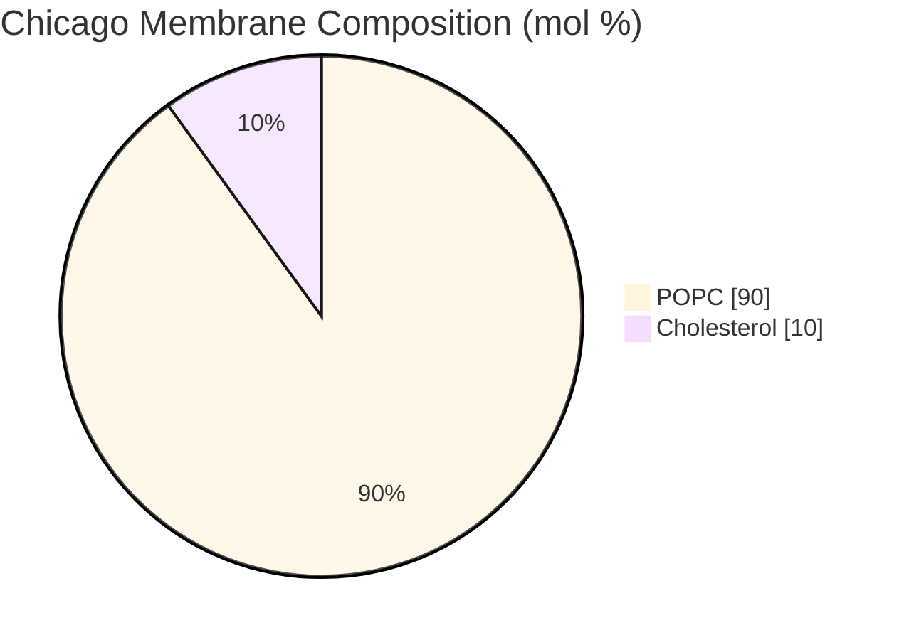
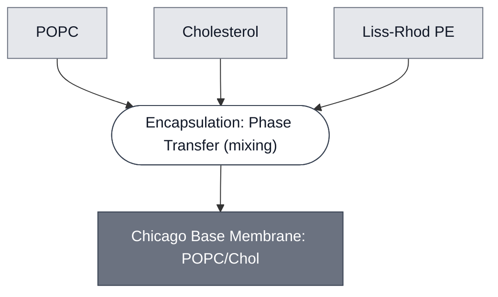

# Overview

<!-- gen:position -->
**Position.** Refines [`membrane`](../membrane/spec.md). Refined by nothing on this branch.
<!-- /gen:position -->

The Chicago Membrane is a 90:10 POPC:cholesterol phospholipid bilayer used in every liposome in the [Chicago DevCell](../../implementations/chicago-devcell/main.md) demo. Compare to [Base Membrane](../membrane-popc-chol/spec.md) (70:30 POPC:cholesterol) which uses more cholesterol, and [London Membrane](../membrane-popc/spec.md) which uses pure POPC. Optionally, this membrane can include 0.1 mol% fluorescently tagged lipids to facilitate visualization.

:::{attention} 🚧 Draft
This page is a work in progress and not yet ready for use.
:::

# Reference Composition

:::::{tab-set}

<!-- gen:composition-diagram -->
::::{tab-item} Module Dependencies

::::
<!-- /gen:composition-diagram -->

::::{tab-item} Lipid Composition

:::{table} Chicago Membrane Composition.
:label: comp-membrane-chicago-base

| Component               | Target Percentage (%) | Molecular Weight (g/mol) | Stock concentration (mg/mL) |
| ----------------------- | --------------------- | ------------------------ | --------------------------- |
| POPC                    | 89.9                  | 760.076                  | 25                          |
| Cholesterol             | 10                    | 386.66                   | 50                          |
| (Optional) Liss Rhod PE | 0.1                   | 1301.71                  | 1                           |

:::

::::

::::{tab-item} Preparations

:::{table} Preparations of the Chicago base membrane.
:label: comp-membrane-chicago-preps

| Preparation | POPC (µL) | Cholesterol (µL) | Liss-Rhod PE (µL) | Method |
| ----------- | --------- | ---------------- | ----------------- | ------ |
| [Chicago Chassis](../chicago-chassis/spec.md) synthetic cells (0.5 mM total lipid) | 41 | 1.16 | 1.952 | [Inverted-emulsion phase transfer](../../processes/assemble-base-cell/main.md) |
| [CPRG-loaded SUVs](../substrate-cprg-suv/spec.md) | 208.51 | 6.00 | - | [Lipid-film hydration and extrusion](../../processes/encapsulate-suv/main.md) |
:::

::::

:::::

# Expected Behavior

The Chicago Membrane is used for both synthetic cell preparations in the Chicago DevStudio Demo: synthetic cells encapsulating [Base Cytosol](../base-cytosol/spec.md); and [CPRG-loaded SUVs](../substrate-cprg-suv/spec.md) carrying a chromogenic substrate as part of the [LacZ Reporter](../reporter-lacz/spec.md) colorimetric readout. This membrane module can be used generally to encapsulate Cytosolic modules. See [Chicago Chassis](../chicago-chassis/spec.md) and [Encapsulation: SUV](../../processes/encapsulate-suv/main.md) for more information.

# Processes

Synthetic cells are prepared using [inverted-emulsion (lipid-in-oil) phase-transfer method](../../processes/assemble-base-cell/main.md). SUVs are prepared using [lipid-film hydration and extrusion](../../processes/encapsulate-suv/main.md).

# Implementations

- [Chicago DevCell](../../implementations/chicago-devcell/main.md): the membrane of the Chicago demo's synthetic cells.

# Credits

Developed by the Chicago Node (Kamat Lab and Liu Lab, Northwestern).

:::{attention} Credits are draft
Contributor attribution on this page has not been confirmed with the Node. Assign each credit explicitly before this page is merged to `main`.
:::
