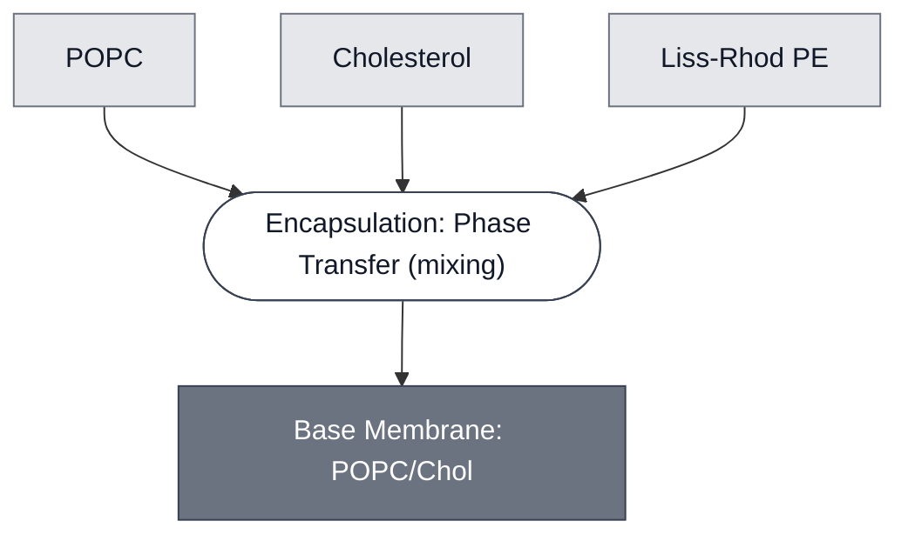

# Overview

<!-- gen:position -->
**Position.** Refines [`membrane`](../membrane/spec.md). Refined by nothing on this branch.
<!-- /gen:position -->

The Base Membrane specifies a phospholipid bilayer composed of POPC, cholesterol, and fluorescent Lissamine Rhodamine PE (Liss-Rhod PE). The Base Membrane is our recommended default membrane for making synthetic cells by using [Encapsulation: Phase Transfer](../../processes/assemble-base-cell/main.md).

:::{figure} schematic.png
:width: 50%
:align: center

Schematic of a POPC/Chol liposome.
:::

# Reference Composition

:::::{tab-set}

<!-- gen:composition-diagram -->
::::{tab-item} Module Dependencies

::::
<!-- /gen:composition-diagram -->

:::::

:::{table}
:label: comp-membrane-popc-chol

| Component    | Target Percentage (%) | Molecular Weight (g/mol) | Stock concentration (mg/mL) | Volume to add (µL) |
| ------------ | --------------------- | ------------------------ | --------------------------- | ------------------ |
| POPC         | 70                    | 760.076                  | 25                          | 162.17             |
| Cholesterol  | 29.95                 | 386.654                  | 50                          | 17.65              |
| Liss-Rhod PE | 0.05                  | 1301.71                  | 1                           | 4.96               |

:::

# Expected Behavior

The behavior of Base Membrane is characterized using the [deGFP Reporter](../reporter-degfp/spec.md) Module in [Base Cell](../base-cell/spec.md).

# Processes

Protocols for assembling Base Cell and making its components from scratch are described in the Process [Encapsulation: Phase Transfer](../../processes/assemble-base-cell/main.md).

# Credits

Developed by b.next.
