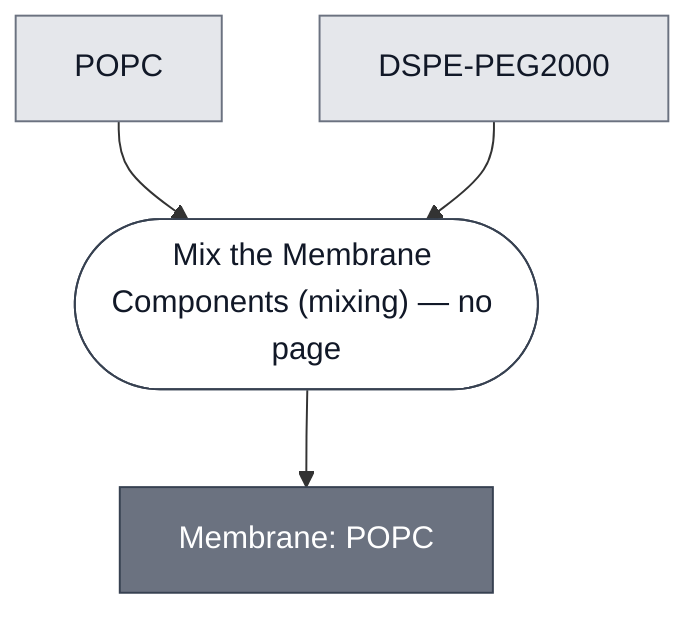

# Overview

<!-- gen:position -->
**Position.** Refines [Membrane](../membrane/spec.md). Refined by nothing on this branch.
<!-- /gen:position -->

This membrane is a pure POPC bilayer with no cholesterol, used for every synthetic cell in the London demo. Compare to [Membrane: POPC/Chol (7:3)](../membrane-popc-chol/spec.md) and [Membrane: POPC/Chol (9:1)](../membrane-popc-chol-9-1/spec.md), which both include cholesterol. Optionally, this membrane can include 0.1 mol% fluorescently tagged lipids to facilitate visualization.

:::{attention} 🚧 Draft
This page is a work in progress and not yet ready for use.
:::

# Reference Composition

:::::{tab-set}

<!-- gen:composition-diagram -->
::::{tab-item} Module Dependencies

::::
<!-- /gen:composition-diagram -->

::::{tab-item} Bilayer

:::{table} Membrane: POPC lipids.
:label: comp-membrane-popc-base

| Component                    | Molecular Weight (g/mol) | Stock concentration (mg/mL) | Notes                |
| ---------------------------- | ------------------------ | --------------------------- | -------------------- |
| POPC              | 760.076                  | 25                          | bilayer-forming lipid; in every preparation |
| DSPE-PEG2000      | 2805.5                   | 10                          | PEGylated preparation only |
| 18:1 Cyanine 5 PC | 1316.26                  | 1                           | labeled preparation only   |

:::

Neither additional lipid is optional within its own recipe: each distinguishes one preparation from the other. They are not combined in one membrane.

The two are not the same kind of addition. DSPE-PEG2000's PEG headgroup provides steric stabilization at the bilayer surface, which is a functional change rather than a labeling one, so the PEGylated membrane behaves differently from plain POPC. 18:1 Cyanine 5 PC is a red fluorescently-tagged lipid used the way Liss-Rhod PE is used elsewhere in Nucleus: to see the membrane, not to change it.

::::

::::{tab-item} Preparation

:::{table} Documented preparations of this membrane. Each row is a self-consistent recipe; the two optional lipids are not mixed.
:label: comp-membrane-popc-preps

| Preparation                 | Target composition (mol %)      | POPC (µL) | DSPE-PEG2000 (µL) | 18:1 Cyanine 5 PC (µL) | Total lipid (mg) |
| --------------------------- | ------------------------------- | --------- | ----------------- | ---------------------- | ---------------- |
| PEGylated membrane          | 99.15 POPC : 0.85 DSPE-PEG2000  | 130.4     | 10.32             | —                      | 3.36             |
| Fluorescently labeled membrane | 99.9 POPC : 0.1 Cyanine 5 PC | 79.863    | —                 | 3.423                  | 2.00             |

:::

The PEGylated recipe gives 99.150 mol% POPC and 0.850 mol% DSPE-PEG2000; the labeled recipe gives 99.901 mol% POPC and 0.099 mol% Cyanine 5 PC, from the stocks in the Lipid Composition tab. The PEGylated preparation is a 3.5× batch (1× batch = 320 µL lipid-in-oil at 3 mg/mL); the labeled preparation is the 2 mg single-batch scale described under Process below.

:::{attention} Cyanine 5 PC stock concentration unconfirmed
The volumes above assume an 18:1 Cyanine 5 PC stock of 1 mg/mL, which gives 0.099 mol% dye against the 0.1 mol% target. At 25 mg/mL the same volumes would give 2.42 mol% dye, about 24× the target. 1 mg/mL is also the dye-stock convention used for Liss-Rhod PE in both other Nucleus membranes.

@Editor(london): confirm the Cyanine 5 PC stock concentration with the London Node before bench use.
:::

::::

:::::

# Expected Behavior

This membrane closes around an aqueous interior and holds it apart from the solution outside. Pure POPC with no cholesterol, it is the least stiff of the three membranes here, and it encapsulates a cytosol of any composition: nothing in the bilayer depends on what is inside it.

# Implementations

- [LuxR-GFP Demo](../../implementations/devstudio-luxr-gfp-demo/main.md): its membrane — around the synthetic cells.

# Processes

The membrane is prepared and encapsulated by the shared mineral-oil phase-transfer method in [Encapsulation: Phase Transfer](../../processes/assemble-base-cell/main.md). Gel embedding of the labeled variant is documented in [Embedding: Thermal Setting](../../processes/embed-thermal-setting/main.md).

To prepare this membrane, assemble 2 mg total lipids (e.g., 80 µL of a 25 mg/mL chloroform stock). Dry, then resuspend in 500 µL mineral oil (4 mg/mL working concentration). 

# Credits

Developed by Ion Ioannou and Jonah McDonald (London Node, Elani Lab), and extended by Jonah McDonald and Charlie Newell (London Node) with PEGylated lipids.

:::{attention} Credits are draft
Contributor attribution on this page has not been confirmed with the Node. Assign each credit explicitly before this page is merged to `main`.
:::
