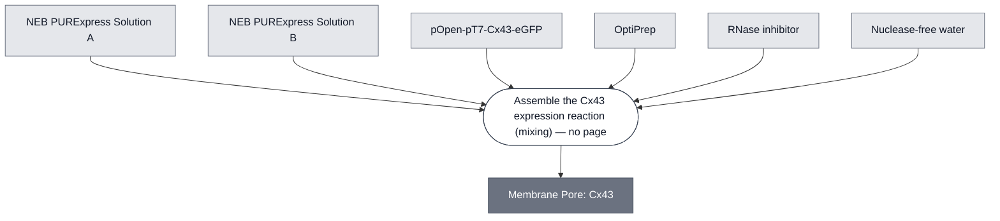

# Overview

<!-- gen:position -->
**Position.** Refines [`pore`](../pore/spec.md). Refined by nothing on this branch.
<!-- /gen:position -->

The Cx43 Module expresses connexin 43 (Cx43), a mammalian gap junction protein, that self-assembles into hexameric hemichannels (connexons) that spontaneously integrate into the membrane of synthetic cells and permit the passage of molecules up to ~1 kDa. Cx43 provides an alternative to α-hemolysin: its status as a non-select agent makes it easier to distribute, and its capacity to form gap junctions between neighboring cells represents a new function that opens a path toward tissue-like assemblies.

This Module was contributed to the Nucleus Community by Ahmed Sihorwala (Belardi Lab, UT Austin), based on the construct design from the Stachowiak Lab and the publication [Sihorwala et al., 2023](https://doi.org/10.1021/jacs.2c12491). Validation data is presented in the DevNote [Cx43 Cell: DNA Validation](https://doi.org/10.63765/xvxu3274).

:::{attention} Not yet validated
This Module has not been validated in Nucleus Cytosol. Expected performance data below is from PURExpress cells.
:::

:::::{tab-set}

<!-- gen:composition-diagram -->
::::{tab-item} Module Dependencies

::::
<!-- /gen:composition-diagram -->

::::{tab-item} Schematic

:::{figure} xref:devnote-cx43#fig:scheme
Depiction of connexin and its relationship to a connexon: (left) Connexins are membrane-spanning proteins whose N- and C-termini are located in the cytoplasm; (right) connexons are complexes of six connexins. Figure by [Totland et al., 2023](https://doi.org/10.1016/j.bbadis.2023.166812) used under CC-BY-4.0 / cropped from original.
:::

::::

:::::

# Reference Composition

:::::{tab-set}

::::{tab-item} DNA

:::{attention}
Design files for the constructs below are available [Nucleus DNA repository](https://github.com/nucleus-eng/DNA) and in the [DevNote](https://doi.org/10.63765/xvxu3274).
:::

| Construct             | Size    | Description                                                            | **File**                                                                                 |
| --------------------- | ------- | ---------------------------------------------------------------------- | ---------------------------------------------------------------------------------------- |
| `pOpen-pT7-Cx43`      | 3320 bp | Expresses wild-type Cx43 under T7 promoter in pOpen backbone           | [pOpen-Cx43.gb](https://github.com/nucleus-eng/DNA/blob/main/pores/pOpen-Cx43.gb)        |
| `pOpen-pT7-Cx43-eGFP` | 3996 bp | Expresses Cx43-eGFP fusion protein under T7 promoter in pOpen backbone | [pOpen-Cx43-eGFP](https://github.com/nucleus-eng/DNA/blob/main/pores/pOpen-Cx43-eGFP.gb) |

::::

:::::

# Expected Behavior

**Insertion Assay** — Liposomes encapsulating NEB PURExpress and `pOpen-pT7-Cx43-eGFP` were incubated at 37 °C for 6 h. Green fluorescent rings around liposomes confirm membrane localization of Cx43-eGFP. Control liposomes lacking the Cx43 plasmid show no rings.

:::::{tab-set}

::::{tab-item} +Cx43

:::{figure} cell-insertion-sample.png
Liposomes expressing Cx43-eGFP. Green fluorescent rings surrounding liposomes indicate successful membrane localization of Cx43-eGFP hemichannels. 488 nm (green, Cx43-eGFP) and 561 nm (red, membrane label) channels overlaid.
:::

::::

::::{tab-item} -Cx43

:::{figure} cell-insertion-control.png
Control liposomes without Cx43 plasmid. No green fluorescent rings are observed. Faint green signal within liposomes is encapsulated PURE.
:::

::::

:::::

:::{note} Additional focus views
Higher-magnification views of individual Cx43-eGFP-expressing liposomes are available in the [DevNote](https://doi.org/10.63765/xvxu3274).
:::

**Leakage Assay** — Liposomes co-encapsulating NEB PURExpress, `pOpen-pT7-Cx43`, and Alexa Fluor 647 dye were incubated at 37 °C for 6 h and imaged by confocal microscopy every 10 min.

:::{attention} The cargo is ~1.3 kDa, and the time axis is expression, not transport
**Alexa Fluor 647 is about 1.3 kDa** — above the ~1 kDa figure stated under Requirements, and it crosses. The cutoff is an approximation the cargo sits inside rather than a ceiling it violates.

**Cx43 is expressed in situ** from the co-encapsulated plasmid, not reconstituted from purified protein. So the six-hour decay is limited by transcription, translation and channel assembly, and a rate fitted from it is an expression constant rather than a transport one. Equilibration through an assembled channel is expected to be far faster than the reaction it is measured against.

**The captions below say "Cx43-reconstituted", and that word is wrong.** In membrane biophysics it names insertion of purified protein into a preformed membrane. Five statements on this page say otherwise — the methods sentence above, the construct's own row in the Designs table, the Insertion Assay, its control ("without Cx43 plasmid"), and the leakage control ("leakage requires Cx43 expression"). The captions are left as recorded rather than silently edited. @Editor(chicago): confirm, then fix the three captions.
:::

:::{figure} cell-leakage-kinetics.png
Background-subtracted Alexa Fluor 647 fluorescence intensity over 6 h at 37 °C. Liposomes containing Cx43 show a progressive decrease in encapsulated dye fluorescence relative to controls, consistent with pore-mediated dye leakage.
:::

:::::{tab-set}

::::{tab-item} +Cx43

:::{figure} cell-leakage-timeseries-sample.png
Time series of Cx43-reconstituted liposomes encapsulating Alexa Fluor 647 over 6 h at 37 °C (images every 10 min, starting 40 min after preparation). Progressive loss of fluorescence is observed as dye leaks through Cx43 channels. Scale bar: 500 µm.
:::

::::

::::{tab-item} -Cx43

:::{figure} cell-leakage-timeseries-control.png
Time series of control liposomes encapsulating Alexa Fluor 647 over 6 h at 37 °C. Dye fluorescence is maintained throughout, confirming that leakage requires Cx43 expression. Scale bar: 500 µm.
:::

::::

:::::

:::::{tab-set}

::::{tab-item} +Cx43 (start)

:::{figure} cell-leakage-startpoint-sample.png
Confocal image of Cx43-reconstituted liposomes at the start point, 40 min after preparation. Some liposomes already show reduced fluorescence, consistent with early dye leakage at room temperature. Scale bar: 500 µm.
:::

::::

::::{tab-item} +Cx43 (endpoint)

:::{figure} cell-leakage-endpoint-sample.png
Endpoint confocal image (6 h 40 min) of Cx43-reconstituted liposomes. A higher proportion of non-fluorescent liposomes is observed relative to controls. Scale bar: 500 µm.
:::

::::

::::{tab-item} -Cx43 (start)

:::{figure} cell-leakage-startpoint-control.png
Confocal image of control liposomes at the start point, 40 min after preparation. Liposomes remain fluorescent, confirming dye retention in the absence of Cx43. Scale bar: 500 µm.
:::

::::

::::{tab-item} -Cx43 (endpoint)

:::{figure} cell-leakage-endpoint-control.png
Endpoint confocal image (6 h 40 min) of control liposomes. Most liposomes remain fluorescent throughout the experiment. Scale bar: 500 µm.
:::

::::

:::::

# Requirements

Requires a membrane (e.g., [Base Membrane](../membrane-popc-chol/spec.md)). If using DNA components, additionally requires pT7 transcription and translation (e.g. [Base Cytosol](../base-cytosol/spec.md)).

Passes molecules up to ~1 kDa. [α-Hemolysin](../membrane-pore-ahly/spec.md) passes up to ~3 kDa, so substituting this Module for it lowers the cutoff and a cargo between the two figures will stop crossing.

**The figure is approximate, and this page's own assay shows by how much.** The leakage result above uses Alexa Fluor 647, about 1.3 kDa, and it crosses. So ~1 kDa is a scale rather than a ceiling, and a cargo somewhat above it is not excluded. Mass is one clause of a pore's selectivity, not the whole of it — [Gramicidin A](../membrane-pore-gramicidin/spec.md) selects on charge instead, and passes protons at 1 Da while excluding uncharged solutes many times larger.

**Transport is symmetric, and that obliges the outer solution.** The cutoff is equally a statement about what leaves. Anything below it that the interior consumes equilibrates with the outside, so **it must also be present in the outer solution, or the interior runs out**. The requirement propagates to any membrane carrying this pore and to any Cell built on that membrane, and is discharged by checking the outer solution's composition rather than anything on this page.

# Credits

Module contributed by Ahmed Sihorwala (Belardi Lab, UT Austin). Validation data by Yen-Yu Hsu (b.next).
