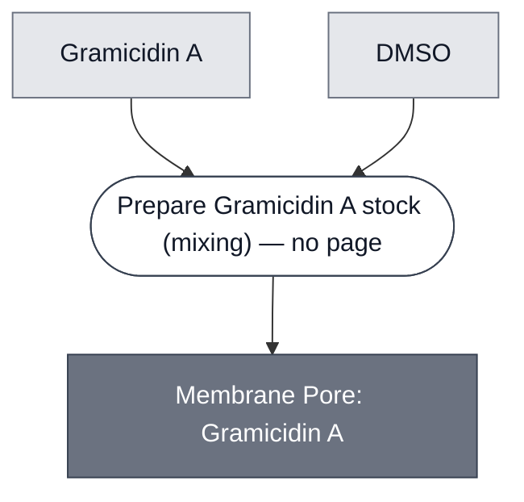

# Overview

<!-- gen:position -->
**Position.** Refines [Pore](../pore/spec.md). Refined by nothing on this branch.
<!-- /gen:position -->

Gramicidin A is a linear pentadecapeptide from *Bacillus brevis* that dimerizes across a lipid bilayer to form a narrow channel conducting monovalent cations and protons. In Nucleus it is used for one job: letting H⁺ cross the membrane of a synthetic cell so that an encapsulated [pH-Sensing Module](../detector-ph/spec.md) can see the pH of the outer solution.

**It selects on charge and identity, not on size.** This makes it the odd member of the pore family. [α-Hemolysin](../membrane-pore-ahly/spec.md) and [Cx43](../membrane-pore-cx43/spec.md) are geometric apertures, and what they pass is governed by a mass figure — roughly 3 kDa and 1 kDa. Gramicidin passes a proton at 1 Da and excludes uncharged solutes many times larger. A mass cutoff cannot describe it.

:::{attention} 🚧 Draft
This page is a work in progress and not yet ready for use.
:::

(membrane-pore-gramicidin-reference-composition)=
# Reference Composition

:::::{tab-set}

<!-- gen:composition-diagram -->
::::{tab-item} Module Dependencies

::::
<!-- /gen:composition-diagram -->

:::::

:::{table} Gramicidin A, as used.
:label: comp-membrane-pore-gramicidin

| Component | Working concentration | Notes |
| --- | --- | --- |
| Gramicidin A | not established | @Editor(chicago): no working concentration is recorded anywhere in this documentation. It is used in the pH cascade's GFP-expression result and that result does not state a figure |
| Solvent | DMSO | stock is prepared in DMSO and stored frozen — see Materials |
:::

:::{attention} Working concentration not established
The failure mode of this Module is dose-shaped: too much ruptures liposomes. Without a working concentration, the one result that used it cannot be reproduced.
:::

(membrane-pore-gramicidin-expected-behavior)=
# Expected Behavior

## Cells

Expect protons to equilibrate across the membrane, so an encapsulated pH sensor reads the outer solution rather than its own lumen. This is the reason to add it: [pH-Sensing Module](../detector-ph/spec.md) requires direct exposure to the pH source, and encapsulation otherwise denies it that.

:::{danger} It causes premature lysis; it does not prevent it
Gramicidin A, used as a proton channel for the pH cascade's GFP-expression result, was left out of the colorimetric demonstration because it ruptured a portion of the CPRG-loaded liposomes, producing nonspecific color. Its absence can reduce pH-sensing efficiency, but proton diffusion into the more permeable liposomes was enough to drive PLA1 expression and initiate the lysis cascade. See [PLA1 Lysis Module](../effector-pla1/spec.md#effector-pla1-expected-behavior) and [pH Cascade](../ph-cascade/spec.md).

**Do not add Gramicidin A to a colorimetric cascade.** A ruptured substrate liposome releases its dye with no lysis signal, so the readout reports the channel rather than the analyte.
:::

**The colorimetric cascade runs without it.** Proton diffusion through the bare membrane was enough. So this Module is an optimization for pH-sensing efficiency, not a requirement of the pH route.

(membrane-pore-gramicidin-requirements)=
# Requirements

Requires a membrane (e.g. [Membrane: POPC/Chol (7:3)](../membrane-popc-chol/spec.md)) to insert into.

**Requires that nothing in the same compartment depends on retaining a small cation**, which is the general form of the lysis finding above.

**Transport is symmetric, and that obliges the outer solution.** What crosses in also crosses out. Anything the interior consumes that this channel conducts must also be present in the outer solution, or the interior runs out. The requirement propagates to any membrane carrying this channel and to any Cell built on that membrane, and it is discharged by checking the outer solution's composition rather than anything on this page. For gramicidin the conducted set is narrow — monovalent cations and protons — so the obligation is correspondingly narrow, unlike a size-limited pore that drains a cytosol's whole substrate pool.

**No rate is established.** How fast protons equilibrate through it, against how fast a reaction consumes or produces them, is not established for this or any other transport Module.

# Processes

None specific to this Module. It is added to a membrane-forming or encapsulation step; see [SensorCell[pH ⟶ PLA1]](../ph-sensing-cell/spec.md) for the composition that uses it.

# Materials

:::{table} Bill of Materials
| Item | Purpose | Supplier | Part number | Notes |
| --- | --- | --- | --- | --- |
| Gramicidin A from *Bacillus brevis* | Proton channel for membrane pH equilibration | Sigma-Aldrich | 50845-5MG | Stock in DMSO, stored frozen |
:::

# Credits

:::{attention} Credits are draft
Contributor attribution on this page has not been confirmed with the Node. Assign each credit explicitly before this page is merged to `main`.
:::

Used by the Chicago Node (Liu Lab) in the pH cascade's GFP-expression result.
