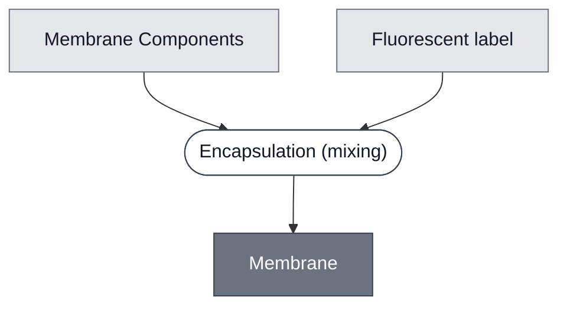

# Overview

<!-- gen:position -->
**Position.** Refines [`container`](../container/spec.md). Refined by [`membrane-popc`](../membrane-popc/spec.md), [`membrane-popc-chol`](../membrane-popc-chol/spec.md), [`membrane-popc-chol-9-1`](../membrane-popc-chol-9-1/spec.md).
<!-- /gen:position -->

A class: a closed lipid bilayer.

Every member is closed: what it holds is a volume, enclosed by the bilayer.

:::{attention} 🚧 Draft
This page is a work in progress and not yet ready for use.
:::

# Reference Composition

A bilayer is lipid in a bilayer arrangement, so [Membrane Components](../membrane-components/spec.md) is the one constituent. Members differ in which components they use, and any of them may carry an optional fluorescent label.

:::::{tab-set}

<!-- gen:composition-diagram -->
::::{tab-item} Module Dependencies

::::
<!-- /gen:composition-diagram -->
::::{tab-item} Lipid

:::{table} What each member puts in the lipid slot.
| Member | Lipids |
| --- | --- |
| [Membrane: POPC](../membrane-popc/spec.md) | POPC, with DSPE-PEG2000 in the PEGylated preparation |
| [Membrane: POPC/Chol (7:3)](../membrane-popc-chol/spec.md) | POPC and cholesterol, 70:30, with optional Liss-Rhod PE |
| [Membrane: POPC/Chol (9:1)](../membrane-popc-chol-9-1/spec.md) | POPC and cholesterol, 90:10, with optional Liss-Rhod PE |
:::

::::

:::::

# Expected Behavior

A member separates its inside from the outside by a barrier that something must cross.

# Requirements

Requires a lipid phase to form the bilayer from.

# Processes

A bilayer is formed and closed by [Encapsulation](../../processes/encapsulate/main.md), through one of its two routes: [Encapsulation: Phase Transfer](../../processes/assemble-base-cell/main.md), or [Encapsulation: Extrusion](../../processes/encapsulate-suv/main.md), which hydrates a dried lipid film and extrudes it.

# Constituent Modules

- [Membrane Components](../membrane-components/spec.md) — the molecules the bilayer is made from. Which ones is the member's choice, and a fluorescent label is optional on all of them

# Credits

:::{attention} Credits are draft
Contributor attribution on this page has not been confirmed with the Node. Assign each credit explicitly before this page is merged to `main`.
:::
