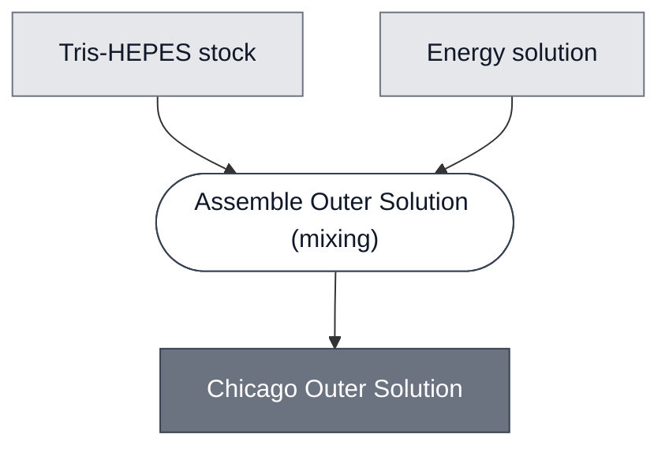

# Overview

<!-- gen:position -->
**Position.** Refines [`outer-solution`](../outer-solution/spec.md). Refined by nothing on this branch.
<!-- /gen:position -->

A member of [Outer Solution](../outer-solution/spec.md): a Tris-HEPES stock with an energy
solution, used by all three Chicago cascades.

**The agarose dissolves into this and both cell populations sit in it**, so this osmolarity sets
the gel's.

:::{attention} 🚧 Draft
This page is a work in progress and not yet ready for use.
:::

# Reference Composition

<!-- composition-tabs: no-dna (the energy solution here is a buffer component of this
     solution, not the Energy: PPK Module. The checker prefix-matches ENERGY and cannot
     tell the two apart, so this is a false positive rather than a missing tab) -->

:::::{tab-set}

<!-- gen:composition-diagram -->
::::{tab-item} Module Dependencies

::::
<!-- /gen:composition-diagram -->

::::{tab-item} Solutes

:::{table} The Chicago formulation.
| Component | Working concentration | Notes |
| --- | --- | --- |
| Tris-HEPES | 42.5% (v/v) in water | from a stock |
| Energy solution | — | no figure on record |
| Osmolarity | ~1180 mOsm | a relation, and it sets the gel's |
:::

**Osmolarity is additive and the polymer's own term is negligible**, about 0.7% by weight, so
this value carries the gel.

::::

:::::

# Constituent Modules

- Tris-HEPES stock — 42.5% (v/v) in water
- Energy solution — no figure on record

# Requirements

Requires an osmolarity of about 1180 mOsm, matched across the membranes of the cells embedded
in the gel it forms.

# Processes

See the composition source. The step is [Assemble Outer Solution](../../processes/assemble-outer-solution/main.md), which is one of the two instances of [Assemble Solution](../../processes/assemble-solution/assemble-solution-main.md).

# Credits

:::{attention} Credits are draft
Contributor attribution on this page has not been confirmed with the Node. Assign each credit
explicitly before this page is merged to `main`.
:::
