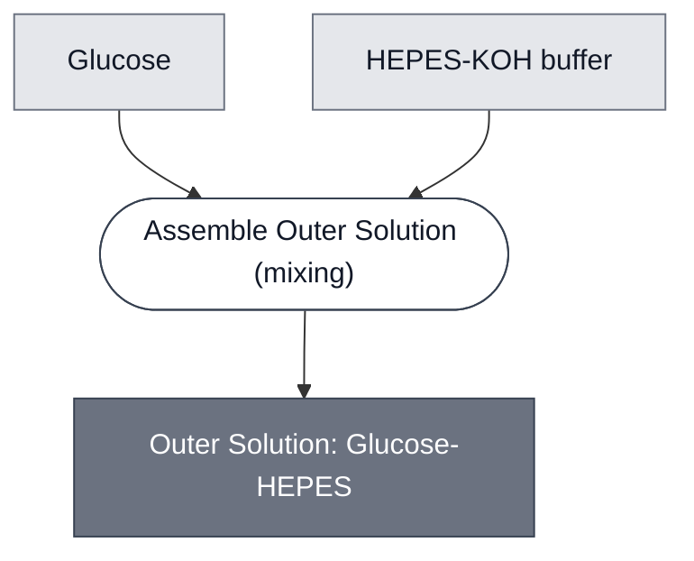

# Overview

<!-- gen:position -->
**Position.** Refines [Outer Solution](../outer-solution/spec.md). Refined by nothing on this branch.
<!-- /gen:position -->

A member of [Outer Solution](../outer-solution/spec.md): glucose buffered with HEPES-KOH. It is the solution the aTc path's synthetic cells sit in, and the phase its gel sets in.

:::{attention} 🚧 Draft
This page is a work in progress and not yet ready for use.
:::

:::{attention} One source, and it is a whiteboard
@Editor(chicago): this formulation is recorded only on the aTc demo board. Confirm the figures, and record whether the osmolarity was measured or calculated.
:::

# Reference Composition

:::::{tab-set}

<!-- gen:composition-diagram -->
::::{tab-item} Module Dependencies

::::
<!-- /gen:composition-diagram -->

::::{tab-item} Solutes

:::{table} What this solution mixes.
| Component | Concentration |
| --- | --- |
| Glucose | 400 mM |
| HEPES-KOH, pH 7.6 | 1 M |
:::

::::

:::::

# Expected Behavior

The solution holds the cells embedded in it at its own osmolarity, so that figure sets the gel's. Glucose carries most of the osmotic load and HEPES-KOH fixes the pH at 7.6.

:::{attention} The osmolarity is not recorded
@Editor(chicago): no source gives this solution's osmolarity. The cells it holds are matched against about 1180 mOsm elsewhere in the aTc path, and whether this formulation reaches that is unverified.
:::

# Requirements

Requires that whatever is embedded in it tolerates pH 7.6 and its osmolarity.

# Processes

- [Assemble Outer Solution](../../processes/assemble-outer-solution/main.md) — mixes the solutes.

# Credits

:::{attention} Credits are draft
Contributor attribution on this page has not been confirmed with the Node. Assign each credit explicitly before this page is merged to `main`.
:::
