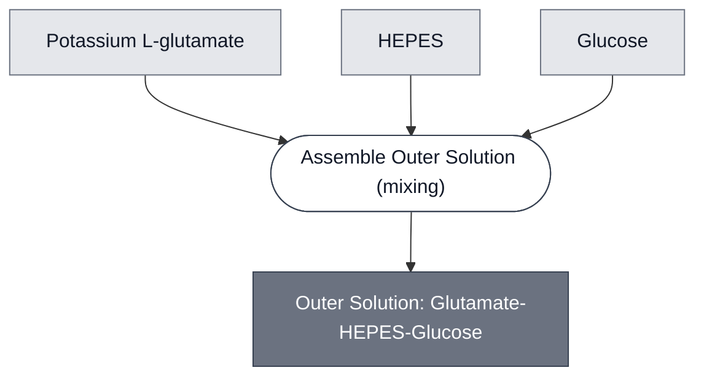

# Overview

<!-- gen:position -->
**Position.** Refines [Solution](../solution/spec.md). Refined by nothing on this branch.
<!-- /gen:position -->

A member of [Outer Solution](../outer-solution/spec.md): potassium glutamate, HEPES and glucose, matched to the [SensorCell[3OC6-HSL ⟶ PLA1]](../ahsl-sensing-cell/spec.md) inner solution.

:::{attention} 🚧 Draft
This page is a work in progress and not yet ready for use.
:::

# Reference Composition

:::::{tab-set}

<!-- gen:composition-diagram -->
::::{tab-item} Module Dependencies

::::
<!-- /gen:composition-diagram -->

::::{tab-item} Solutes

:::{table} The London formulation, as used in [Gel: ULGA](../gel-ulga/spec.md).
| Component | Working concentration | Notes |
| --- | --- | --- |
| Potassium glutamate | 578 mM | |
| HEPES | 72 mM | pH 7.4 |
| Glucose | 300 mM | |
| Osmotic concentration | ~920 mOsm | a relation, matched to the SensorCell[3OC6-HSL ⟶ PLA1] inner solution. @Editor: 578 mM glutamate, 72 mM HEPES and 300 mM glucose add to 950 mOsm/L as written, and to about 1560 mOsm/L when each ion of the salts counts. Neither is 920. Is 920 a reading of a different solution, or is the recipe wrong? |
:::

::::

:::::

# Requirements

Requires an osmotic concentration of about 920 mOsm, matched to the cells suspended in it.

# Implementations

- [LuxR-GFP Demo](../../implementations/devstudio-luxr-gfp-demo/main.md): its outer solution — the phase the gel sets in.

# Processes

The step is [Assemble Outer Solution](../../processes/assemble-outer-solution/main.md), which is one of the two instances of [Assemble Solution](../../processes/assemble-solution/assemble-solution-main.md).

# Constituent Modules

- Potassium glutamate — 578 mM
- HEPES — 72 mM, pH 7.4
- Glucose — 300 mM

# Credits

:::{attention} Credits are draft
Contributor attribution on this page has not been confirmed with the Node. Assign each credit
explicitly before this page is merged to `main`.
:::
