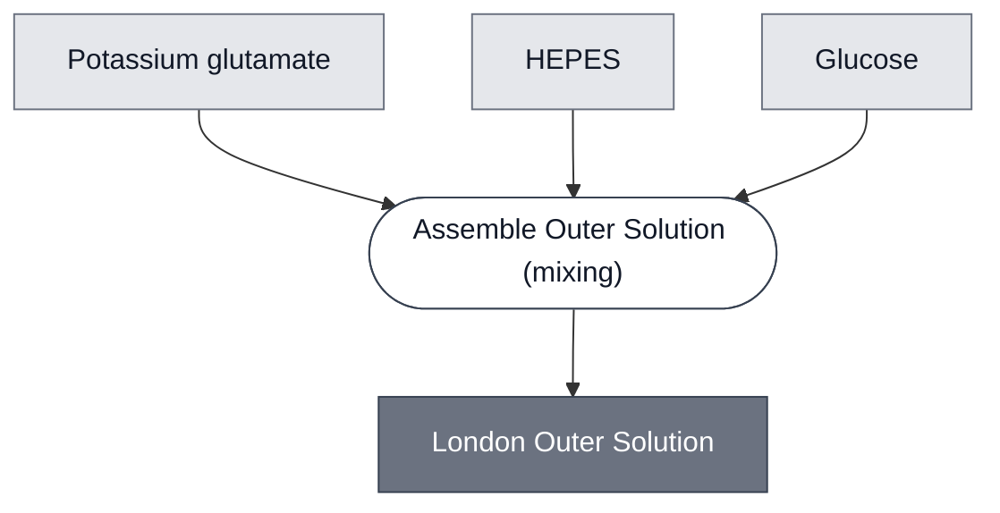

# Overview

<!-- gen:position -->
**Position.** Refines [`outer-solution`](../outer-solution/spec.md). Refined by nothing on this branch.
<!-- /gen:position -->

A member of [Outer Solution](../outer-solution/spec.md): potassium glutamate, HEPES and glucose,
matched to the [AHL Sensing Cell](../ahl-sensing-cell/spec.md) inner solution.

**This formulation had two names and no page.** [London Cascade](../london-cascade/spec.md)
produced it as `outer-solution` and [Gel: ULGA](../gel-ulga/spec.md) produced it as
`london-outer-solution`, with the same three components and the same osmolarity in both.

:::{attention} 🚧 Draft
This page is a work in progress and not yet ready for use.
:::

# Reference Composition

:::::{tab-set}

<!-- gen:composition-diagram -->
::::{tab-item} Module Dependencies

::::
<!-- /gen:composition-diagram -->

::::{tab-item} Solutes

:::{table} The London formulation, from `gel-ulga`, which is the source that carried the figures.
| Component | Working concentration | Notes |
| --- | --- | --- |
| Potassium glutamate | 578 mM | |
| HEPES | 72 mM | pH 7.4 |
| Glucose | 300 mM | |
| Osmolarity | ~920 mOsm | a relation, matched to the AHL Sensing Cell inner solution |
:::

**The osmolarity stays even though each solute is stated**, because it has to match across a
membrane and no component page can say that.

::::

:::::

# Constituent Modules

- Potassium glutamate — 578 mM
- HEPES — 72 mM, pH 7.4
- Glucose — 300 mM

# Requirements

Requires an osmolarity of about 920 mOsm, matched to the cells suspended in it. **AHL is
excluded**: it is the analyte, present in the induced condition only, and belongs to the assay
rather than to the composition.

# Processes

See the composition source. The step is [Assemble Outer Solution](../../processes/assemble-outer-solution/main.md), which is one of the two instances of [Assemble Aqueous Solution](../../processes/assemble-aqueous-solution/assemble-aqueous-solution-main.md).

# Credits

:::{attention} Credits are draft
Contributor attribution on this page has not been confirmed with the Node. Assign each credit
explicitly before this page is merged to `main`.
:::
