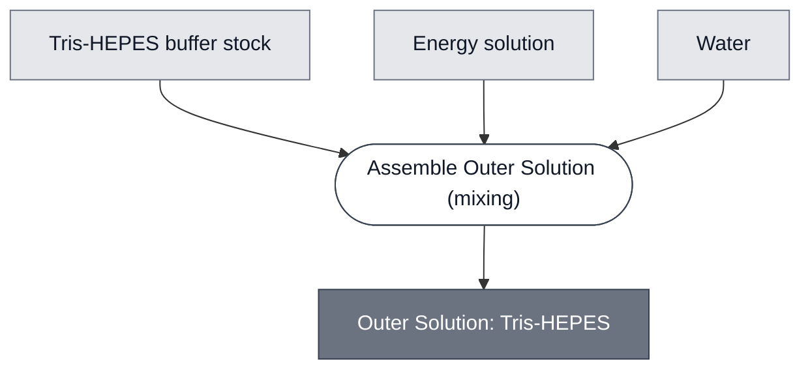

# Overview

<!-- gen:position -->
**Position.** Refines [Outer Solution](../outer-solution/spec.md). Refined by nothing on this branch.
<!-- /gen:position -->

A member of [Outer Solution](../outer-solution/spec.md): a Tris-HEPES stock with an energy solution. It is the solution the pH path's cells sit in.

**The agarose dissolves into this and both cell populations sit in it**, so this osmotic concentration sets the gel's.

:::{attention} 🚧 Draft
This page is a work in progress and not yet ready for use.
:::

# Reference Composition

<!-- composition-tabs: no-dna (the energy solution here is a buffer component of this
     solution, not the Energy: PPK Module. The checker prefix-matches ENERGY and cannot
     tell the two apart, so this is a false positive rather than a missing tab) -->

:::::{tab-set}

<!-- gen:composition-diagram -->
::::{tab-item} Module Dependencies

::::
<!-- /gen:composition-diagram -->

::::{tab-item} Solutes

:::{table} The Tris-HEPES formulation.
| Component | Working concentration | Notes |
| --- | --- | --- |
| Tris-HEPES | 46.67% (v/v) in water | from a stock |
| Energy solution | 1× in the finished reaction | a 2× sub-mix of ten components; see the Energy solution tab |
| Osmotic concentration | ~1180 mOsm | a relation, and it sets the gel's |
:::

**Osmolarity is additive and the polymer's own term is negligible**, about 0.7% by weight, so this value carries the gel.

::::

::::{tab-item} Energy solution

The energy solution is a 2× sub-mix of ten components, made up to 4000 µL. It is used at 1×, so the last column is the concentration to reach in the finished reaction.

:::{table} Energy solution. The mix is 4000 µL.
:label: comp-outer-solution-tris-hepes-energy

| Component | Stock | Volume (µL) | In the 2× mix | At 1× |
| --- | --- | --- | --- | --- |
| Spermidine | 1 M | 12 | 3 mM | 1.5 mM |
| Creatine phosphate | 1 M | 200 | 50 mM | 25 mM |
| Magnesium acetate tetrahydrate | 1 M | 144 | 36 mM | 18 mM |
| L-Glutamic acid potassium salt monohydrate | 2 M | 1120 | 560 mM | 280 mM |
| Folinic acid calcium salt hydrate | 332 mM | 9.2 | 0.764 mM | 0.382 mM |
| ATP | 100 mM | 300 | 7.5 mM | 3.75 mM |
| GTP | 100 mM | 200 | 5 mM | 2.5 mM |
| CTP | 100 mM | 100 | 2.5 mM | 1.25 mM |
| UTP | 100 mM | 100 | 2.5 mM | 1.25 mM |
| Amino acid mix | 6 mM | 400 | 0.6 mM | 0.3 mM |
| Ultra-pure distilled water | — | 1414.8 | — | — |
| Total | | 4000 | | |
:::

The counter-ion on the magnesium salt is a free choice among innocuous ones. Acetate is what the recipe names; glutamate is the salt the benches stock.

:::{attention} The source for this recipe is not settled
@Editor(chicago): the recipe is recorded as following Sun et al. 2013, DOI 10.3791/50762. That paper's energy solution is built on 3-PGA, not creatine phosphate, and carries tRNA, CoA, NAD and cAMP, which this mix does not. Name the paper this mix follows, or confirm it is in-house.
:::

::::

:::::

# Requirements

Requires an osmotic concentration of about 1180 mOsm, matched across the membranes of the cells embedded
in the gel it forms.

# Implementations

- [pH Demo](../../implementations/devstudio-ph-demo/main.md): the outer solution both arms are built on.

# Processes

Made by [Assemble Outer Solution](../../processes/assemble-outer-solution/main.md), which is one of the two instances of [Assemble Solution](../../processes/assemble-solution/assemble-solution-main.md).

# Constituent Modules

- Tris-HEPES stock — 46.67% (v/v) in water
- Energy solution — a 2× sub-mix of ten components, used at 1×

# Credits

:::{attention} Credits are draft
Contributor attribution on this page has not been confirmed with the Node. Assign each credit
explicitly before this page is merged to `main`.
:::
