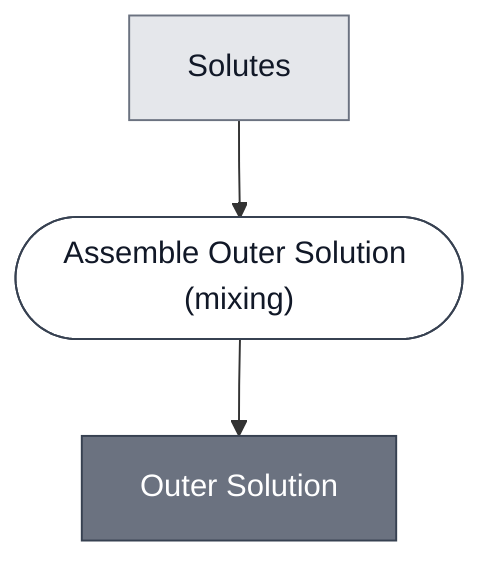

# Overview

<!-- gen:position -->
**Position.** Refines [`solution`](../solution/spec.md). Refined by [`outer-solution-chicago`](../outer-solution-chicago/spec.md), [`outer-solution-london`](../outer-solution-london/spec.md).
<!-- /gen:position -->

A class: the aqueous phase a synthetic cell is suspended in. Two members.

**It exists because both demos have one, both call it the same thing, and the two are different
formulations.** A meet over London and Chicago drew two boxes with identical labels and no way to
tell them apart.

**The invariant is an osmolarity, not an ingredient list.** The two members share no solute.
What they share is that the solution must match, osmotically, whatever is suspended in it.

**It refines nothing.** An outer solution is not a container, a gel or a membrane. It is the
phase those things sit in, and nothing in this corpus names that sort.

:::{attention} 🚧 Draft
This page is a work in progress and not yet ready for use.
:::

# Reference Composition

:::::{tab-set}

<!-- gen:composition-diagram -->
::::{tab-item} Module Dependencies

::::
<!-- /gen:composition-diagram -->

::::{tab-item} Solutes

**The two members share no component**, which is why the class names one abstract input.

:::{table} What each member mixes, and the one thing both declare.
| Member | Solutes | Osmolarity |
| --- | --- | --- |
| [London Outer Solution](../outer-solution-london/spec.md) | potassium glutamate, HEPES, glucose | ~920 mOsm |
| [Chicago Outer Solution](../outer-solution-chicago/spec.md) | Tris-HEPES stock, energy solution | ~1180 mOsm |
:::

**The two osmolarities differ and both are correct.** Each matches the inner solution of the
cells it suspends, so the figure is a relation to a different thing in each case rather than a
constant this class could state.

::::

:::::

# Constituent Modules

- Solutes — a salt, a buffer and a sugar in one member; a buffer stock and an energy solution in the other. No page: a class composes abstract constituents

# Requirements

Requires that its osmolarity match across the membrane of whatever is suspended in it.
**That is the whole function**, and it is a relation rather than a property, so no component page
can state it.

# Processes

See the composition source. The step is [Assemble Outer Solution](../../processes/assemble-outer-solution/main.md), which is one of the two instances of [Assemble Solution](../../processes/assemble-solution/assemble-solution-main.md).

# Credits

:::{attention} Credits are draft
Contributor attribution on this page has not been confirmed with the Node. Assign each credit
explicitly before this page is merged to `main`.
:::
