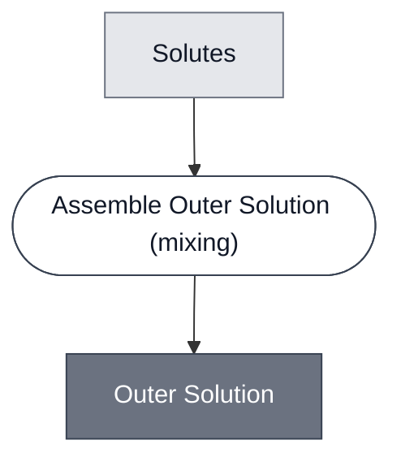

# Overview

<!-- gen:position -->
**Position.** Refines [Solution](../solution/spec.md). Refined by [Outer Solution: Glucose-HEPES](../outer-solution-glucose-hepes/spec.md), [Outer Solution: Glutamate-HEPES-Glucose](../outer-solution-glutamate/spec.md), [Outer Solution: Tris-HEPES](../outer-solution-tris-hepes/spec.md).
<!-- /gen:position -->

A class: the aqueous phase a synthetic cell is suspended in.

What every member shares is an osmolarity relation, not an ingredient list. The members share no solute.

:::{attention} 🚧 Draft
This page is a work in progress and not yet ready for use.
:::

# Reference Composition

:::::{tab-set}

<!-- gen:composition-diagram -->
::::{tab-item} Module Dependencies

```mermaid
flowchart TD
    SOLUTES["Solutes"]

    P1_ASSEMBLE_OUTER_SOLUTION_0(["Assemble Outer Solution (mixing)"])
    OUTER_SOLUTION["Outer Solution"]

    SOLUTES --> P1_ASSEMBLE_OUTER_SOLUTION_0
    P1_ASSEMBLE_OUTER_SOLUTION_0 --> OUTER_SOLUTION


    classDef leaf     fill:#e5e7eb,stroke:#6b7280,color:#111827;
    classDef composed fill:#6b7280,stroke:#374151,color:#ffffff;
    classDef process  fill:#ffffff,stroke:#374151,color:#111827;
    class SOLUTES leaf;
    class OUTER_SOLUTION composed;
    class P1_ASSEMBLE_OUTER_SOLUTION_0 process;

    click P1_ASSEMBLE_OUTER_SOLUTION_0 "/docs/processes/assemble-outer-solution/main"
    click OUTER_SOLUTION "/docs/modules/outer-solution/spec"
```

::::
<!-- /gen:composition-diagram -->

::::{tab-item} Solutes

:::{table} What each member mixes, and the osmolarity it reaches.
| Member | Solutes | Osmolarity |
| --- | --- | --- |
| [Outer Solution: Glutamate-HEPES-Glucose](../outer-solution-glutamate/spec.md) | potassium glutamate, HEPES, glucose | ~920 mOsm |
| [Outer Solution: Tris-HEPES](../outer-solution-tris-hepes/spec.md) | Tris-HEPES stock, energy solution | ~1180 mOsm |
| [Outer Solution: Glucose-HEPES](../outer-solution-glucose-hepes/spec.md) | glucose, HEPES-KOH | not recorded |
:::

::::

:::::

# Expected Behavior

A member is the aqueous phase around a synthetic cell, at the osmolarity listed in the Solutes tab. The osmolarity differs by member.

# Requirements

Requires that its osmolarity stand, across the membrane, at the difference the vesicle it suspends was designed for: a match for some vesicles, and an offset for others.

# Implementations

- [CRAIC Demo](../../implementations/devstudio-craic-demo/main.md): its outer solution — the class; no member is chosen.

# Processes

A member is made by [Assemble Outer Solution](../../processes/assemble-outer-solution/main.md), one of the two instances of [Assemble Solution](../../processes/assemble-solution/assemble-solution-main.md), and checked by [Osmometry Readout](../../processes/osmometry-readout/main.md).

# Constituent Modules

- Solutes — the dissolved components each member mixes into one compartment

# Credits

:::{attention} Credits are draft
Contributor attribution on this page has not been confirmed with the Node. Assign each credit explicitly before this page is merged to `main`.
:::
