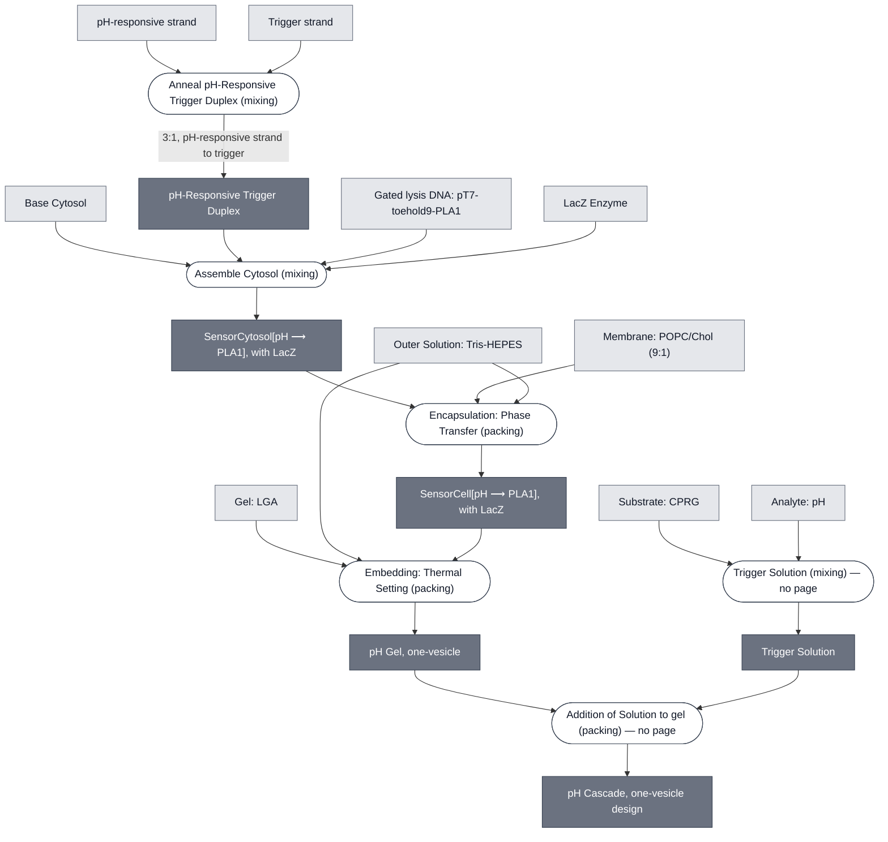

# Overview

<!-- gen:position -->
**Position.** Refines [pH Cascade](../ph-cascade/spec.md). Refined by nothing on this branch.
<!-- /gen:position -->

A proposed redesign of the [pH Cascade](../ph-cascade/spec.md) with **one liposome population instead of two**. The enzyme moves inside the sensing cell, and the substrate stops being encapsulated at all: CPRG arrives in solution after the gel is set.

:::{attention} 🚧 Proposed, not run
Nothing on this page has been built. It is written so that this design and the two-liposome one can be compared as compositions rather than as intentions.
:::

**It is the aTc arrangement applied to the pH detector.** [SensorCytosol[aTc ⟶ PLA1]](../atc-sensor-cytosol/spec.md) already mixes [LacZ Enzyme](../reporter-lacz-enzyme/spec.md) into its cytosol, and [aTc Cascade](../atc-cascade/spec.md) doses its substrate in from a trigger solution. Under this design the two Chicago demonstrations would differ only in what they sense.

**Why it is worth drawing.** The two-liposome design needs a second population whose preparation is unsettled — the extruded and freeze-thaw routes are both being run — and whose leakiness is the branch's open risk. One population removes that whole branch.

# Reference Composition

:::::{tab-set}

<!-- gen:composition-diagram -->
::::{tab-item} Module Dependencies

::::
<!-- /gen:composition-diagram -->

::::{tab-item} DNA

:::{table} The gated construct. The strands that open it are documented on the Detector page.
:label: comp-ph-cascade-one-vesicle-dna

| **Name** | **Length (bp)** | **File** | **Supply route** |
| --- | --- | --- | --- |
| `pT7-toehold9-PLA1` | 1203 | [pT7-toehold9-PLA1-linear.gb](https://github.com/nucleus-eng/DNA/blob/devcells/devstudio-constructs/effectors/detector-ph/pT7-toehold9-PLA1-linear.gb) | Expressed inside the cell. The toehold switch and PLA1 are one molecule, so PLA1 is not a separate addition |
| LacZ | — | — | Not DNA here. Added as purified enzyme, inside the cell, which is this design's change |
:::

See [Detector: pH-Sensing](../detector-ph/spec.md) for the pH-responsive and trigger strands, which the source names as two halves annealed 3:1.

::::

::::{tab-item} Cytosol

The one liposome's interior. It carries the enzyme as well as the sensor, which is what separates this design from the two-liposome one.

:::{table} Inner solution. No working concentration is documented for this design.
:label: comp-ph-cascade-one-vesicle-cytosol

| Component | Working concentration |
| --- | --- |
| [Base Cytosol](../base-cytosol/spec.md) components | At reaction concentration; not separately documented |
| `pT7-toehold9-PLA1` | not documented for this design |
| pH-responsive ssDNA : trigger ssDNA, annealed 3:1 | not documented for this design |
| [LacZ Enzyme](../reporter-lacz-enzyme/spec.md) | not documented for this design |
:::

**This design is specified and has not run**, so no figure here is measured. The [two-liposome cascade](../ph-cascade/spec.md) states doses for the first two components, and they are not copied across: that design keeps the enzyme outside, and whether these figures survive putting it inside is the first open item below.

::::

::::{tab-item} Membrane

:::{table} The one bilayer in the system — [Membrane: POPC/Chol (9:1)](../membrane-popc-chol-9-1/spec.md).
:label: comp-ph-cascade-one-vesicle-membrane

| Component | Target percentage (%) |
| --- | --- |
| POPC | 89.9 |
| Cholesterol | 10 |
| Liss-Rhod PE | 0.1 |
:::

**The membrane is the off state.** While the cell is intact it is the only thing keeping the enzyme from its substrate, so this bilayer carries the whole readout rather than only containing a reaction.

::::

::::{tab-item} Substrate

:::{table} CPRG in the one-liposome path.
:label: comp-ph-cascade-one-vesicle-substrate

| Component | Working concentration | Notes |
| --- | --- | --- |
| [Substrate: CPRG](../substrate-cprg/spec.md) | not documented | **Not encapsulated.** It arrives in the trigger solution after the gel is set, carried in with the analyte |
:::

**Whether one solution can carry both is open.** The analyte is an acid, and whether CPRG tolerates being carried in it is recorded nowhere. See the open items below.

::::

:::::

# Expected Behavior

Acidic pH opens the toehold switch, PLA1 is expressed, and the cell lyses. Lysis releases LacZ into the gel, where it meets the CPRG already dosed in, and the yellow-to-purple change follows.

**The off state is the membrane.** While the cell is intact, enzyme and substrate are in different compartments and nothing happens. That is the [Color Change](../color-change/spec.md) invariant, satisfied with the enzyme inside rather than outside.

# Requirements

Requires the enzyme to be the encapsulated half and the substrate to be outside it. This design does not merely permit that arrangement; it depends on it, because the membrane is the only thing holding the readout off.

Requires LacZ to tolerate the sensing conditions, which is the first thing to measure — see the open items below.

# Open

:::{attention} Three things decide whether this works
**Does LacZ survive the sensing pH?** The two-liposome design keeps the enzyme out of the cell precisely because β-galactosidase works poorly at the pH the sensor needs. This design puts it in. The cytosol is buffered and the analyte acidifies the gel, so the enzyme may never see the low pH — but nothing has measured that, and if it does, the design fails at its first step.

**Can the trigger solution carry both?** The aTc cascade doses substrate and analyte together because aTc is membrane-permeable and chemically quiet. The pH analyte is an acid, and whether CPRG tolerates being carried in it is recorded nowhere.

**Does this replace the two-liposome design?** Both are specified now. That one has run; this has not. Nothing here claims to supersede it.
:::

# Constituent Modules

- **SensorCell[pH ⟶ PLA1], with LacZ** — the one liposome population, and it has **no page of its own**. It is not the two-liposome cascade's sensing cell: this one carries the enzyme inside, which makes it a different Module, and only one of the two is built. Named here rather than linked for that reason
- [Base Cytosol](../base-cytosol/spec.md) — the expression system inside it
- `pT7-toehold9-PLA1` — the gated construct. The toehold switch drives PLA1 from the same molecule, so PLA1 is not a separate addition. PLA1 itself is described on the Lysis: PLA1 page, `../effector-pla1/spec.md`
- [LacZ Enzyme](../reporter-lacz-enzyme/spec.md) — **inside the cell**, which is the design change
- [Membrane: POPC/Chol (9:1)](../membrane-popc-chol-9-1/spec.md) — the one bilayer in the system
- [Substrate: CPRG](../substrate-cprg/spec.md) — **not encapsulated.** It arrives in the trigger solution after the gel is set
- [Analyte: pH](../analyte-ph/spec.md) — carried in with the substrate
- [Gel: LGA](../gel-lga/spec.md) — the matrix
- [Outer Solution: Tris-HEPES](../outer-solution-tris-hepes/spec.md) — the phase the agarose dissolves into

The pH-responsive and trigger strands are named by the source as the two halves annealed 3:1. The **Detector: pH-Sensing** page documents them; it is not linked here because this source names the strands rather than the Module.

# Credits

:::{attention} Credits are draft
Contributor attribution on this page has not been confirmed with the Node. Assign each credit explicitly before this page is merged to `main`.
:::
