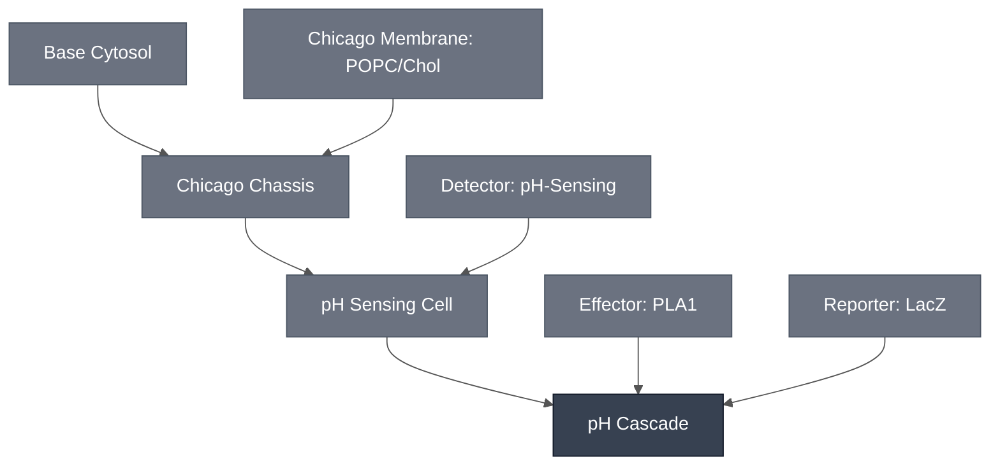

# Overview

The pH Cascade combines the [pH Sensing Cell](../ph-sensing-cell/spec.md) with the [PLA1 Lysis Module](../effector-pla1/spec.md) and the [LacZ Reporter Module](../reporter-lacz/spec.md), giving a synthetic cell that turns a drop in pH into a visible colorimetric readout. In this cascade, the pH Sensing Cell's toehold switch gates expression of PLA1, which lyses its own liposome and a neighboring CPRG-loaded liposome; the released CPRG then reacts with LacZ to produce the yellow-to-purple color change. This page names that pH-sensor-to-readout chain as its own Module — see each constituent spec for its own reference composition, requirements, and expected performance.

:::{attention} 🚧 Draft
This page is a work in progress and not yet ready for use.
:::

:::{attention} Cascade composition is proposed, not a demonstrated combined result
This page documents a proposed chain of three constituent Modules, not a single validated result for the combination. The pieces have been shown to work in different, partial combinations — see [Expected Behavior](#expected-behavior) below — but no experiment has run the full pH Sensing Cell → PLA1 → LacZ chain together in one format. Do not treat this page as describing a completed cascade.
:::

```mermaid
%%{init: {'theme': 'base', 'themeVariables': {'lineColor': '#555555', 'edgeLabelBackground': '#ffffff'}}}%%
flowchart LR
    PH["pH Sensing Cell:<br/>pH-responsive ssDNA : trigger ssDNA<br/>(4.625 µM trigger ssDNA, final)"] -->|"pH drops to ~6.5,<br/>toehold switch opens"| PLA1["PLA1 Lysis Module:<br/>toehold-gated PLA1 construct<br/>(2 nM, final)"]
    PLA1 -->|"PLA1 expressed,<br/>lyses own + neighboring liposome"| LYSIS["Lysis:<br/>CPRG released from<br/>neighboring liposome"]
    LYSIS -->|"CPRG reacts with<br/>external LacZ"| READOUT["LacZ Reporter Module:<br/>yellow CPRG to purple CPR"]
    READOUT -.->|"proposed: hydrogel-embedded<br/>Chicago Chassis format"| GEL["Combined, gel-integrated<br/>pH Cascade"]

    classDef confirmed fill:#def5ee,stroke:#009E73,color:#00402e;
    classDef proposed fill:#f5f5f5,stroke:#999999,color:#555555,stroke-dasharray: 5 5;

    class PH,PLA1,LYSIS,READOUT confirmed;
    class GEL proposed;
```

Schematic representation of the confirmed, solution-phase pH Cascade integration path: the pH-sensing toehold switch releases at pH ≈ 6.5 and turns on expression of a co-encapsulated PLA1 construct, which lyses its own liposome and a neighboring CPRG-loaded liposome; the released CPRG then reacts with external LacZ to produce the yellow-to-purple color change. This part of the chain is confirmed at the solution level (see [Reference Composition](#reference-composition) and [Expected Behavior](#expected-behavior) below). The final step — running this same chain inside a hydrogel-embedded Chicago Chassis synthetic cell — is proposed, not yet demonstrated, so it is drawn dashed/gray, matching the proposed-edge convention used in the [module-integration diagram](../chicago-cascade/spec.md). No published schematic exists for this mechanism; the diagram above is a simplified summary, not a reproduction of a lab figure.

# Reference Composition

The pH Cascade combines its constituent Modules as follows:

- **Sensing input:** [pH Sensing Cell](../ph-sensing-cell/spec.md) — the pH-responsive toehold switch encapsulated in the Chicago Chassis synthetic cell, gating downstream expression at pH ≈ 6.5.
- **Lysis trigger:** [PLA1 Lysis Module](../effector-pla1/spec.md) — expressed once the pH switch fires; ruptures its own liposome and a neighboring CPRG-loaded liposome, coupling sensing to readout.
- **Colorimetric readout:** [LacZ Reporter Module](../reporter-lacz/spec.md) — reacts with the released CPRG substrate to produce the visible yellow-to-purple color change.

None of the three constituent pages documents the combined three-part chain directly. This page exists to name that chain as the Chicago diagram's `PHCAS` node.

:::::{tab-set}

<!-- gen:composition-diagram -->
::::{tab-item} Module Dependencies

What this Module is composed of. Arrows point from a constituent to the Module that contains it; the darker node is this page. Click any node to open its spec.

This diagram shows composition only — it does not assert that any integration is confirmed.

Generated from the `# Constituent Modules` section of each page by the `mermaid-diagrams` skill. Edit the composition, not this block.

::::
<!-- /gen:composition-diagram -->

::::{tab-item} Working Concentrations

The table below aggregates the working concentrations behind the confirmed, solution-phase two-liposome result described in [Expected Behavior](#expected-behavior), one row per constituent Module, flattened one level deep. Two of the three rows come from the pH-sensing/PLA1 liposome's own reaction table, sourced from the Chicago Node's status materials ("Demo Status – Chicago," Module 2 – pH Sensor, "Key Experiment: inner solution condition") rather than from either constituent Module's own spec page — this data has not yet been transcribed into the [pH Sensing Cell](../ph-sensing-cell/spec.md) or [PLA1 Lysis Module](../effector-pla1/spec.md) pages.

:::{table} Reference composition — confirmed solution-phase pH Cascade integration path (Chicago)
:label: comp-ph-cascade

| Module | Component | Working concentration |
| --- | --- | --- |
| pH Sensing Cell | pH-responsive ssDNA : trigger ssDNA (3:1, annealed) | 4.625 µM trigger ssDNA, final — co-encapsulated with the PLA1 construct below in one liposome |
| PLA1 Lysis Module | Toehold-switch-gated PLA1 DNA template | 2 nM, final — co-encapsulated with the pH-sensing ssDNA above; this is a distinct, PLA1-fused construct, not the standalone toehold-LacZ/XylE construct listed on the [pH-Sensing Module](../detector-ph/spec.md) page's DNA tab |
| LacZ Reporter Module | CPRG substrate | Not documented at a reaction concentration for this specific two-liposome pairing — CPRG is loaded into a separate liposome population and reacts with external β-galactosidase after lysis, but no working concentration for either is recorded in the surveyed source material for this pairing |
:::

:::{attention} CPRG/LacZ concentration is a real documentation gap, not a stand-in number
Unlike the [aTc Cascade](../atc-cascade/spec.md#reference-composition) (0.5 mM CPRG, 20 U/mL LacZ, encapsulated) or the theophylline cascade's CPRG-loaded SUVs (50 mM CPRG loading), no CPRG or LacZ concentration is documented anywhere for this pH cascade's own solution-phase, two-liposome pairing. Do not substitute a number from a different cascade's readout integration path to fill this row — that would misrepresent an undocumented gap as a real, sourced value. Flag this for follow-up once a formal devnote for the Chicago pH cascade's two-liposome reaction is written.
:::

::::

:::::

# Expected Behavior

No result has been generated for the full pH Sensing Cell → PLA1 → LacZ chain run together. The closest available data are the constituent-level results documented on each Module's own page, none of which is the combined cascade.

## Cells

- **pH-sensing color change, solution-phase, two-liposome system:** a visible yellow-to-purple color change at pH 6.5, using separate pH-sensing and CPRG-loaded liposome populations in solution. See [pH Sensing Cell](../ph-sensing-cell/spec.md#expected-behavior) for detail.
- **PLA1-driven lysis coupling to CPRG/LacZ readout:** confirmed at the solution level for the Chicago pH cascade — see [PLA1 Lysis Module](../effector-pla1/spec.md#implementations), "Chicago pH cascade."

:::{warning}
**Not yet demonstrated as a working multiplexed cascade.** The pH Sensing Cell's own integration into the Chicago Chassis's synthetic cell/hydrogel format is itself still proposed, not confirmed (see [pH Sensing Cell](../ph-sensing-cell/spec.md)). This page's cascade — pH Sensing Cell driving PLA1-triggered lysis and LacZ/CPRG readout, together in one format — has not been run as a single experiment. Keep this cascade's edge into the combined, multiplexed Chicago Cascade dashed/proposed until a gel-integrated, combined result is confirmed.
:::

## Gels

- **pH-sensing, bulk hydrogel, no liposomes:** embedding the pH-sensing reaction directly in 0.7% low-gelling agarose gives a real but modest color change — "slight pink," not as bright as expected (Sung-Won Hwang, Liu Lab). Full detail, including the concentration-dependent absorbance data, is documented on the [pH Sensing Cell](../ph-sensing-cell/spec.md#expected-behavior) spec and is not duplicated here.

# Requirements

Requires pT7 transcription and translation (e.g. [Base Cytosol](../base-cytosol/spec.md)) to express the toehold-switch-gated PLA1 construct, and a drop to pH ≈ 6.5 to open the toehold switch (e.g. [Detector: pH-Sensing](../detector-ph/spec.md)).

Requires two lipid compartments — a sensing/PLA1 liposome and a separate CPRG-loaded liposome (e.g. [Chicago Chassis](../chicago-chassis/spec.md)) — plus β-galactosidase in the exterior solution (e.g. [LacZ Reporter Module](../reporter-lacz/spec.md)). The readout depends on lysis releasing CPRG from one compartment into another, so this cascade has no bulk-cytosol route.

Premature lysis is a known failure mode for this cascade, by two independent routes.

**Gramicidin A causes premature lysis; it does not prevent it.** Gramicidin A was used as a proton channel for the pH cascade's GFP-expression result, but it was deliberately left out of the colorimetric demonstration because it caused a portion of the CPRG-loaded liposomes to rupture prematurely, producing nonspecific color. Its absence can reduce pH-sensing efficiency, but proton diffusion into the more permeable subset of liposomes was enough to drive PLA1 expression.

**Acidic conditions alone rupture some CPRG-loaded liposomes**, independent of PLA1, which confounds attributing any color change to the sensing pathway.

See the [PLA1 Lysis Module](../effector-pla1/spec.md#requirements) spec for detail.

:::{attention} Corrected 2026-08-19 — this section previously stated the opposite
An earlier revision said gramicidin A was used "to keep the PLA1-carrying liposome intact" and that *removing* it caused background color. Both halves inverted the source, which states gramicidin A "was not included in the colorimetric demonstration because it **caused** a portion of the CPRG-loaded vesicles to rupture prematurely." Recorded rather than silently rewritten.
:::

# Implementations

- [Chicago Cascade](../chicago-cascade/spec.md): the pH integration path of the multiplexed Chicago demo. That combination has not been built.
- [Chicago DevCell](../../implementations/chicago-devcell/main.md): places the Chicago cascades in a hydrogel with spatial patterning.

# Process

No process page documents assembling this three-part cascade end to end. The [pH Sensing Cell](../ph-sensing-cell/spec.md#process) spec already flags its own synthetic cell-encapsulation/hydrogel-embedding gap; combining that cell with PLA1 and LacZ into one cascade is a further, undocumented step. Do not assume any existing process page covers this combination — flag for a follow-up process page rather than treating a citation here as equivalent.

# Constituent Modules

- [pH Sensing Cell](../ph-sensing-cell/spec.md) — pH-responsive sensing circuit in the Chicago Chassis synthetic cell
- [PLA1 Lysis Module](../effector-pla1/spec.md) — lysis trigger coupling sensing to readout
- [LacZ Reporter Module](../reporter-lacz/spec.md) — LacZ/CPRG colorimetric readout chemistry

# Credits

Developed by Sung-Won Hwang and Samuel Chen (Chicago Node, Liu Lab) — the pH sensing result (14 Aug 2026 status deck, slide 9) and the spatially confined colorimetric readout in patterned agarose (slide 10), respectively. This page composes those two results; the combined three-part cascade has not been demonstrated end to end.

Contributor names come from the 14 Aug 2026 status deck and from the module sections of the Chicago and London status documents, and have not been confirmed by the teams.
