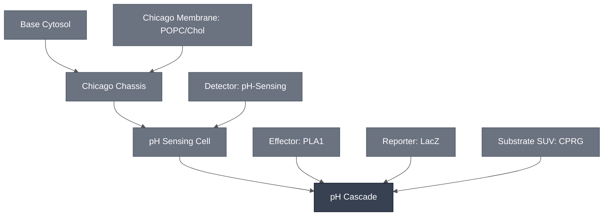

# Overview

The pH Cascade combines the [pH Sensing Cell](../ph-sensing-cell/spec.md) with the [PLA1 Lysis Module](../effector-pla1/spec.md) and the [LacZ Reporter Module](../reporter-lacz/spec.md) to turn a drop in pH into a visible colorimetric readout.

The pH Sensing Cell's toehold switch gates expression of PLA1, which lyses its own liposome and a neighboring CPRG-loaded liposome. The released CPRG reacts with LacZ to produce the yellow-to-purple color change.

:::{attention} 🚧 Draft
This page is a work in progress and not yet ready for use.
:::

# Reference Composition

The pH Cascade combines its Modules as follows:

- **Sensing input:** [pH Sensing Cell](../ph-sensing-cell/spec.md) — the pH-responsive toehold switch encapsulated in the Chicago Chassis synthetic cell, gating downstream expression at pH ≈ 6.5.
- **Lysis trigger:** [PLA1 Lysis Module](../effector-pla1/spec.md) — expressed once the pH switch fires; ruptures its own liposome and a neighboring CPRG-loaded liposome, coupling sensing to readout.
- **Colorimetric readout:** [LacZ Reporter Module](../reporter-lacz/spec.md) — reacts with the released CPRG substrate to produce the visible yellow-to-purple color change.

The combined three-part chain is specified here.

:::::{tab-set}

<!-- gen:composition-diagram -->
::::{tab-item} Module Dependencies

::::
<!-- /gen:composition-diagram -->

::::{tab-item} DNA

:::{table}
| **Name** | **Length (bp)** | **File** | **Supply route** |
| --- | --- | --- | --- |
| Toehold-switch-gated PLA1 template | not documented | — | Expressed in the pH Sensing Cell |
| pH-responsive ssDNA : trigger ssDNA | not applicable | — | Synthesized oligonucleotides, added directly |
| β-galactosidase (LacZ) | not applicable | — | Supplied as purified enzyme, not expressed |
:::

See [Detector: pH-Sensing](../detector-ph/spec.md) for the toehold-switch design and [Effector: PLA1](../effector-pla1/spec.md) for the PLA1 constructs.

:::{attention} Construct not yet in `nucleus-eng/DNA`
The toehold-switch-gated PLA1 template has no sequence file in [`nucleus-eng/DNA`](https://github.com/nucleus-eng/DNA) and no recorded length. It is also not recorded as a construct in its own right anywhere in this corpus: neither [Detector: pH-Sensing](../detector-ph/spec.md), which specifies the toehold switch with LacZ and XylE effectors, nor [Effector: PLA1](../effector-pla1/spec.md), which lists two PLA1 constructs, claims this one. Whether it is a third design or one of those two under another name is not established — do not assume it from the name. Do not add a length or file entry until the construct is confirmed and its length verified against the source file.
:::

::::

::::{tab-item} pH Sensing Cell

The pH-sensing ssDNA and the toehold-switch-gated PLA1 template are co-encapsulated in one liposome, in [Base Cytosol](../base-cytosol/spec.md).

:::{table} pH Sensing Cell cytosol, confirmed solution-phase integration path.
:label: comp-ph-cascade-sensing

| Component | Working concentration |
| --- | --- |
| pH-responsive ssDNA : trigger ssDNA (3:1, annealed) | 4.625 nM trigger ssDNA, final |
| Toehold-switch-gated PLA1 DNA template | 2 nM, final — a distinct, PLA1-fused construct |
| Base Cytosol components | At reaction concentration; not separately documented for this pairing |
:::

:::{table} pH Sensing Cell membrane — [Chicago Membrane: POPC/Chol](../membrane-popc-chol-chicago/spec.md).
:label: comp-ph-cascade-sensing-membrane

| Component | Target percentage (%) |
| --- | --- |
| POPC | 89.9 |
| Cholesterol | 10 |
| Liss-Rhod PE | 0.1 |
:::

::::

::::{tab-item} Substrate SUV

A second liposome population carrying the chromogenic substrate. See [Substrate SUV: CPRG](../substrate-cprg-suv/spec.md).

:::{table} Substrate SUV lumen.
:label: comp-ph-cascade-suv

| Component | Working concentration |
| --- | --- |
| CPRG substrate | Not documented at a reaction concentration for this two-liposome pairing |
:::

:::{table} Substrate SUV membrane — [Chicago Membrane: POPC/Chol](../membrane-popc-chol-chicago/spec.md).
:label: comp-ph-cascade-suv-membrane

| Component | Target percentage (%) |
| --- | --- |
| POPC | 89.9 |
| Cholesterol | 10 |
| Liss-Rhod PE | 0.1 |
:::

::::

::::{tab-item} Outer Solution

:::{table} Outer solution.
:label: comp-ph-cascade-outer

| Component | Working concentration |
| --- | --- |
| H⁺ | pH 7.4 at rest; a drop to ≈ 6.5 opens the toehold switch |
| β-galactosidase (LacZ) | Not reported for this cascade configuration; see [LacZ Reporter](../reporter-lacz/spec.md) |
:::

This cascade is the mirror of the [aTc Cascade](../atc-cascade/spec.md): the substrate is enclosed in the Substrate SUV and the enzyme is out here, rather than the other way round. Either separation keeps the system OFF until lysis.

::::

:::::

# Expected Behavior

The pH Cascade is expected to turn a drop to pH ≈ 6.5 into a visible yellow-to-purple color change: the toehold switch opens, PLA1 is expressed, and lysis releases CPRG from the substrate population to LacZ in the exterior solution.

## Cells

- **pH-sensing color change, solution-phase, two-liposome system:** a visible yellow-to-purple color change at pH 6.5, using separate pH-sensing and CPRG-loaded liposome populations in solution. See [pH Sensing Cell](../ph-sensing-cell/spec.md#expected-behavior) for detail.
- **PLA1-driven lysis coupling to CPRG/LacZ readout:** confirmed at the solution level for the Chicago pH cascade — see [PLA1 Lysis Module](../effector-pla1/spec.md#implementations), "Chicago pH cascade."

:::{warning} Not yet validated as a combined cascade
The three Modules above have run in partial combinations, never together in one format. The pH Sensing Cell's own integration into the Chicago Chassis synthetic cell and hydrogel format is itself proposed rather than confirmed — see [pH Sensing Cell](../ph-sensing-cell/spec.md).
:::

## Gels

- **pH-sensing, bulk hydrogel, no liposomes:** embedding the pH-sensing reaction directly in 0.7% low-gelling agarose gives a real but modest color change — "slight pink," not as bright as expected (Sung-Won Hwang, Liu Lab). The concentration-dependent absorbance data is on the [pH Sensing Cell](../ph-sensing-cell/spec.md#expected-behavior) spec.

:::{attention} Premature lysis has two independent causes
**Gramicidin A causes premature lysis; it does not prevent it.** Used as a proton channel for the GFP-expression result, it was left out of the colorimetric demonstration because it ruptured a portion of the CPRG-loaded liposomes, producing nonspecific color. Its absence can reduce pH-sensing efficiency, but proton diffusion into the more permeable liposomes was enough to drive PLA1 expression.

**Acidic conditions alone rupture some CPRG-loaded liposomes**, independent of PLA1, which confounds attributing a color change to the sensing pathway.
:::

# Requirements

Requires pT7 transcription and translation (e.g. [Base Cytosol](../base-cytosol/spec.md)) to express the toehold-switch-gated PLA1 construct, and a drop to pH ≈ 6.5 to open the toehold switch (e.g. [Detector: pH-Sensing](../detector-ph/spec.md)).

Requires two lipid compartments — a sensing/PLA1 liposome and a separate CPRG-loaded liposome (e.g. [Chicago Chassis](../chicago-chassis/spec.md)) — plus β-galactosidase in the exterior solution (e.g. [LacZ Reporter Module](../reporter-lacz/spec.md)). The readout depends on lysis releasing CPRG from one compartment into another, so this cascade has no bulk-cytosol route.

Do not add gramicidin A to the colorimetric configuration. It ruptures a portion of the CPRG-loaded liposomes by itself, producing color that did not come from sensing. Leaving it out costs some pH-sensing efficiency, but proton diffusion into the more permeable liposomes is enough to drive PLA1 expression without it.

Requires a control that separates sensing-driven color from acid-driven leakage. Acidic conditions rupture some CPRG-loaded liposomes on their own, with no PLA1 involved, so color at pH 6.5 is not by itself attributable to the sensing pathway.

# Implementations

- [Chicago DevCell](../../implementations/chicago-devcell/main.md): places the Chicago cascades in a hydrogel with spatial patterning.

# Processes

No process page documents assembling this three-part cascade end to end.

# Constituent Modules

- [pH Sensing Cell](../ph-sensing-cell/spec.md) — pH-responsive sensing circuit in the Chicago Chassis synthetic cell
- [PLA1 Lysis Module](../effector-pla1/spec.md) — lysis trigger coupling sensing to readout
- [LacZ Reporter Module](../reporter-lacz/spec.md) — LacZ/CPRG colorimetric readout chemistry
- [Substrate SUV: CPRG](../substrate-cprg-suv/spec.md) — the second liposome population, carrying the CPRG released on lysis

# Credits

Developed by Sung-Won Hwang and Samuel Chen (Chicago Node, Liu Lab).
