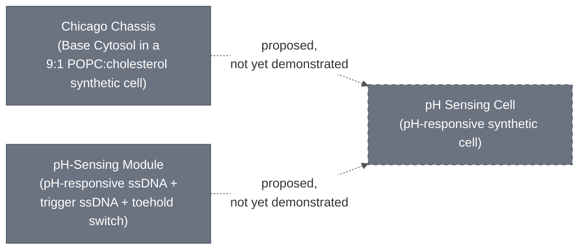
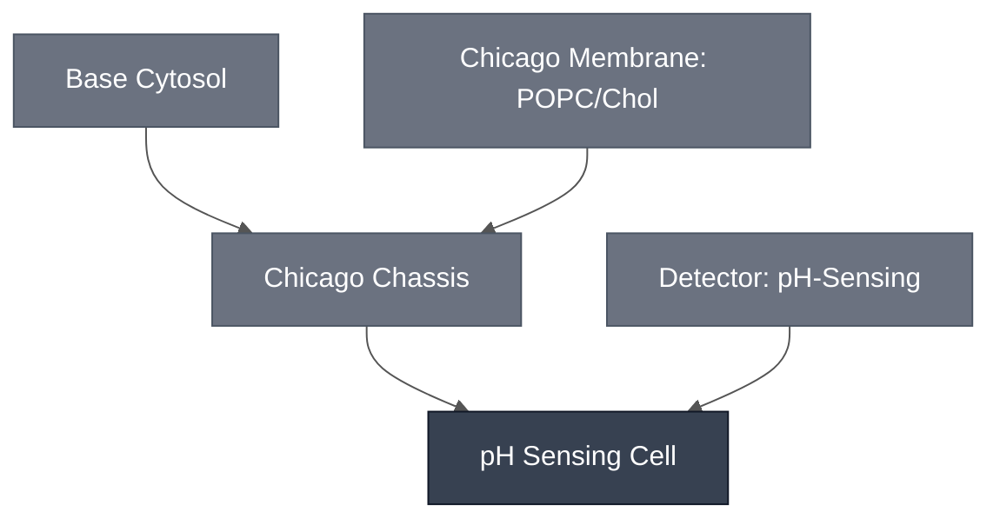

# Overview

The pH Sensing Cell is the [pH-Sensing Module](../detector-ph/spec.md) embedded in the [Chicago Chassis](../chicago-chassis/spec.md) — the synthetic-cell-encapsulated cytosol that acts as the Chicago demo's synthetic-cell substrate. On its own, the pH-Sensing Module is a solution-phase ssDNA/toehold-switch circuit that turns on a colorimetric reporter (LacZ or XylE) when pH drops to about 6.5. The pH Sensing Cell is what that circuit becomes once it is carried inside the chassis: the two-liposome sensing system encapsulated in the chassis's synthetic cell, ready to be embedded in a hydrogel for the Chicago Cascade demo.

:::{attention} 🚧 Draft
This page is a work in progress and not yet ready for use.
:::

:::{attention} Chassis integration is proposed, not confirmed
The current module-integration diagram draws the edge from the Chicago Chassis to the pH Sensing Cell as dashed (proposed), not solid (confirmed). The pH-sensing two-liposome system has been demonstrated in solution with a visible yellow-to-purple color change at pH 6.5, and a separate bulk-reaction test embedded the sensing reaction directly in 0.7% low-gelling agarose hydrogel (see Expected Behavior below) — but the sensing system has not yet been demonstrated encapsulated in the Chicago Chassis's synthetic cell format, nor embedded in a hydrogel in that combined form. Do not treat this page as describing a completed, validated Sensing Cell — it documents a proposed composition, not a demonstrated one.
:::

No published schematic exists for this mechanism; the diagram above is a simplified summary, not a reproduction of a lab figure.

# Reference Composition

:::{attention} Combined-recipe concentrations not documented
Neither constituent page documents the working concentrations of its own components once combined into a single reaction before encapsulation. The table below states each constituent as a single aggregated line item, as used **on its own page** — see each constituent spec for its full internal composition. Do not treat the "combined recipe" column as a demonstrated formulation.
:::

:::::{tab-set}

<!-- gen:composition-diagram -->
::::{tab-item} Module Dependencies

What this Module is composed of. Arrows point from a constituent to the Module that contains it; the darker node is this page. Click any node to open its spec.

This diagram shows composition only — it does not assert that any integration is confirmed.

Generated from the `# Constituent Modules` section of each page by the `mermaid-diagrams` skill. Edit the composition, not this block.

::::
<!-- /gen:composition-diagram -->

::::{tab-item} Cytosol

:::{table}
:label: comp-sensing-cell-cytosol

| Line item | Contribution | Working concentration/fraction in combined recipe |
| --- | --- | --- |
| Chicago Chassis | [Base Cytosol](../base-cytosol/spec.md) | At reaction concentration, per [Chicago Chassis](../chicago-chassis/spec.md#reference-composition) — carries over unchanged |
| pH-Sensing Module | pH-responsive ssDNA, trigger ssDNA, linear toehold switch (LacZ or XylE) | Not documented for this combined format — see [pH-Sensing Module](../detector-ph/spec.md#reference-composition) for the concentrations used in that module's own, unencapsulated reactions |

:::

::::

::::{tab-item} Membrane

:::{table}
:label: comp-sensing-cell-membrane

| Line item | Contribution | Working concentration/fraction in combined recipe |
| --- | --- | --- |
| Chicago Chassis | 9:1 POPC:cholesterol synthetic cell membrane | Unchanged from [Chicago Chassis](../chicago-chassis/spec.md#reference-composition) |
| pH-Sensing Module | Not applicable — solution-phase circuit, contributes no membrane component here | N/A |

:::

:::{attention} pH-Sensing Module's own membrane figure is a different, unrelated formulation
The [pH-Sensing Module](../detector-ph/spec.md) page separately lists a membrane fraction (89.9% POPC / 10% cholesterol / 0.1% Rhod-PE) for a possible future liposome-encapsulated format of its own. That fraction is not the membrane used here — the Sensing Cell embeds in the Chicago Chassis's 9:1 POPC:cholesterol synthetic cell (no Rhod-PE). Do not conflate the two.
:::

::::

:::::

This page exists to name the combination above as the Chicago diagram's `PHV` node — see each constituent spec for its own full reference composition and requirements.

# Expected Behavior

No result has been generated for the pH-Sensing Module encapsulated in the Chicago Chassis's synthetic cell format. The closest available data are two separate, earlier-stage results, neither of which is the combined Sensing Cell:

- **Solution-phase, two-liposome system:** a visible yellow-to-purple color change at pH 6.5, using separate pH-sensing and CPRG-loaded liposome populations in solution (not the chassis synthetic cell).
- **Bulk hydrogel, no liposomes:** Sung-Won Hwang (Liu Lab) embedded the pH-sensing reaction directly in 0.7% low-gelling agarose (no liposomes at all), added β-galactosidase with neutralization buffer, and incubated 5 h at 37 °C (2026-08-14). Absorbance at 570 nm at the 5 h timepoint:

  | Condition | Abs₅₇₀ (5 h) |
  | --- | --- |
  | Positive control (Triton X) | ~0.46 |
  | Negative control | ~0.31 |
  | pH 7.4 | ~0.31 |
  | pH 6.5 | ~0.39 |

  This is a real, concentration-dependent difference between pH 7.4 and pH 6.5, and the fluorescence channel showed no Cy5 dye signal at pH 6.5, consistent with reporter expression at the acidic condition. But the gap between the two pH conditions is small relative to the positive control, and the result was described at the time as "slight pink" and "not as bright as I wanted," with an open plan to increase CPRG loading concentration. Treat this as a real, modest, concentration-dependent lead worth building on — not a robust or complete demonstration, and not a test of the synthetic-cell-encapsulated or hydrogel-embedded Sensing Cell itself.

See the [pH-Sensing Module](../detector-ph/spec.md) spec for full detail on both results, including the requirement that trigger ssDNA be HPLC-purified and resuspended in duplex buffer (a 30× signal difference from desalted ssDNA in water).

:::{attention} Backing DevNote is a template stub
The formal DevNote for the pH-Sensing Module — [Module Development Plan: DevCell-based pH sensor](https://github.com/nucleus-eng/2026-CERN-OHL-P/blob/main/devnotes/chicago-ph-sensor-plan/main.md) (`chicago-ph-sensor-plan`) — is a template stub, not a completed writeup: its `title` field is still the literal placeholder `"[Title]"`, and it carries no populated figures or dated results. This page and the [pH-Sensing Module](../detector-ph/spec.md) spec draw on that DevNote's design description combined with quantitative results reported separately at the 2026-08-14 DevCell status meeting, because the DevNote itself has not been filled in with that data. This is a real documentation gap, not treated here as a real source in its own right.
:::

# Process

No synthetic cell-encapsulation or hydrogel-embedding process specific to the pH Sensing Cell is yet documented in `docs/processes/`. The Chicago Chassis's own synthetic-cell formation process is itself an open gap (see [Chicago Chassis](../chicago-chassis/spec.md#process)); combining that with the pH-sensing circuit's addition step is a further, undocumented step. Do not assume any existing process page covers this combination — flag for a follow-up process page rather than treating a citation here as equivalent.

# Constituent Modules

- [Chicago Chassis](../chicago-chassis/spec.md)
- [pH-Sensing Module](../detector-ph/spec.md)

# Credits

Developed by Sung-Won Hwang (Chicago Node, Liu Lab) — pH sensing in 0.7% agarose hydrogel, read out by Cy5 dye loss (14 Aug 2026 status deck, slide 9).
