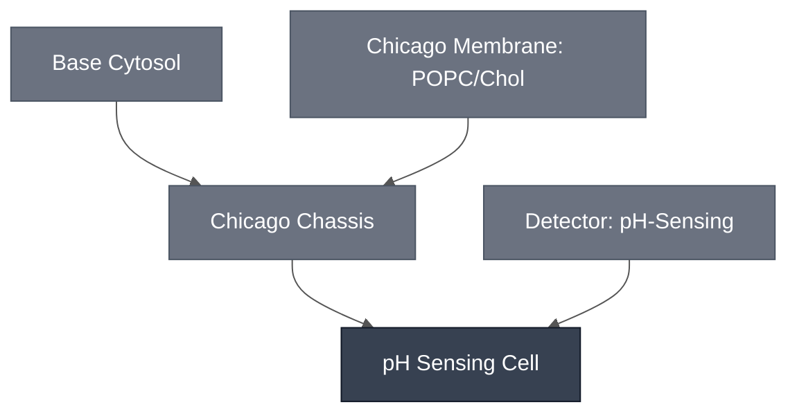

# Overview

The pH Sensing Cell is the [pH-Sensing Module](../detector-ph/spec.md) embedded in the [Chicago Chassis](../chicago-chassis/spec.md). On its own, the pH-Sensing Module is an cytosolic ssDNA/toehold-switch circuit that turns on a downstream effector gene (e.g., a colorimetric reporter) when pH drops to about 6.5. The pH Sensing Cell encapsulates this module in a synthetic cell.

:::{attention} 🚧 Draft
This page is a work in progress and not yet ready for use.
:::

# Reference Composition

:::::{tab-set}

<!-- gen:composition-diagram -->
::::{tab-item} Module Dependencies

::::
<!-- /gen:composition-diagram -->

::::{tab-item} DNA

:::{table}
| **Name** | **Length (bp)** | **File** | **Supply route** |
| --- | --- | --- | --- |
| Toehold-switch-gated reporter template | not documented | — | Expressed in the Sensing Cell |
| pH-responsive ssDNA : trigger ssDNA | not applicable | — | Synthesized oligonucleotides, added directly |
:::

:::{attention} Constructs not in `nucleus-eng/DNA`
@Editor(chicago): no sequence file is confirmed for these constructs. Confirm with the Chicago Node.
:::

See [Detector: pH-Sensing](../detector-ph/spec.md) for the design.

::::

::::{tab-item} Cytosol

The inner solution follows the [Chicago Chassis](../chicago-chassis/spec.md) cytosol at reaction concentration, with the toehold-switch template and the annealed pH-responsive ssDNA : trigger ssDNA duplex from the [pH-Sensing Module](../detector-ph/spec.md).

:::{table} Combined synthetic cell reaction, one level deep.
:label: comp-sensing-cell-cytosol

| Module | Working concentration | Notes |
| --- | --- | --- |
| [Chicago Chassis](../chicago-chassis/spec.md) | Base Cytosol at reaction concentration, in a 9:1 POPC:cholesterol synthetic cell membrane | Transcription, translation, and encapsulation. |
| [pH-Sensing Module](../detector-ph/spec.md) | `pT7-toehold9-PLA1` template at 2 nM; pH-responsive ssDNA : trigger ssDNA duplex (3:1, annealed) at 4.625 µM trigger ssDNA | Compare [pH-Sensing Module](../detector-ph/spec.md#detector-ph-reference-composition), whose design values are quoted at 4.8 µM. |
| Optiprep | 4.5% (v/v) | Density agent for the phase-transfer step. Present in the encapsulated reaction and not in the bulk one. |
| RNase inhibitor | 1000 U/mL | Half the 2000 U/mL used in the bulk module reaction. |
| Sulfo-Cyanine5 | 2 µM, optional | Membrane-independent fill marker, used when the lumen needs to be visible. |

:::

::::

::::{tab-item} Membrane

:::{table} The [Chicago Membrane](../membrane-popc-chol-chicago/spec.md).
:label: comp-sensing-cell-membrane

| Component   | Target Percentage (%) | Molecular Weight (g/mol) | Stock concentration (mg/mL) |
| ----------- | --------------------- | ------------------------ | --------------------------- |
| POPC        | 90                  | 760.076                  | 25                          |
| Cholesterol | 10                    | 386.66                   | 50                          |

:::

::::

:::::

See each Module's spec for its own reference composition and requirements.

(ph-sensing-cell-expected-behavior)=
# Expected Behavior

The pH Sensing Cell is expected to express its effector gene when the surrounding solution drops to pH 6.5 or below. Both demonstrations to date are in this Cell's own format — Base Cytosol in a Chicago Membrane — in solution. Neither has been embedded into a hydrogel.

## Cells

A two-liposome system — separate pH-sensing and CPRG-loaded populations in solution — gives a visible yellow-to-purple color change at pH 6.5. The assay runs in two steps, because both the purple CPR product and β-galactosidase activity are themselves pH-dependent: 16 h incubation under acidic conditions to induce PLA1 expression, then a pH 9.9 neutralizing buffer before the color is read.

A separate result shows pH-responsive GFP expression in liposomes in solution. That one used gramicidin A, which was left out of the colorimetric demonstration because it ruptured CPRG-loaded liposomes and produced nonspecific color.

:::{warning} Not yet validated in a hydrogel
Both results are in solution. The Chicago demo embeds this Cell in a hydrogel, and that step has not been run — the source states the system will be tested in a gel next. The [pH Cascade](../ph-cascade/spec.md) records the gel step as the open integration gap for this path.
:::

## Gels

Embedded directly in 0.7% low-gelling agarose with no liposomes at all, the pH-sensing reaction plus β-galactosidase and neutralization buffer gives a measurable pH-dependent difference after 5 h at 37 °C:

| Condition | Abs₅₇₀ (5 h) |
| --- | --- |
| Positive control (Triton X) | ~0.46 |
| Negative control | ~0.31 |
| pH 7.4 | ~0.31 |
| pH 6.5 | ~0.39 |

The fluorescence channel shows no membrane fluorescence (Cy5) at pH 6.5, consistent with PLA1 expression. The gap between the two pH conditions is small relative to the positive control.

See the [pH-Sensing Module](../detector-ph/spec.md) spec for details.

:::{attention} Backing DevNote is a template stub
@Editor(chicago): no completed DevNote exists for the pH-Sensing Module. Confirm with the Chicago Node.
:::

# Requirements

Requires pT7 transcription and translation (e.g. [Base Cytosol](../base-cytosol/spec.md)), supplied here by the [Chicago Chassis](../chicago-chassis/spec.md).

Requires pH detection — see [Detector: pH-Sensing](../detector-ph/spec.md).

# Processes

- [Colorimetric Readout](../../processes/colorimetric-readout/main.md) — the CPRG conversion that produces the visible signal
- [Alginate Hydrogel Embedding](../../processes/embed-alginate-hydrogel/main.md) — the Chicago hydrogel format

# Constituent Modules

- [Chicago Chassis](../chicago-chassis/spec.md)
- [pH-Sensing Module](../detector-ph/spec.md)

# Implementations

- [Chicago DevCell](../../implementations/chicago-devcell/main.md): the pH sensing element of the Chicago demo.

# Credits

Developed by Sung-Won Hwang, Samuel Chen, and Allen Liu (Chicago Node, Liu Lab).

:::{attention} Credits are draft
Contributor attribution on this page has not been confirmed with the Node. Assign each credit explicitly before this page is merged to `main`.
:::
