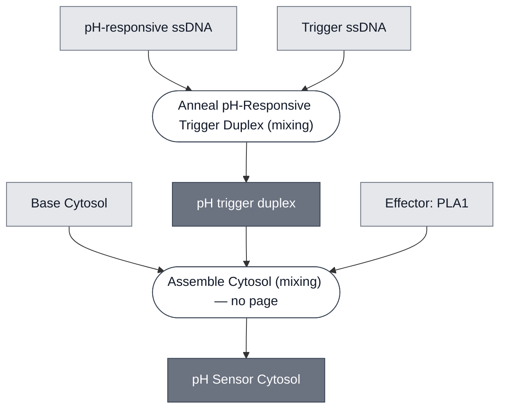

# Overview

The pH Sensor Cytosol is the aqueous phase of the [pH Sensing Cell](../ph-sensing-cell/spec.md): [Base Cytosol](../base-cytosol/spec.md) carrying the [pH-Sensing Module](../detector-ph/spec.md) — an annealed trigger duplex and a toehold-gated template — together with the [PLA1 Lysis Module](../effector-pla1/spec.md) the toehold switch gates. It is mixed before encapsulation, not added to a closed compartment.

Compare the [aTc Sensor Cytosol](../atc-sensor-cytosol/spec.md), which shares the Base Cytosol background and swaps the detector. This cytosol carries **no** reporter enzyme: the pH path reports through CPRG released on lysis, and the LacZ that converts it is dispersed in the gel.

:::{attention} 🚧 Draft
This page is a work in progress and not yet ready for use.
:::

# Reference Composition

:::::{tab-set}

<!-- gen:composition-diagram -->
::::{tab-item} Module Dependencies

::::
<!-- /gen:composition-diagram -->

::::{tab-item} DNA

:::{table} Constructs in the pH Sensor Cytosol.
| **Name** | **Length (bp)** | **File** | **Supply route** |
| --- | --- | --- | --- |
| `pT7-toehold9-PLA1` | 1203 | [pT7-toehold9-PLA1-linear.gb](https://github.com/nucleus-eng/DNA/blob/main/effectors/detector-ph/pT7-toehold9-PLA1-linear.gb) | Expressed in the cytosol at 2 nM |
| pH-responsive ssDNA | 49 | [pH-responsive-ssDNA-2.gb](https://github.com/nucleus-eng/DNA/blob/main/detectors/detector-ph/pH-responsive-ssDNA-2.gb) | Synthesized oligonucleotide, annealed before mixing |
| trigger ssDNA | 36 | [trigger-ssDNA-3.gb](https://github.com/nucleus-eng/DNA/blob/main/detectors/detector-ph/trigger-ssDNA-3.gb) | Synthesized oligonucleotide, annealed before mixing |
:::

The toehold switch and the effector are on one molecule, so [PLA1](../effector-pla1/spec.md) has no construct of its own here.

::::

::::{tab-item} Cytosol

:::{table} Cytosolic components of the pH Sensor Cytosol, at reaction concentration.
| Module | Working concentration | Notes |
| --- | --- | --- |
| [Base Cytosol](../base-cytosol/spec.md) | At reaction concentration | Transcription and translation |
| [pH-Sensing Module](../detector-ph/spec.md) | `pT7-toehold9-PLA1` template at 2 nM; pH-responsive ssDNA : trigger ssDNA duplex (3:1, annealed) at 4.625 µM trigger ssDNA | The duplex is annealed before it enters this mixture — see Process |
| [PLA1 Lysis Module](../effector-pla1/spec.md) | Covered by the 2 nM toehold-gated template | The switch and the effector are on one molecule |
| Optiprep | 4.5% (v/v) | Density agent for the phase-transfer step. Present in the encapsulated reaction and not in the bulk one |
| RNase inhibitor | 1000 U/mL | Half the 2000 U/mL used in the bulk module reaction |
| Sulfo-Cyanine5 | 2 µM, optional | Membrane-independent fill marker, used when the lumen needs to be visible. Sulfo-Cyanine5 carboxylic acid, Lumiprobe 13390 |
:::

::::

:::::

**Optiprep is a process reagent that has to sit in the composition.** It is present because of how the cell is encapsulated, not because the sensing function needs it, and it is absent from the bulk reaction. It is listed here because it is in the tube.

# Constituent Modules

- [Base Cytosol](../base-cytosol/spec.md) — transcription and translation
- [pH-Sensing Module](../detector-ph/spec.md) — trigger duplex and toehold-gated template
- [PLA1 Lysis Module](../effector-pla1/spec.md) — carried on the same molecule as the switch

# Process

- [Anneal pH-Responsive Trigger Duplex](../../processes/anneal-ph-trigger-duplex/main.md) — anneals the sensing and trigger strands into the single duplex reagent, **before** this cytosol is mixed.
- [Assemble Base Cytosol](../../processes/assemble-base-cytosol/main.md) — produces the Base Cytosol background.

This cytosol is consumed by [Encapsulation: Phase Transfer](../../processes/assemble-base-cell/main.md), which combines it with the [Chicago Membrane](../membrane-popc-chol-chicago/spec.md) to form the [pH Sensing Cell](../ph-sensing-cell/spec.md).

# Credits

Developed by the Chicago Node (Kamat Lab and Liu Lab).

:::{attention} Credits are draft
Contributor attribution on this page has not been confirmed with the Node. Assign each credit explicitly before this page is merged to `main`.
:::
