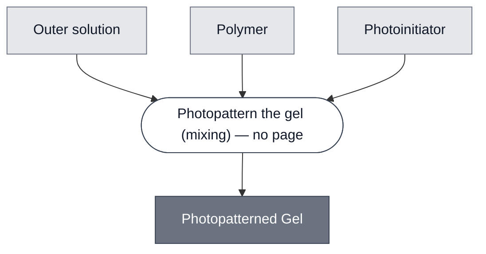

# Overview

<!-- gen:position -->
**Position.** Refines [`gel`](../gel/spec.md). Refined by [`gel-peg-norbornene`](../gel-peg-norbornene/spec.md), [`gel-pegda`](../gel-pegda/spec.md).
<!-- /gen:position -->

A class: a [Gel](../gel/spec.md) whose shape is set by projected light.

Every member sets only where the light falls, so its geometry comes from an image rather than from a container. A thermally or ionically set gel takes the shape of whatever it is poured into. A photopatterned gel is shaped when it is cast, and its shape can differ between two places in the same well.

:::{attention} 🚧 Draft
This page is a work in progress and not yet ready for use.
:::

# Reference Composition

:::::{tab-set}

<!-- gen:composition-diagram -->
::::{tab-item} Module Dependencies

::::
<!-- /gen:composition-diagram -->

::::{tab-item} Outer Solution

:::{table} What each member puts in the outer solution slot.
| Member | Outer solution |
| --- | --- |
| [PEG-Norbornene](../gel-peg-norbornene/spec.md) | PBS, deionized water or buffer |
| [PEGDA](../gel-pegda/spec.md) | PBS |
:::

::::

::::{tab-item} Polymer

:::{table} What each member puts in the polymer slot, by crosslinking chemistry.
| Member | Polymer | Chemistry |
| --- | --- | --- |
| [PEG-Norbornene](../gel-peg-norbornene/spec.md) | 4-arm PEG-norbornene with a PEG4SH crosslinker | step-growth thiol-ene, with the network defined by the arms and the crosslinker |
| [PEGDA](../gel-pegda/spec.md) | PEGDA575 | radical acrylate chain-growth, with the network defined by chain propagation |
:::

::::

::::{tab-item} Photoinitiator

A photoinitiator is the constituent this class adds to the outer solution and polymer of a [Gel](../gel/spec.md).

:::{table} What each member puts in the photoinitiator slot.
| Member | Photoinitiator | Light |
| --- | --- | --- |
| [PEG-Norbornene](../gel-peg-norbornene/spec.md) | LAP | 405 nm |
| [PEGDA](../gel-pegda/spec.md) | LAP | 405 nm |
:::

::::

:::::

# Expected Behavior

A Photopatterned Gel is expected to set only where the light falls, so the pattern is the projected image. That makes it a route to spatial separation: two populations set into separate regions of one piece stay apart, which is what a composition needs when each would otherwise act on the other.

What an embedded payload survives depends on the chemistry. Radical acrylate polymerization is not compatible with lipid membranes, so [Gel: PEGDA](../gel-pegda/spec.md) is canceled as a cell-carrying gel. [Gel: PEG-Norbornene](../gel-peg-norbornene/spec.md) is the live chemistry, as [Embedding: Photodevelopment](../../processes/embed-photodevelopment/main.md) records.

# Requirements

Requires a photoinitiator (e.g. LAP, which both members use).

Requires 405 nm light projected as a pattern rather than as flood illumination.

Requires that anything embedded tolerate the light exposure and the radicals the photoinitiator generates.

# Processes

[Embedding: Photodevelopment](../../processes/embed-photodevelopment/main.md) is the one step: it mixes the outer solution, the polymer and the photoinitiator, and exposes the result as a pattern. Both members form by it.

# Credits

:::{attention} Credits are draft
Contributor attribution on this page has not been confirmed with the Node. Assign each credit explicitly before this page is merged to `main`.
:::
