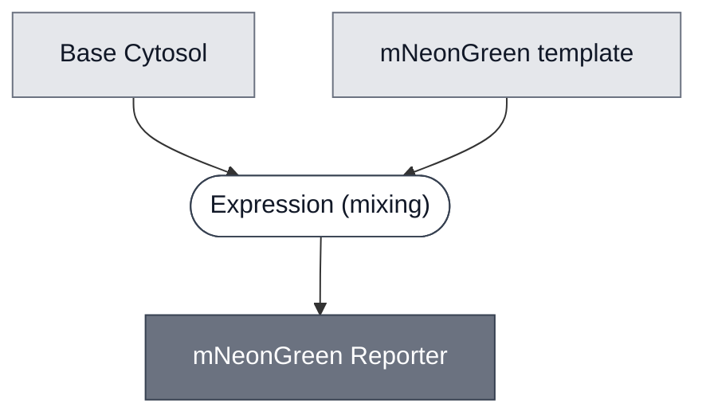

# Overview

<!-- gen:position -->
**Position.** Refines [Reporter](../reporter/spec.md) and [Chromophore](../chromophore/spec.md). Refined by nothing on this branch.
<!-- /gen:position -->

The mNeonGreen Reporter Module produces mNeonGreen, a monomeric green fluorescent protein derived from the lancelet *Branchiostoma lanceolatum*. The protein is the signal, so no substrate is added and the reaction is read directly on a green fluorescence channel.

mNeonGreen excites at 506 nm and emits at 517 nm, with an extinction coefficient of 116 000 M⁻¹ cm⁻¹ and a quantum yield of 0.80. It matures in about 10 min, has a fluorescence lifetime of 3.1 ns, and has a pKa of 5.7. Reference values are from [FPbase: mNeonGreen](https://www.fpbase.org/protein/mneongreen/), and the protein was first reported by [Shaner et al., 2013](https://doi.org/10.1038/nmeth.2413).

:::{attention} 🚧 Draft
This page is a work in progress and not yet ready for use. The Module runs in both Base Cytosol and S30 Lysate, no working concentration for its own template is on record in either, and every reading on this page comes from Base Cytosol. All three are stated below.
:::

# Reference Composition

:::::{tab-set}

<!-- gen:composition-diagram -->
::::{tab-item} Module Dependencies

::::
<!-- /gen:composition-diagram -->

::::{tab-item} DNA

:::{table} Templates carrying the mNeonGreen coding sequence. A length is given only where a sequence exists to read it from.
:label: comp-reporter-mneongreen-constructs

| Construct | Role |
| --- | --- |
| `T7-mNG-T7term` | This Module's own template: the coding sequence with nothing in front of it. It is the unrepressed reference that gated readings are scaled against. No sequence exists for it |
| `T7-[EsaO]2-mNG-T7term` | 1118 bp. The same coding sequence behind two tandem `EsaO` operator sites. Belongs to [Detector: 3OC6-HSL (EsaR)](../detector-esar/spec.md) |
| `T7-[EsaO]-mNG-T7term` | 1098 bp. The same coding sequence behind one `EsaO` site |
:::

**The coding sequence is mNeonGreen as published, with nothing added to it.** It runs 711 bp, which is 236 residues and a stop codon, and those residues are the reference sequence character for character. The two operator-bearing templates carry it base for base, so they differ from each other only in the operator region.

:::{attention} The sequence files are not in `nucleus-eng/DNA`
No file for any template above is in [nucleus-eng/DNA](https://github.com/nucleus-eng/DNA), and the two lengths were read from sequences held elsewhere. @Editor(london): land them there and check each length against its `LOCUS` line. `T7-mNG-T7term` has no sequence at all and is the one to supply first, because it is the reference every gated reading is scaled against.
:::

::::

::::{tab-item} Cytosol

:::{table} The reporter reaction as assembled in Base Cytosol, with no repressor and no operator in it.
:label: comp-reporter-mneongreen-cytosol

| Component | Stock concentration | Final concentration |
| --- | --- | --- |
| [Base Cytosol](../base-cytosol/spec.md) | — | 1× |
| `T7-mNG-T7term` template | not recorded | **not recorded** |
| RNase inhibitor | 40 U/µL | 1 U/µL |
:::

**This is the Base Cytosol build, and it is the only one recorded.** The Module also runs in [S30 Lysate](../s30-lysate/spec.md), and no composition exists for that reaction. @Editor(london): give the S30 Lysate form its own column here.

**The template dose is the gap on this page.** The one build on record gives the template as a volume with no concentration behind it. The same coding sequence behind an `EsaO` operator ran across 0.1 to 9 nM, but those doses were chosen to move a repressor-to-template ratio, so none of them is this Module's working concentration. @Editor(london): state the dose for the plain reporter.

::::

:::::

# Expected Behavior

The mNeonGreen Reporter Module is expected to give green fluorescence that rises over the course of a reaction, with no substrate added and no second molecule required.

## Cytosols

The Module runs in both [Base Cytosol](../base-cytosol/spec.md) and [S30 Lysate](../s30-lysate/spec.md). What is on record for the two is not the same, so they are stated apart.

**Base Cytosol, with the readings.** Fluorescence has been read on a Synergy 2 plate reader, as a 6 h kinetic at 37 °C with a reading every 5 min, against a fluorescein ladder at 0, 0.5, 1 and 2 µM. In those runs this Module was the unrepressed reference and gave the signal the gated arms were measured against. **No yield, no time to half-maximum and no template dose is recorded for it**, so the page cannot say how bright the reaction gets or how fast it gets there.

**S30 Lysate, with none.** The Module expresses and fluoresces here as well. No trace, no yield, no template dose and no reader setting is recorded, so every figure and every setting above belongs to Base Cytosol alone. @Editor(london): supply one S30 Lysate run, so the two cytosols can be compared on this page.

:::{attention} The green channel is standard, and this protein sits at the blue edge of it
Every reading on record was taken on the standard green channel — 485/20 excitation, 528/20 emission, 510 nm top mirror. mNeonGreen's own maxima are 506 nm and 517 nm, which sit bluer than that channel is centred for, so the protein is collected off its peak. It reads fine: the traces are usable, and comparisons between arms hold because every arm was read the same way. A filter set matched to 506/517 would collect more of the signal, and is what an absolute brightness figure for this Module should be taken through. @Editor(london): confirm whether a matched set is available, and re-read one reaction through it.
:::

:::{attention} No figure yet
@Editor(london): the readings above have no plot on this page.
:::

## Cells

:::{warning} Not yet validated
This Module has not been demonstrated in a synthetic cell. Every reading on record is bulk cytosol.
:::

# Requirements

Requires pT7 transcription and translation — for example [Base Cytosol](../base-cytosol/spec.md) or [S30 Lysate](../s30-lysate/spec.md), both of which this Module runs in.

Requires a reader able to excite near 506 nm and collect near 517 nm. A standard green channel does this, with the protein sitting at the blue edge of it.

mNeonGreen is sensitive to acid: its reported pKa is 5.7, so fluorescence falls as a compartment acidifies. Nothing on this page tests it, and the figure comes from the reference entry rather than from a run here.

# Processes

- [Expression](../../processes/express/main.md) — makes the protein from the template, in the compartment that reads it.

No Process page documents the fluorescence readout. What was used is a Synergy 2 plate reader on the standard green channel, 485/20 excitation and 528/20 emission, at 37 °C. @Editor: write the readout up, or say which Module it belongs with.

# Constituent Modules

- [Base Cytosol](../base-cytosol/spec.md) — transcription and translation, at 1×, in the one build on record
- mNeonGreen template — DNA encoding the reporting protein

# Credits

:::{attention} Credits are draft
Contributor attribution on this page has not been confirmed with the Node. Assign each credit explicitly before this page is merged to `main`.
:::
