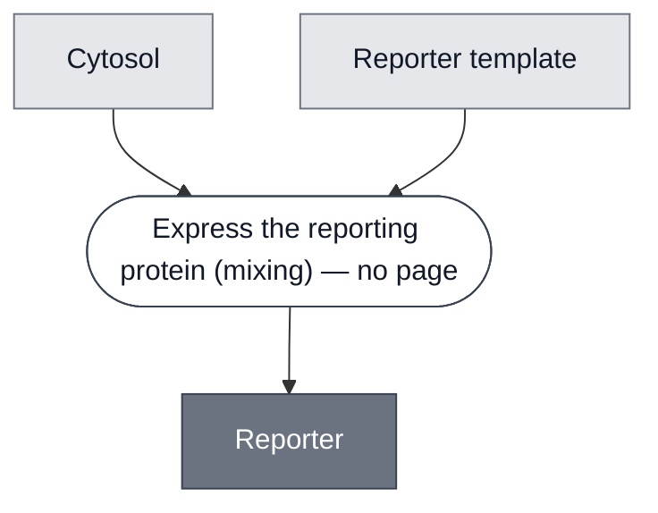

# Overview

<!-- gen:position -->
**Position.** Refines nothing declared. Refined by [`color-change`](../color-change/spec.md), [`reporter-degfp`](../reporter-degfp/spec.md).
<!-- /gen:position -->

A class: a [Cytosol](../cytosol/spec.md) expressing a protein that makes a signal. Three sourced
members, and one of them is itself a class.

**It refines nothing, and it exists because the members do not agree on what a signal costs.**
Two of the three need a second molecule to produce one. The third does not, because the protein
is the signal.

:::{attention} 🚧 Draft
This page is a work in progress and not yet ready for use.
:::

# Reference Composition

:::::{tab-set}

<!-- gen:composition-diagram -->
::::{tab-item} Module Dependencies

::::
<!-- /gen:composition-diagram -->

::::{tab-item} DNA

**Every member expresses its reporting protein from a template**, three of three, and that is the class invariant.

:::{table} What the members put in this slot.
| Member | Template |
| --- | --- |
| [LacZ Reporter](../reporter-lacz/spec.md) | `T7pro-LacZ-T7term`, not yet in `nucleus-eng/DNA` |
| [XylE Reporter](../reporter-xyle/spec.md) | `pT7-TetO-catecholase` (`pMN067`), not yet in `nucleus-eng/DNA` |
| [deGFP Reporter](../reporter-degfp/spec.md) | `pOpen-deGFP` |
:::

**The template is not the only supply route.** [LacZ Enzyme](../reporter-lacz-enzyme/spec.md) is the purified protein and refines [LacZ Reporter](../reporter-lacz/spec.md) rather than this class, because a supply form is a form of one reporter and not a reporter of its own.

::::

:::::

**Members are a different relation from constituents.** In `compositional-biology-theory`,
`glossary.md#T34` makes Constituent a containment relation and `glossary.md#T13` makes membership
a matter of what a sort classifies.

**The invariant is expression, three of three.** Every sourced member mixes a cytosol with a
template encoding the reporting protein. That much is shared and it is all that is shared.

:::{table} What varies is whether a second molecule is needed.
| Member | Signal | Needs a substrate? |
| --- | --- | --- |
| [Color Change](../color-change/spec.md) | absorbance | **yes**, and holding it apart is that class's invariant |
| [LacZ Reporter](../reporter-lacz/spec.md) | absorbance, via Color Change | yes, CPRG |
| [XylE Reporter](../reporter-xyle/spec.md) | absorbance, via Color Change | yes, catechol |
| [deGFP Reporter](../reporter-degfp/spec.md) | **fluorescence**, 488 nm and 561 nm | **no** |
:::

**deGFP is the case that forced this page.** It was declared `measured_by` the Colorimetric
Readout, whose own page scopes itself to a chromogenic substrate hydrolyzed by a reporter enzyme
and read by absorbance. deGFP has neither. Corrected 2026-09-21.

# Constituent Modules

- [Cytosol](../cytosol/spec.md) — the expression machinery
- Reporter template — DNA encoding the reporting protein. No page: a class composes abstract constituents

# Requirements

Requires a cytosol that can express the template. **Whether it also requires a substrate is what
divides the class**, so the class itself requires none.

# Processes

See the composition source. One step, `mixing`, and it has no page because no process in this
corpus expresses a generic reporter.

# Credits

:::{attention} Credits are draft
Contributor attribution on this page has not been confirmed with the Node. Assign each credit
explicitly before this page is merged to `main`.
:::
