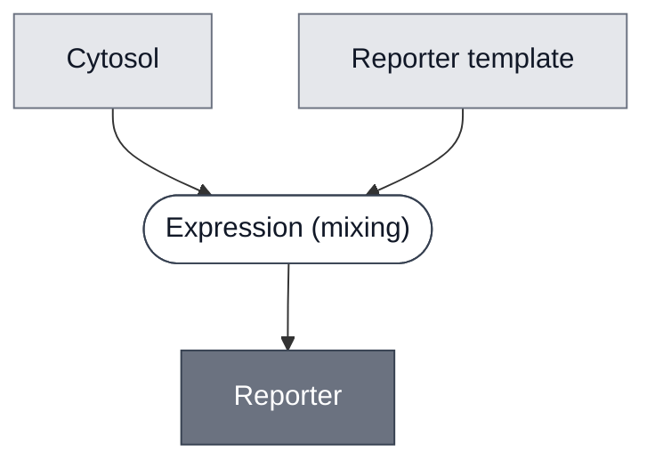

# Overview

<!-- gen:position -->
**Position.** Refines nothing declared. Refined by [`color-change`](../color-change/spec.md), [`reporter-degfp`](../reporter-degfp/spec.md).
<!-- /gen:position -->

A class: a [Cytosol](../cytosol/spec.md) expressing a protein that makes a signal.

Every member expresses its reporting protein from a DNA template. Members differ in whether the protein needs a second molecule to make a signal. [Color Change](../color-change/spec.md) and its members need a substrate. [deGFP Reporter](../reporter-degfp/spec.md) does not, because the protein is the signal.

:::{attention} 🚧 Draft
This page is a work in progress and not yet ready for use.
:::

# Reference Composition

:::::{tab-set}

<!-- gen:composition-diagram -->
::::{tab-item} Module Dependencies

```mermaid
flowchart TD
    CYTOSOL["Cytosol"]
    REPORTER_TEMPLATE["Reporter template"]

    P1_EXPRESS_THE_REPORTER_0(["Expression (mixing)"])
    REPORTER["Reporter"]

    CYTOSOL --> P1_EXPRESS_THE_REPORTER_0
    REPORTER_TEMPLATE --> P1_EXPRESS_THE_REPORTER_0
    P1_EXPRESS_THE_REPORTER_0 --> REPORTER


    classDef leaf     fill:#e5e7eb,stroke:#6b7280,color:#111827;
    classDef composed fill:#6b7280,stroke:#374151,color:#ffffff;
    classDef process  fill:#ffffff,stroke:#374151,color:#111827;
    class CYTOSOL,REPORTER_TEMPLATE leaf;
    class REPORTER composed;
    class P1_EXPRESS_THE_REPORTER_0 process;

    click CYTOSOL "/docs/modules/cytosol/spec"
    click P1_EXPRESS_THE_REPORTER_0 "/docs/processes/express/main"
    click REPORTER "/docs/modules/reporter/spec"
```

::::
<!-- /gen:composition-diagram -->

::::{tab-item} Cytosol

:::{table} What each member puts in the cytosol slot.
| Member | Cytosol |
| --- | --- |
| [LacZ Reporter](../reporter-lacz/spec.md) | [Base Cytosol](../base-cytosol/spec.md) |
| [XylE Reporter](../reporter-xyle/spec.md) | [Base Cytosol](../base-cytosol/spec.md) |
| [deGFP Reporter](../reporter-degfp/spec.md) | [Base Cytosol](../base-cytosol/spec.md) |
:::

::::

::::{tab-item} DNA

:::{table} What each member puts in the template slot.
| Member | Template |
| --- | --- |
| [LacZ Reporter](../reporter-lacz/spec.md) | `T7pro-LacZ-T7term`, not yet in `nucleus-eng/DNA` |
| [XylE Reporter](../reporter-xyle/spec.md) | `pT7-TetO-catecholase` (`pMN067`). Two constructs of the same design are in `nucleus-eng/DNA` under the name `C23DO`, and whether one of them is this is unconfirmed |
| [deGFP Reporter](../reporter-degfp/spec.md) | `pOpen-deGFP` |
:::

The template is not the only way to supply the protein. LacZ can also be added as purified enzyme. See [LacZ](../lacz/spec.md).

::::

:::::

# Expected Behavior

A Reporter is expected to give a signal that a reader can measure, once its cytosol has expressed the template. What the signal is, and whether it needs a second molecule, depends on the member.

:::{table} What each member signals, and whether it needs a substrate.
| Member | Signal | Needs a substrate? |
| --- | --- | --- |
| [LacZ Reporter](../reporter-lacz/spec.md) | absorbance | yes, CPRG |
| [XylE Reporter](../reporter-xyle/spec.md) | absorbance | yes, catechol |
| [deGFP Reporter](../reporter-degfp/spec.md) | fluorescence, 488 nm channel | no |
:::

The two members that need a substrate go through [Color Change](../color-change/spec.md), which holds the enzyme and the substrate apart until a trigger. [Colorimetric Readout](../../processes/colorimetric-readout/main.md) reads their absorbance. deGFP is read by fluorescence.

# Constituent Modules

- [Cytosol](../cytosol/spec.md) — the expression machinery
- Reporter template — DNA encoding the reporting protein

# Requirements

Requires a cytosol that can express the template. A member whose signal comes from a substrate also requires that substrate. See [Color Change](../color-change/spec.md).

# Processes

A member is made by [Expression](../../processes/express/main.md): the cytosol supplies the machinery and the template supplies the sequence, in one compartment.

# Credits

:::{attention} Credits are draft
Contributor attribution on this page has not been confirmed with the Node. Assign each credit
explicitly before this page is merged to `main`.
:::
