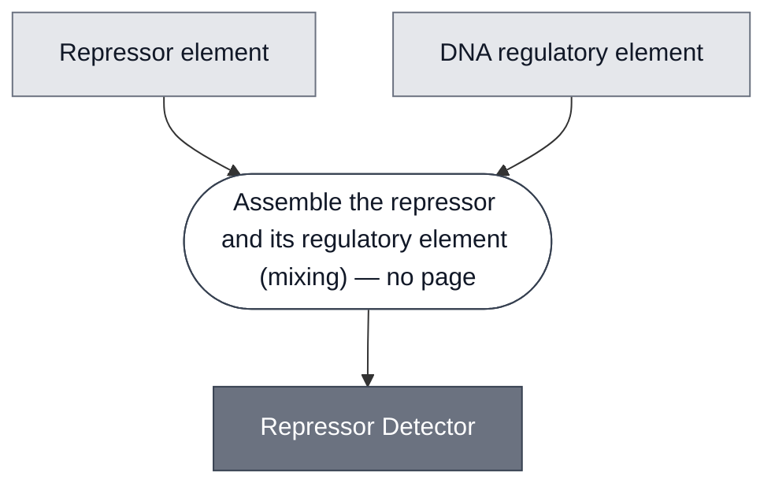

# Overview

<!-- gen:position -->
**Position.** Refines [Detector](../detector/spec.md). Refined by [Detector: 3OC6-HSL (EsaR)](../detector-esar/spec.md), [LacI/IPTG Detector](../detector-laci-iptg/spec.md), [tetR-aTc Detector](../detector-tetr-atc/spec.md).
<!-- /gen:position -->

A class: a [Detector](../detector/spec.md) in which a repressor holds a gene off until the analyte relieves it.

Every member has two elements. A repressor element binds a DNA regulatory element and holds expression down. The analyte binds the repressor, the repressor lets go, and expression goes up. Members differ in the analyte, in the repressor and operator that implement the binding, and in how the repressor element is supplied.

:::{attention} 🚧 Draft
This page is a work in progress and not yet ready for use.
:::

# Reference Composition

:::::{tab-set}

<!-- gen:composition-diagram -->
::::{tab-item} Module Dependencies

::::
<!-- /gen:composition-diagram -->

::::{tab-item} Repressor element

The repressor element binds the regulatory element and holds the gene off. It is supplied as a purified protein, or as DNA that expresses the protein in place.

:::{table} What each member puts in the repressor element slot.
| Member | Analyte | Repressor element |
| --- | --- | --- |
| [Detector: tetR-aTc](../detector-tetr-atc/spec.md) | [aTc](../analyte-atc/spec.md) | TetR, as purified protein or expressed from `pT7-tetR` |
| [Detector: LacI-IPTG](../detector-laci-iptg/spec.md) | [IPTG](../analyte-iptg/spec.md) | LacI, as purified protein or expressed from `pT7-lacI` |
| [Detector: 3OC6-HSL (EsaR)](../detector-esar/spec.md) | [3OC6-HSL](../analyte-3oc6-hsl/spec.md) | EsaR(D91G), a LuxR homolog that represses where LuxR activates. Expressed in a separate reaction from `T7-EsaR(D91G)-T7term` and added as protein. Purified protein is available from Biocrest and has not been used. |
:::

How the repressor element is supplied is not fixed by the class. A protein is mixed in. DNA is two constructs mixed, or one construct carrying both. Both built members use two constructs: `pT7-tetR` with `pT7-tetO-plamGFP`, and `pT7-lacI` with `pT7-lacO-plamGFP`. A repressor supplied as DNA is expressed in the reaction, or in a separate reaction first, as described in [Expression](../../processes/express/main.md).

::::

::::{tab-item} DNA regulatory element

The regulatory element is DNA, always: the operator or promoter the repressor binds.

:::{table} What each member puts in the regulatory element slot.
| Member | Regulatory element |
| --- | --- |
| [Detector: tetR-aTc](../detector-tetr-atc/spec.md) | the `tetO` operator, in `pT7-tetO-plamGFP` |
| [Detector: LacI-IPTG](../detector-laci-iptg/spec.md) | the `lacO` operator, in `pT7-lacO-plamGFP` |
| [Detector: 3OC6-HSL (EsaR)](../detector-esar/spec.md) | the `EsaO` operator, one or two tandem copies, in `T7-[EsaO]2-mNG-T7term` |
:::

::::

:::::

# Expected Behavior

A Repressor Detector is expected to hold expression of its downstream gene down until the analyte arrives. The analyte then releases the repressor from the regulatory element, and expression recovers.

The preparation of the repressor matters, and not only how it is supplied. [Detector: tetR-aTc](../detector-tetr-atc/spec.md) compares three preparations of TetR. All three repressed expression, and only the one expressed overnight in a cell-free reaction induced it in Nucleus Cytosol. The two that failed were purified preparations with different tags and sources. That page reads the tag and the source as functional parameters rather than sourcing detail, and notes that the comparison cannot separate the route from the preparation.

The second member says the same thing and points the other way on one detail. [Detector: 3OC6-HSL (EsaR)](../detector-esar/spec.md) compares two donor incubations of the same cell-free route: the longer one holds the fold change and lowers the yield. So "expressed overnight in a cell-free reaction" names a route for TetR and a cost for EsaR, and the two results together say the donor's age is a parameter rather than a detail.

**One parameter is shared by both members and is easy to miss.** How long the repressor sits with its regulatory element before the working reaction starts changes the result. On the EsaR member, 15 min gives about a twofold change and 1 h gives about fivefold. The class already requires the two elements to be present together before the analyte arrives; this says how long together is also a choice.

# Requirements

Requires transcription and translation. Which kind follows the cytosol rather than the detector.

Requires an analyte that reaches the repressor element.

Requires that the repressor element and the regulatory element be present together before the analyte arrives. A repressor added after induction has nothing to relieve.

# Processes

A member is made by mixing the repressor element with its DNA regulatory element in one compartment. No Process page covers this step on its own.

# Constituent Modules

- Repressor element — TetR or LacI in the built members, EsaR in the designed one
- DNA regulatory element — the operator or promoter the repressor binds

# Credits

:::{attention} Credits are draft
Contributor attribution on this page has not been confirmed with the Node. Assign each credit explicitly before this page is merged to `main`.
:::
