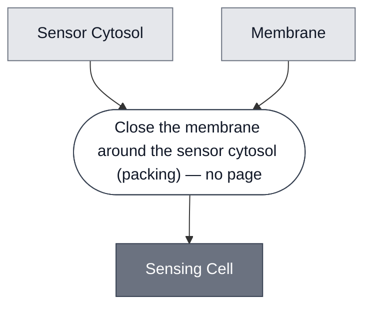

# Overview

<!-- gen:position -->
**Position.** Refines [`cell`](../cell/spec.md). Refined by [`ahl-sensing-cell`](../ahl-sensing-cell/spec.md), [`atc-sensing-cell`](../atc-sensing-cell/spec.md), [`ph-sensing-cell`](../ph-sensing-cell/spec.md), [`theophylline-sensing-cell`](../theophylline-sensing-cell/spec.md).
<!-- /gen:position -->

A class: a [Cell](../cell/spec.md) whose cytosol is a
[Sensor Cytosol](../sensor-cytosol/spec.md). Four members.

**The refinement from its parent is one slot.** The membrane slot is untouched. Only the cytosol
narrows.

:::{attention} 🚧 Draft
This page is a work in progress and not yet ready for use.
:::

# Reference Composition

:::::{tab-set}

<!-- gen:composition-diagram -->
::::{tab-item} Module Dependencies

::::
<!-- /gen:composition-diagram -->

:::::

**Members are a different relation from constituents.** In `compositional-biology-theory`,
`glossary.md#T34` makes Constituent a containment relation and `glossary.md#T13` makes
membership a matter of what a sort classifies.

**`SensingCell = SensorCytosol ⊗ Membrane`, `packing` over exactly two operands, four of
four**, and the final step is the same step in all four.

:::{table} What varies is the membrane, not the shape.
| Member | Sensor cytosol | Membrane |
| --- | --- | --- |
| [AHL Sensing Cell](../ahl-sensing-cell/spec.md) | AHL | [POPC](../membrane-popc/spec.md) |
| [aTc Sensing Cell](../atc-sensing-cell/spec.md) | aTc | [Chicago POPC/Chol](../membrane-popc-chol-chicago/spec.md) |
| [pH Sensing Cell](../ph-sensing-cell/spec.md) | pH | [Chicago POPC/Chol](../membrane-popc-chol-chicago/spec.md) |
| [Theophylline Sensing Cell](../theophylline-sensing-cell/spec.md) | Theophylline | [Chicago POPC/Chol](../membrane-popc-chol-chicago/spec.md) |
:::

**Both membranes refine [Membrane](../membrane/spec.md)**, so the slot holds across all four.

# Requirements

Requires that the cytosol be composed before encapsulation rather than added to a closed
chassis. Four of four do this.

# Constituent Modules

- [Sensor Cytosol](../sensor-cytosol/spec.md) — the cytosol slot, narrowed from its parent
- [Membrane](../membrane/spec.md) — the boundary, unchanged from its parent

# Processes

See the composition source. The step this class runs is stated there, and it has no page
because no process in this corpus performs it at this grain.

# Credits

:::{attention} Credits are draft
Contributor attribution on this page has not been confirmed with the Node. Assign each credit
explicitly before this page is merged to `main`.
:::
