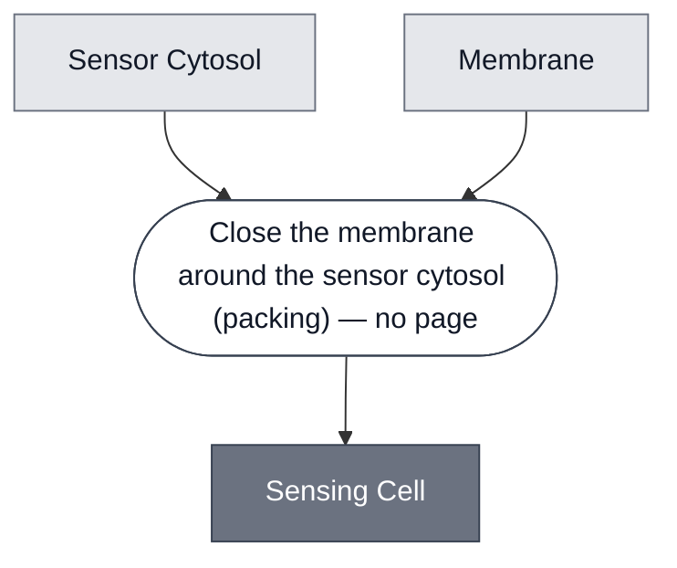

# Overview

<!-- gen:position -->
**Position.** Refines [`cell`](../cell/spec.md). Refined by [`ahsl-sensing-cell`](../ahsl-sensing-cell/spec.md), [`atc-sensing-cell`](../atc-sensing-cell/spec.md), [`ph-sensing-cell`](../ph-sensing-cell/spec.md), [`theophylline-sensing-cell`](../theophylline-sensing-cell/spec.md).
<!-- /gen:position -->

A class: a [Cell](../cell/spec.md) whose cytosol is a [Sensor Cytosol](../sensor-cytosol/spec.md).

Every member packs a sensor cytosol and a membrane. Only the cytosol slot narrows from Cell, and the membrane slot stays as it is in Cell.

:::{attention} 🚧 Draft
This page is a work in progress and not yet ready for use.
:::

# Reference Composition

:::::{tab-set}

<!-- gen:composition-diagram -->
::::{tab-item} Module Dependencies

```mermaid
flowchart TD
    SENSOR_CYTOSOL["Sensor Cytosol"]
    MEMBRANE["Membrane"]

    P1_ENCAPSULATE_0(["Close the membrane around the sensor cytosol (packing) — no page"])
    SENSING_CELL["Sensing Cell"]

    SENSOR_CYTOSOL --> P1_ENCAPSULATE_0
    MEMBRANE --> P1_ENCAPSULATE_0
    P1_ENCAPSULATE_0 --> SENSING_CELL


    classDef leaf     fill:#e5e7eb,stroke:#6b7280,color:#111827;
    classDef composed fill:#6b7280,stroke:#374151,color:#ffffff;
    classDef process  fill:#ffffff,stroke:#374151,color:#111827;
    class SENSOR_CYTOSOL,MEMBRANE leaf;
    class SENSING_CELL composed;
    class P1_ENCAPSULATE_0 process;

    click SENSOR_CYTOSOL "/docs/modules/sensor-cytosol/spec"
    click MEMBRANE "/docs/modules/membrane/spec"
    click SENSING_CELL "/docs/modules/sensing-cell/spec"
```

::::
<!-- /gen:composition-diagram -->

::::{tab-item} Cytosol

:::{table} What each member puts in the cytosol slot.
| Member | Sensor cytosol |
| --- | --- |
| [SensorCell[3OC6-HSL ⟶ PLA1]](../ahsl-sensing-cell/spec.md) | [SensorCytosol[3OC6-HSL ⟶ PLA1]](../ahsl-sensor-cytosol/spec.md) |
| [SensorCell[aTc ⟶ PLA1]](../atc-sensing-cell/spec.md) | [SensorCytosol[aTc ⟶ PLA1]](../atc-sensor-cytosol/spec.md) |
| [SensorCell[pH ⟶ PLA1]](../ph-sensing-cell/spec.md) | [SensorCytosol[pH ⟶ PLA1]](../ph-sensor-cytosol/spec.md) |
| [Theophylline Sensing Cell](../theophylline-sensing-cell/spec.md) | [Theophylline Sensor Cytosol](../theophylline-sensor-cytosol/spec.md) |
:::

::::

::::{tab-item} Membrane

:::{table} What each member puts in the membrane slot.
| Member | Membrane |
| --- | --- |
| [SensorCell[3OC6-HSL ⟶ PLA1]](../ahsl-sensing-cell/spec.md) | [POPC](../membrane-popc/spec.md) |
| [SensorCell[aTc ⟶ PLA1]](../atc-sensing-cell/spec.md) | [Membrane: POPC/Chol (9:1)](../membrane-popc-chol-chicago/spec.md) |
| [SensorCell[pH ⟶ PLA1]](../ph-sensing-cell/spec.md) | [Membrane: POPC/Chol (9:1)](../membrane-popc-chol-chicago/spec.md) |
| [Theophylline Sensing Cell](../theophylline-sensing-cell/spec.md) | [Membrane: POPC/Chol (9:1)](../membrane-popc-chol-chicago/spec.md) |
:::

::::

:::::

# Expected Behavior

A Sensing Cell is expected to respond to its analyte from inside a closed membrane. The detector in its sensor cytosol gates the reaction, and the membrane keeps that reaction in a compartment of its own.

# Requirements

Requires that the sensor cytosol be complete before the membrane closes around it, as for any [Cell](../cell/spec.md).

# Constituent Modules

- [Sensor Cytosol](../sensor-cytosol/spec.md) — the cytosol slot, narrowed from its parent
- [Membrane](../membrane/spec.md) — the boundary, unchanged from its parent

# Processes

[Encapsulation](../../processes/encapsulate/main.md) closes the membrane around the sensor cytosol. Every member uses the [Phase Transfer](../../processes/assemble-base-cell/main.md) route.

# Credits

:::{attention} Credits are draft
Contributor attribution on this page has not been confirmed with the Node. Assign each credit
explicitly before this page is merged to `main`.
:::
