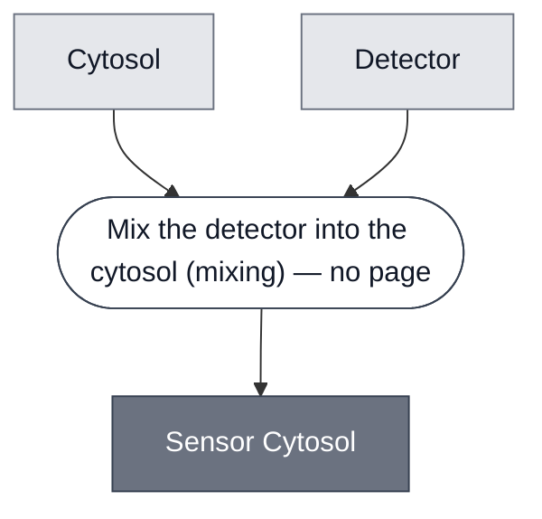

# Overview

<!-- gen:position -->
**Position.** Refines [`cytosol`](../cytosol/spec.md). Refined by [`ahsl-sensor-cytosol`](../ahsl-sensor-cytosol/spec.md), [`atc-sensor-cytosol`](../atc-sensor-cytosol/spec.md), [`ph-sensor-cytosol`](../ph-sensor-cytosol/spec.md), [`theophylline-sensor-cytosol`](../theophylline-sensor-cytosol/spec.md).
<!-- /gen:position -->

A class: a [Cytosol](../cytosol/spec.md) with a [Detector](../detector/spec.md) mixed into
it. Four members.

**The refinement from its parent is one input.** A cytosol expresses. A sensor cytosol expresses
and responds, because something in the same compartment gates it.

:::{attention} 🚧 Draft
This page is a work in progress and not yet ready for use.
:::

# Reference Composition

:::::{tab-set}

<!-- gen:composition-diagram -->
::::{tab-item} Module Dependencies

::::
<!-- /gen:composition-diagram -->

::::{tab-item} DNA

**The detector is the nucleic acid or protein that gates the reaction**, and it is not always a Module.

:::{table} What the four members put in this slot.
| Member | Sensing element |
| --- | --- |
| [AHSL Sensor Cytosol](../ahsl-sensor-cytosol/spec.md) | [Detector: 3OC6-HSL](../detector-3oc6-hsl/spec.md) |
| [aTc Sensor Cytosol](../atc-sensor-cytosol/spec.md) | [Detector: TetR/aTc](../detector-tetr-atc/spec.md) |
| [pH Sensor Cytosol](../ph-sensor-cytosol/spec.md) | **a trigger duplex annealed in file**, not a detector page |
| [Theophylline Sensor Cytosol](../theophylline-sensor-cytosol/spec.md) | [Detector: Theophylline](../detector-theophylline/spec.md) |
:::

**The class invariant is a detector, not a detector page.** The pH member stitches its detection into a PLA1 template, so the operand is the sensing element either way.

::::

:::::

**Members are a different relation from constituents.** In `compositional-biology-theory`,
`glossary.md#T34` makes Constituent a containment relation and `glossary.md#T13` makes
membership a matter of what a sort classifies.

**`SensorCytosol = Cytosol ⊞ Detector`, one compartment, `mixing` in three of three sourced
members.** A detector held apart from the reaction it gates could not gate it, so `packing` is
not available here.

:::{table} The four members, and what each mixes in.
| Member | Base | Sensing element |
| --- | --- | --- |
| [AHSL Sensor Cytosol](../ahsl-sensor-cytosol/spec.md) | S30 Lysate | [Detector: 3OC6-HSL](../detector-3oc6-hsl/spec.md) |
| [aTc Sensor Cytosol](../atc-sensor-cytosol/spec.md) | Base Cytosol | [Detector: TetR/aTc](../detector-tetr-atc/spec.md) |
| [pH Sensor Cytosol](../ph-sensor-cytosol/spec.md) | Base Cytosol | a trigger duplex annealed in file |
| [Theophylline Sensor Cytosol](../theophylline-sensor-cytosol/spec.md) | Base Cytosol | [Detector: Theophylline](../detector-theophylline/spec.md) |
:::

**The detector is not always a Module, and the class invariant is a detector rather than a
detector page.** The pH member anneals its own trigger duplex instead of taking a
[Detector: pH](../detector-ph/spec.md), because that integration path's pH detection is stitched into a PLA1
template. The operand is the sensing element either way.

**The base is not the same across members**, which is the reason [Cytosol](../cytosol/spec.md)
has to exist as a class rather than being folded in here.

# Requirements

Requires that the detector act in the phase the cytosol provides. Nothing else is common
to all four.

# Constituent Modules

- [Cytosol](../cytosol/spec.md) — the base the detector is mixed into
- [Detector](../detector/spec.md) — the sensing element, which is not always a Module of its own

# Processes

See the composition source. The step this class runs is stated there, and it has no page
because no process in this corpus performs it at this grain.

# Credits

:::{attention} Credits are draft
Contributor attribution on this page has not been confirmed with the Node. Assign each credit
explicitly before this page is merged to `main`.
:::
