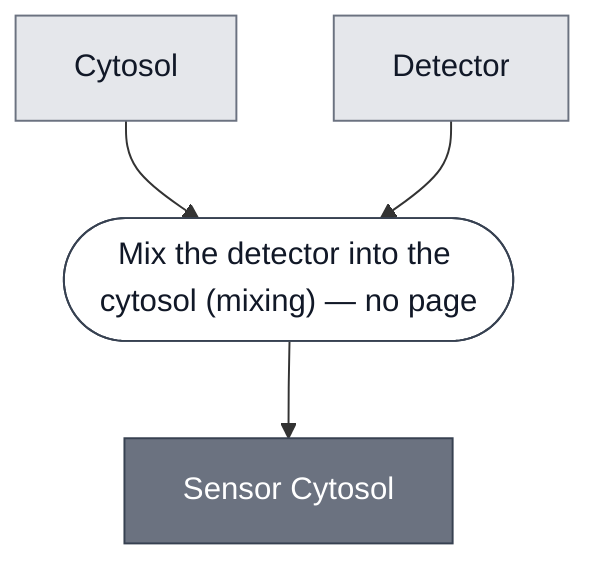

# Overview

<!-- gen:position -->
**Position.** Refines [`cytosol`](../cytosol/spec.md). Refined by [`ahsl-sensor-cytosol`](../ahsl-sensor-cytosol/spec.md), [`atc-sensor-cytosol`](../atc-sensor-cytosol/spec.md), [`ph-sensor-cytosol`](../ph-sensor-cytosol/spec.md), [`theophylline-sensor-cytosol`](../theophylline-sensor-cytosol/spec.md).
<!-- /gen:position -->

A class: a [Cytosol](../cytosol/spec.md) with a [Detector](../detector/spec.md) mixed into it.

A cytosol expresses. A sensor cytosol expresses and responds, because a detector in the same compartment gates it. The detector is mixed in and never packed, because a detector held apart from the reaction it gates could not gate it.

A member is named by what it senses and what it actuates, written `SensorCytosol[α ⟶ ε]`, where `α` is the analyte the detector senses and `ε` is the effector the cytosol actuates. An example is [SensorCytosol[aTc ⟶ PLA1]](../atc-sensor-cytosol/spec.md). The analyte alone does not identify a member, because two members can share an analyte and actuate different effectors. The base is not part of the name. Members differ in base, S30 Lysate or Base Cytosol, and the Cytosol tab gives it.

:::{attention} 🚧 Draft
This page is a work in progress and not yet ready for use.
:::

# Reference Composition

:::::{tab-set}

<!-- gen:composition-diagram -->
::::{tab-item} Module Dependencies

```mermaid
flowchart TD
    CYTOSOL["Cytosol"]
    DETECTOR["Detector"]

    P1_MIX_IN_THE_DETECTOR_0(["Mix the detector into the cytosol (mixing) — no page"])
    SENSOR_CYTOSOL["Sensor Cytosol"]

    CYTOSOL --> P1_MIX_IN_THE_DETECTOR_0
    DETECTOR --> P1_MIX_IN_THE_DETECTOR_0
    P1_MIX_IN_THE_DETECTOR_0 --> SENSOR_CYTOSOL


    classDef leaf     fill:#e5e7eb,stroke:#6b7280,color:#111827;
    classDef composed fill:#6b7280,stroke:#374151,color:#ffffff;
    classDef process  fill:#ffffff,stroke:#374151,color:#111827;
    class CYTOSOL,DETECTOR leaf;
    class SENSOR_CYTOSOL composed;
    class P1_MIX_IN_THE_DETECTOR_0 process;

    click CYTOSOL "/docs/modules/cytosol/spec"
    click DETECTOR "/docs/modules/detector/spec"
    click SENSOR_CYTOSOL "/docs/modules/sensor-cytosol/spec"
```

::::
<!-- /gen:composition-diagram -->

::::{tab-item} Cytosol

:::{table} What each member puts in the cytosol slot.
| Member | Base |
| --- | --- |
| [SensorCytosol[3OC6-HSL ⟶ PLA1]](../ahsl-sensor-cytosol/spec.md) | [S30 Lysate](../s30-lysate/spec.md) |
| [SensorCytosol[aTc ⟶ PLA1]](../atc-sensor-cytosol/spec.md) | [Base Cytosol](../base-cytosol/spec.md) |
| [SensorCytosol[pH ⟶ PLA1]](../ph-sensor-cytosol/spec.md) | [Base Cytosol](../base-cytosol/spec.md) |
| [SensorCytosol[theophylline ⟶ LacZ]](../theophylline-sensor-cytosol/spec.md) | [Base Cytosol](../base-cytosol/spec.md) |
:::

::::

::::{tab-item} DNA

The detector is the nucleic acid or protein that gates the reaction.

:::{table} What each member puts in the detector slot.
| Member | Sensing element |
| --- | --- |
| [SensorCytosol[3OC6-HSL ⟶ PLA1]](../ahsl-sensor-cytosol/spec.md) | [Detector: 3OC6-HSL](../detector-3oc6-hsl/spec.md) |
| [SensorCytosol[aTc ⟶ PLA1]](../atc-sensor-cytosol/spec.md) | [Detector: tetR-aTc](../detector-tetr-atc/spec.md) |
| [SensorCytosol[pH ⟶ PLA1]](../ph-sensor-cytosol/spec.md) | [Detector: pH-Sensing](../detector-ph/spec.md), a trigger duplex annealed before mixing |
| [SensorCytosol[theophylline ⟶ LacZ]](../theophylline-sensor-cytosol/spec.md) | [Detector: Theophylline](../detector-theophylline/spec.md) |
:::

::::

:::::

# Expected Behavior

A Sensor Cytosol is expected to express as any [Cytosol](../cytosol/spec.md) does, and to gate that expression on its analyte through the detector mixed into it. A member needs no effector to be a sensor cytosol: [SensorCytosol[theophylline ⟶ LacZ]](../theophylline-sensor-cytosol/spec.md) expresses its reporter straight from the riboswitch, and lyses nothing.

# Requirements

Requires that the detector act in the phase the cytosol provides.

# Constituent Modules

- [Cytosol](../cytosol/spec.md) — the base the detector is mixed into
- [Detector](../detector/spec.md) — the sensing element

# Processes

[Assemble Cytosol](../../processes/assemble-cytosol/assemble-cytosol-main.md) mixes the detector into the cytosol, so both share one compartment.

# Credits

:::{attention} Credits are draft
Contributor attribution on this page has not been confirmed with the Node. Assign each credit
explicitly before this page is merged to `main`.
:::
