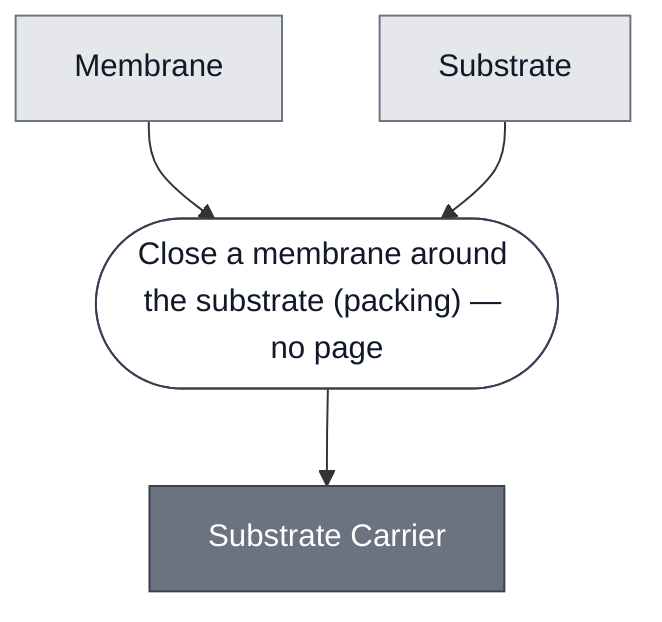

# Overview

<!-- gen:position -->
**Position.** Refines nothing declared. Refined by [`guv-cprg`](../guv-cprg/spec.md), [`substrate-cprg-suv`](../substrate-cprg-suv/spec.md).
<!-- /gen:position -->

A class: a substrate closed inside a [Membrane](../membrane/spec.md). Two members.

**It exists because both demos make the same design choice here and neither had a name for
it.** London encapsulates CPRG in a POPC unilamellar vesicle; Chicago encapsulates the same CPRG in a
POPC/cholesterol one. A meet over the two legs drew them as two unrelated slots, so the choice
could not be reported as a choice.

**It refines nothing here, and that is flagged rather than settled.** A unilamellar vesicle is a membrane
with something in it, which is the `hold` question at `open.md#O8` in the theory corpus.
[Cell](../cell/spec.md) is left a root for the same reason. If `O8` lands, both get a parent on
the same day.

:::{attention} 🚧 Draft
This page is a work in progress and not yet ready for use.
:::

# Reference Composition

:::::{tab-set}

<!-- gen:composition-diagram -->
::::{tab-item} Module Dependencies

::::
<!-- /gen:composition-diagram -->

::::{tab-item} Membrane

**Both members pack a membrane and they do not pack the same one.**

:::{table} The two members, and what each packs.
| Member | Membrane | Size regime | Made by |
| --- | --- | --- | --- |
| [GUV: CPRG](../guv-cprg/spec.md) | [POPC](../membrane-popc/spec.md) | giant unilamellar | phase transfer |
| [Substrate SUV: CPRG](../substrate-cprg-suv/spec.md) | [Chicago POPC/Chol](../membrane-popc-chol-chicago/spec.md) | small unilamellar | hydration and extrusion |
:::

**Both refine [Membrane](../membrane/spec.md)**, so the slot holds across both members.

::::

::::{tab-item} Substrate

**Both members pack [CPRG](../substrate-cprg/spec.md)**, and the class operand is written one
grain up with no page.

:::{table} The payload, which is the same in both.
| Component | Member | Notes |
| --- | --- | --- |
| [CPRG](../substrate-cprg/spec.md) | both | the class names a substrate because a second one could be packed; nothing packs X-Gal today |
:::

**There is no Substrate class to point at**, and that is a finding rather than an omission. See
the composition source.

::::

:::::

**`packing` and never `mixing`, two of two.** A substrate mixed into the phase it is meant to
report on reacts on contact with the enzyme, which is the no-off-state failure
[Color Change](../color-change/spec.md) is defined against. **This class is one way of holding
the pair apart; holding the enzyme instead is the other.**

**Same slot, different process, by design.** The members' own titles name the axis: a giant
unilamellar vesicle made by phase transfer against a small one made by extrusion. The operator and the
operand sorts are identical and the process is not.

# Constituent Modules

- [Membrane](../membrane/spec.md) — the boundary, POPC in one member and POPC/cholesterol in the other
- Substrate — CPRG in both. No page: Substrate is not a class in this corpus

# Requirements

Requires that the substrate stay inside until the unilamellar vesicle is breached. **That is the whole
function**, and a unilamellar vesicle that leaks is a readout with no off state.

# Processes

See the composition source. One step, `packing`, and it has no page because the two members use
two different processes and no page describes the class-level move.

# Credits

:::{attention} Credits are draft
Contributor attribution on this page has not been confirmed with the Node. Assign each credit
explicitly before this page is merged to `main`.
:::
