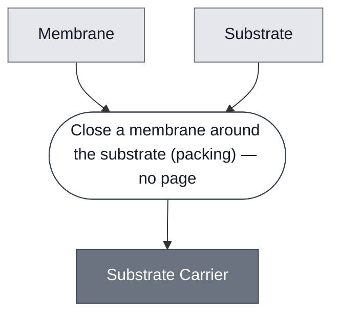

# Overview

<!-- gen:position -->
**Position.** Refines [`vesicle`](../vesicle/spec.md). Refined by [`guv-cprg`](../guv-cprg/spec.md), [`substrate-cprg-luv`](../substrate-cprg-luv/spec.md), [`substrate-cprg-suv`](../substrate-cprg-suv/spec.md).
<!-- /gen:position -->

A class: a substrate closed inside a [Membrane](../membrane/spec.md).

Every member packs a membrane and a substrate, and the substrate stays inside until the membrane is breached.

:::{attention} 🚧 Draft
This page is a work in progress and not yet ready for use.
:::

# Reference Composition

:::::{tab-set}

<!-- gen:composition-diagram -->
::::{tab-item} Module Dependencies

```mermaid
flowchart TD
    MEMBRANE["Membrane"]
    SUBSTRATE["Substrate"]

    P1_ENCAPSULATE_THE_SUBSTRATE_0(["Close a membrane around the substrate (packing) — no page"])
    SUBSTRATE_CARRIER["Substrate Carrier"]

    MEMBRANE --> P1_ENCAPSULATE_THE_SUBSTRATE_0
    SUBSTRATE --> P1_ENCAPSULATE_THE_SUBSTRATE_0
    P1_ENCAPSULATE_THE_SUBSTRATE_0 --> SUBSTRATE_CARRIER


    classDef leaf     fill:#e5e7eb,stroke:#6b7280,color:#111827;
    classDef composed fill:#6b7280,stroke:#374151,color:#ffffff;
    classDef process  fill:#ffffff,stroke:#374151,color:#111827;
    class MEMBRANE,SUBSTRATE leaf;
    class SUBSTRATE_CARRIER composed;
    class P1_ENCAPSULATE_THE_SUBSTRATE_0 process;

    click MEMBRANE "/docs/modules/membrane/spec"
    click SUBSTRATE_CARRIER "/docs/modules/substrate-carrier/spec"
```

::::
<!-- /gen:composition-diagram -->

::::{tab-item} Membrane

:::{table} What each member puts in the membrane slot.
| Member | Membrane | Size regime | Made by |
| --- | --- | --- | --- |
| [GUV: CPRG](../guv-cprg/spec.md) | [POPC](../membrane-popc/spec.md) | giant unilamellar | phase transfer |
| [Substrate SUV: CPRG](../substrate-cprg-suv/spec.md) | [Membrane: POPC/Chol (9:1)](../membrane-popc-chol-9-1/spec.md) | small unilamellar | hydration and extrusion |
| [Substrate LUV: CPRG](../substrate-cprg-luv/spec.md) | [Membrane: POPC/Chol (9:1)](../membrane-popc-chol-9-1/spec.md) | large unilamellar | hydration and freeze-thaw |
:::

::::

::::{tab-item} Substrate

:::{table} What each member puts in the substrate slot.
| Member | Substrate |
| --- | --- |
| [GUV: CPRG](../guv-cprg/spec.md) | [CPRG](../substrate-cprg/spec.md) |
| [Substrate SUV: CPRG](../substrate-cprg-suv/spec.md) | [CPRG](../substrate-cprg/spec.md) |
| [Substrate LUV: CPRG](../substrate-cprg-luv/spec.md) | [CPRG](../substrate-cprg/spec.md) |
:::

::::

:::::

# Expected Behavior

A Substrate Carrier is expected to keep its substrate inside until the membrane is breached. A carrier that leaks gives a readout with no off state.

The substrate is packed and never mixed. A substrate in the same phase as its enzyme reacts on contact, which is the failure [Color Change](../color-change/spec.md) is defined against. A Substrate Carrier is one way to hold the pair apart, and holding the enzyme apart instead is the other.

# Processes

[Encapsulation](../../processes/encapsulate/main.md) closes a membrane around the substrate. The members use different routes: [Encapsulation: Phase Transfer](../../processes/assemble-base-cell/main.md) for GUV: CPRG and [Encapsulation: Extrusion](../../processes/encapsulate-suv/main.md) for Substrate SUV: CPRG.

# Constituent Modules

- [Membrane](../membrane/spec.md) — the boundary, POPC in one member and POPC/cholesterol in the other
- Substrate — CPRG in both members

# Credits

:::{attention} Credits are draft
Contributor attribution on this page has not been confirmed with the Node. Assign each credit
explicitly before this page is merged to `main`.
:::
