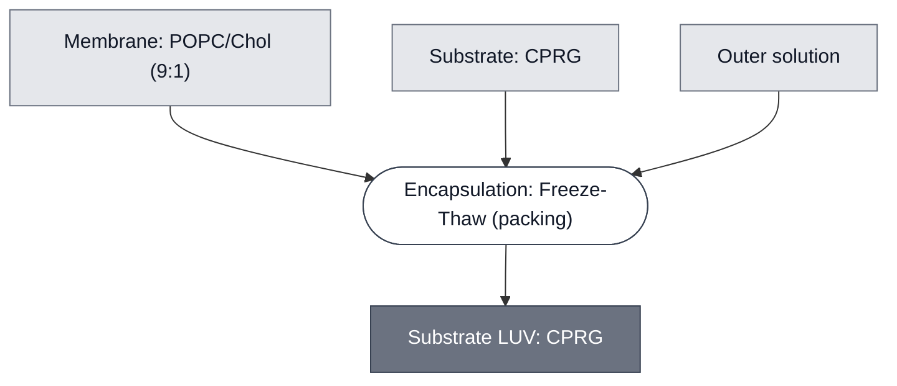

# Overview

<!-- gen:position -->
**Position.** Refines [Substrate Carrier](../substrate-carrier/spec.md) and [LUV](../luv/spec.md) and [Liposome](../liposome/spec.md). Refined by nothing on this branch.
<!-- /gen:position -->

A Substrate LUV is a large unilamellar liposome that carries a chemical substrate and nothing else. This one carries chlorophenol red-β-D-galactopyranoside (CPRG), the substrate half of the [LacZ Reporter](../reporter-lacz/spec.md). CPRG is yellow; β-galactosidase (LacZ) cleaves it to chlorophenol red, which is purple. While the liposome is intact the two never meet, so the readout has an off state.

It is the sibling of [Substrate SUV: CPRG](../substrate-cprg-suv/spec.md) and carries the same payload. **The two differ in how they are made, and that is the whole difference**: this one is hydrated, sonicated and freeze-thawed, with no extrusion step, and is washed by centrifugation rather than purified by column.

This module is not a reporter on its own. It needs [LacZ Reporter Module](../reporter-lacz/spec.md) to produce an output, and a lysis trigger to release the payload.

:::{attention} 🚧 Draft
This page is a work in progress and not yet ready for use.
:::

# Reference Composition

:::::{tab-set}

<!-- gen:composition-diagram -->
::::{tab-item} Module Dependencies

::::
<!-- /gen:composition-diagram -->

::::{tab-item} Membrane

:::{table} Membrane, 2 µmol of lipid in 0.5 mL (4 mM). Volumes are of the lipid stocks.
:label: comp-substrate-cprg-luv-membrane

| Component | Stock | Final (mol%) | Volume (µL) | Amount (µmol) |
| --- | --- | --- | --- | --- |
| POPC | 25 mg/mL | 89.9 | 54.66 | 1.798 |
| Cholesterol | 50 mg/mL | 10 | 1.547 | 0.2 |
| Liss Rhod PE | 1 mg/mL | 0.1 | 2.603 | 0.002 |
| Total | | 100 | | 2 |

:::

See [Membrane: POPC/Chol (9:1)](../membrane-popc-chol-9-1/spec.md). The 0.1 mol% Liss Rhod PE is a fluorescent label for locating the liposomes, not a functional component.

::::

::::{tab-item} Inner Solution

:::{table} Inner solution, 500 µL.
:label: comp-substrate-cprg-luv-inner

| Component | Stock | Final concentration | Volume (µL) |
| --- | --- | --- | --- |
| CPRG | 30 mg/mL | 14.25 mg/mL | 237.5 |
| OptiPrep | 100% (v/v) | 10% (v/v) | 50 |
| Tris-HEPES buffer (1 M Tris, 1.15 M HEPES) | ≈2520 mOsm | 1071 mOsm/L, this buffer's share by dilution | 212.5 |
| Total | | | 500 |

:::

**The OptiPrep is a density agent, not a reagent of the readout.** It makes the loaded liposomes denser than the wash solution so that centrifugation pellets them.

::::

:::::

# Expected Behavior

Intact Substrate LUVs produce no signal. On lysis of a neighboring Sensing Cell, released CPRG meets LacZ in the surrounding matrix and gives a yellow-to-purple change, measurable at 575 nm and visible by eye.

**The off state does not survive an overnight hold.** Left for about 18 h, these liposomes stop holding their CPRG, with no lysis trigger. Finish a readout inside a working day, or expect background color at the start of the next one.

:::{attention} Size and lamellarity are not measured
@Editor: no diameter, size distribution or lamellarity has been measured for this route, so the name LUV rests on the preparation and not on a measurement. Record at least a diameter distribution before this page is published.
:::

:::{attention} Free substrate after the last wash is not measured
@Editor: ten centrifugation washes are specified, and no absorbance reading of the final supernatant is on record. Residual free CPRG is what produces background color before any lysis, so this is the quality-control figure that decides whether the off state holds.
:::

# Requirements

Requires an external β-galactosidase source in the surrounding matrix (e.g. [LacZ Reporter](../reporter-lacz/spec.md)), and a lysis trigger to breach the membrane (e.g. [PLA1 Lysis Module](../effector-pla1/spec.md)).

Requires the wash solution to match the interior. The Tris-HEPES buffer contributes 1071 mOsm/L by dilution, but the whole inner solution, with its CPRG and OptiPrep, has no recorded reading. Measure it, and match the wash to that reading: a wash below it swells the liposomes.

:::{warning} Do not expose CPRG to UV light
**CPRG photobleaches**, including under the 405 nm source used for photodevelopment. Any route that crosslinks a gel with UV while this Module is present will bleach the payload before it can be read. Thermal and ionic gelling involve no UV step and are compatible.
:::

# Implementations

- [pH Demo](../../implementations/devstudio-ph-demo/main.md): the payload population of the solution arm, carrying no Cy5.

# Processes

- [Encapsulation: Freeze-Thaw](../../processes/encapsulate-luv/main.md) — lipid film, CPRG hydration, sonication, five freeze-thaw cycles, ten centrifugation washes.
- [Colorimetric Readout](../../processes/colorimetric-readout/main.md) — the readout step itself.

:::{table} Standard preparation parameters.
:label: proc-substrate-cprg-luv-parameters

| Parameter | Value | Notes |
| --- | --- | --- |
| Lipid in the film | 2 µmol in 0.5 mL | 4 mM |
| Freeze-thaw cycles | 5 | Liquid nitrogen, then a 35 °C water bath |
| Washes | 10 | Centrifugation into the outer solution. The spin is on [Encapsulation: Freeze-Thaw](../../processes/encapsulate-luv/main.md) |
| Wash solution | the implementation's outer solution | Formulations are on [Assemble Outer Solution](../../processes/assemble-outer-solution/main.md) |

:::

# Constituent Modules

- [Membrane: POPC/Chol (9:1)](../membrane-popc-chol-9-1/spec.md) — the bilayer, with 0.1 mol% Liss Rhod PE
- [Substrate: CPRG](../substrate-cprg/spec.md) — the lumen, 14.25 mg/mL

# Credits

Developed by the Chicago Node.

:::{attention} Credits are draft
Contributor attribution on this page has not been confirmed with the Node. Assign each credit explicitly before this page is merged to `main`.
:::
