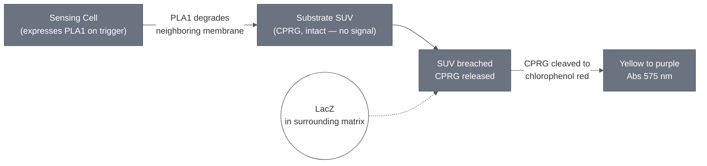

# Overview

A **Substrate SUV** is a small unilamellar liposome that carries a chromogenic substrate and nothing else — no cytosol, no genetic circuit, no expression. It is a subcomponent of a colorimetric cascade rather than a module that does anything on its own, in the same sense that a Feeder Cell is a subcomponent of SpudCell.

This Substrate SUV carries chlorophenol red-β-D-galactopyranoside (CPRG). CPRG is yellow; β-galactosidase (LacZ) cleaves it to chlorophenol red, which is purple. Holding the substrate inside a liposome is what makes the readout *triggered* rather than continuous: as long as the SUV is intact, CPRG and LacZ never meet. When a neighboring Sensing Cell expresses PLA1 and lyses, it breaches these SUVs too, releasing CPRG into the surrounding LacZ solution and starting the color change.

It is not a reporter. The reporter is the enzyme — see [LacZ Reporter Module](../reporter-lacz/spec.md). This module is the substrate reservoir that gates when the reporter can act.

:::{attention} 🚧 Draft
This page is a work in progress and not yet ready for use.
:::

## Schematic

No published schematic exists for this module; the diagram above is a simplified summary, not a reproduction of a lab figure.

# Reference Composition

:::::{tab-set}

::::{tab-item} Membrane

The Substrate SUV uses the [Chicago Membrane](../membrane-popc-chol-chicago/spec.md) base bilayer — 90:10 POPC:cholesterol — with **no fluorescent label**. The label is omitted because the readout is absorbance, not fluorescence.

:::{table} Substrate SUV bilayer, as prepared for the Chicago colorimetric work.
:label: comp-substrate-cprg-bilayer

| Component   | Target Percentage (%) | Molecular Weight (g/mol) | Stock concentration (mg/mL) | Volume to add (µL) |
| ----------- | --------------------- | ------------------------ | --------------------------- | ------------------ |
| POPC        | 90                    | 760.076                  | 25                          | 208.51             |
| Cholesterol | 10                    | 386.654                  | 50                          | 6.00               |

:::

See [Chicago Membrane](../membrane-popc-chol-chicago/spec.md) for the shared base and the labeled variant used for Sensing Cells.

::::

::::{tab-item} Luminal Cargo

The luminal cargo is CPRG in hydration buffer. Two working concentrations are documented, for two different downstream uses.

:::{table} Luminal cargo.
:label: comp-substrate-cprg-lumen

| Use | CPRG concentration | Source |
| --- | --- | --- |
| SUV hydration (loading) | 50 mM, equivalently ~30 mg/mL | `Demo Status - Chicago.docx`; 14 Aug 2026 deck, slide 10 |
| Inner gel, patterned agarose | 15 mg/mL | 14 Aug 2026 deck, slide 10 |

:::

The two figures agree with each other: CPRG has a molecular weight of about 585 g/mol, so 50 mM is 29.3 mg/mL — the "30 mg/mL" of the deck. The 15 mg/mL figure is a different, lower concentration used when the SUVs are cast into the inner gel of a patterned construct, not a restatement of the loading concentration.

::::

::::{tab-item} Preparation Parameters

:::{table} Standard preparation parameters.
:label: comp-substrate-cprg-usage

| Parameter | Value | Notes |
| --- | --- | --- |
| Target diameter | 400 nm | Extruded through a 400 nm polycarbonate membrane |
| Extrusion passes | ≥21, odd number | Odd count avoids retaining unextruded material in the final syringe |
| Free-substrate removal | see the flag below | Sources disagree on the method |
| Storage before use | on ice or at 4 °C | Hold until combining with Sensing Cells and LacZ |

:::

:::{attention} Sources disagree on how free CPRG is removed
`Demo Status - Chicago.docx` states the SUVs are "purified twice using size-exclusion chromatography (SEC) to remove unencapsulated CPRG." The 14 Aug 2026 deck (slide 10) instead states "SUVs were washed via centrifugation to remove CPRG outside SUVs."

These are different methods with different residual-substrate profiles, and residual free CPRG is exactly what produces background color. This may be a change of method over time, or two different preparations. Do not pick one silently — confirm with the Chicago team which is current.
:::

::::

:::::

# Expected Behavior

Intact Substrate SUVs produce no signal. On PLA1-triggered lysis of a neighboring Sensing Cell, released CPRG reacts with LacZ in the surrounding matrix to give a yellow-to-purple change, measurable at 575 nm and visible by eye.

Quality control before combining with other components:

- **Size.** Confirm a mean diameter near 400 nm by dynamic light scattering. A single narrow peak indicates a homogeneous, well-extruded population.
- **Free substrate removed.** Measure absorbance at 575 nm of the purification flow-through, not the liposome fraction. A flat, low-absorbance flow-through indicates unencapsulated CPRG has been removed; residual absorbance means repeat the purification.

:::{attention} No primary data located
The 400 nm target size and the 50 mM loading concentration are cited from Chicago status material and the meeting deck. No DevNote with DLS traces or absorbance QC data has been located, so these values are not independently verified. Listed as a wanted module DevNote.
:::

## Gels

In ~1% alginate the yellow-to-purple change appears after about 16 h.

# Requirements

Requires an external β-galactosidase source in the surrounding matrix (e.g. [LacZ Reporter](../reporter-lacz/spec.md)), and a lysis trigger to breach the SUV membrane (e.g. [PLA1 Lysis Module](../effector-pla1/spec.md)).

**Do not pair pre-loaded Substrate SUVs with PEG-norbornene gelation.** CPRG photobleaches under the UV crosslinking step: side-by-side comparisons show UV exposure during PEG-norbornene crosslinking visibly bleaches the color while an unexposed control retains it.

The confirmed workaround for PEG-norbornene is to invert the order — pre-add LacZ to the gel, crosslink, then add CPRG as a free dye afterwards. That path does not use this module. Agarose, alginate, and ULGA embedding involve no UV step and are compatible with pre-loading as described here.

# Implementations

- [Theophylline Sensing Cell](../theophylline-sensing-cell/spec.md) — the alginate-embedded colorimetric result.
- [aTc Sensing Cell](../atc-sensing-cell/spec.md) — note that this cascade co-encapsulates LacZ and CPRG *inside* the Sensing Cell rather than using a separate Substrate SUV; check which configuration applies before assuming this module is involved.
- [London Cascade](../london-cascade/spec.md) — the two-liposome PLA1/CPRG handoff.

# Process

- [SUV Encapsulation](../../processes/encapsulate-suv/main.md) — lipid film, CPRG hydration, extrusion, purification.
- [Alginate Hydrogel Embedding](../../processes/embed-alginate-hydrogel/main.md) — co-embedding with Sensing Cells and LacZ.
- [Colorimetric Readout](../../processes/colorimetric-readout/main.md) — the readout step itself.

# Credits

Developed by the Chicago Node (Kamat Lab and Liu Lab).
