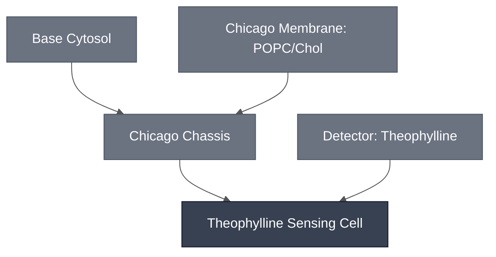

# Overview

The Theophylline Sensing Cell is the [Chicago Chassis](../chicago-chassis/spec.md), a 9:1 POPC:cholesterol membrane encapsulating Base Cytosol, loaded with the [Theophylline Sensing Module](../detector-theophylline/spec.md), a theophylline-responsive riboswitch driving downstream effector gene expression.

:::{attention} 🚧 Draft
This page is a work in progress and not yet ready for use.
:::

This Sensing Cell composes into the multiplexed [Chicago Cascade](../chicago-cascade/spec.md).
# Reference Composition

:::::{tab-set}

<!-- gen:composition-diagram -->
::::{tab-item} Module Dependencies

::::
<!-- /gen:composition-diagram -->

::::{tab-item} DNA

:::{table}
| **Name** | **Length (bp)** | **File** | **Supply route** |
| --- | --- | --- | --- |
| Theophylline riboswitch reporter construct | not documented | — | Expressed in the Sensing Cell |
:::

:::{attention} Constructs not in `nucleus-eng/DNA`
@Editor: no sequence file is confirmed for these constructs. Confirm with the Chicago Node.
:::

See [Detector: Theophylline](../detector-theophylline/spec.md) for the design.

::::

::::{tab-item} Cytosol

The inner solution is [Base Cytosol](../base-cytosol/spec.md) at reaction concentration, per [Chicago Chassis](../chicago-chassis/spec.md), with DNA added encoding the theophylline riboswitch upstream of an effector gene.

:::{table} Combined synthetic cell reaction, one level deep.
:label: comp-theo-sensing-cell-cytosol

| Module | Working concentration | Notes |
| --- | --- | --- |
| [Chicago Chassis](../chicago-chassis/spec.md) | Base Cytosol at reaction concentration, in a 9:1 POPC:cholesterol synthetic cell membrane | Transcription, translation, and encapsulation. |
| [Theophylline Sensing Module](../detector-theophylline/spec.md) | `pT7-theophylline-LacZ` (`pMN066`) at 5 nM final DNA | The riboswitch drives whichever effector gene sits downstream of it; this is the characterized construct. |
| [LacZ Reporter Module](../reporter-lacz/spec.md) | LacZ 20 U/mL as purified enzyme; CPRG 0.5 mM | Not expressed. See the constraint under [Requirements](#requirements) before pairing this Module with LacZ. | 

:::

:::{attention} Construct not yet in `nucleus-eng/DNA`
`pT7-theophylline-LacZ` (`pMN066`) has no sequence file in [`nucleus-eng/DNA`](https://github.com/nucleus-eng/DNA) — the same gap is recorded on [Theophylline Sensing Module](../detector-theophylline/spec.md). Do not link a placeholder or add a length until the construct is submitted and its length verified against the source file.
:::

::::

::::{tab-item} Membrane

:::{table} Synthetic cell membrane — [Chicago Membrane: POPC/Chol](../membrane-popc-chol-chicago/spec.md).
:label: comp-theov-membrane

| Component | Target percentage (%) |
| --- | --- |
| POPC | 89.9 |
| Cholesterol | 10 |
| Liss-Rhod PE | 0.1 |

:::

The same membrane as [Chicago Chassis](../chicago-chassis/spec.md), which carries the note on how the 9:1 ratio differs from the default [Base Membrane](../membrane-popc-chol/spec.md).

::::

:::::

# Expected Behavior

The Theophylline Sensing Cell drives expression of an effector gene downstream of the riboswitch on detection of theophylline in the outer solution at 1 mM. 

## Cytosols

In bulk Base Cytosol, the riboswitch converts CPRG to chlorophenol red faster with 1.5 mM theophylline than without, read by absorbance at 570 nm — see [Colorimetric Readout](../../processes/colorimetric-readout/main.md) and the [`chicago-theophylline-lacz`](https://devnotes.nucleus.engineering/articles/019e0431-5045-7f14-a4f9-d3795e22bcdd) devnote. That establishes the riboswitch works in Nucleus Cytosol.

**Expect leak.** A later bulk replication found the riboswitch expressing its effector without theophylline at close to the induced level: Abs₅₇₀ ≈ 3.0 AU by 3.5 h undosed, against ≈ 3.9 AU by 1.7 h at 1 mM or 2 mM. Dose separates from no-dose in rate rather than in endpoint.

## Cells

:::{warning} Not yet validated
No synthetic cell result for this Sensing Cell is on record. Both results above are bulk Base Cytosol, so encapsulation is expected to work by construction from [Chicago Chassis](../chicago-chassis/spec.md) rather than demonstrated.
:::

# Requirements

Requires pT7 transcription and translation (e.g. [Base Cytosol](../base-cytosol/spec.md)), supplied here by the [Chicago Chassis](../chicago-chassis/spec.md).

Requires theophylline to cross the membrane and reach the encapsulated riboswitch; the reported result uses 1 mM theophylline in the outer solution.

Must not use [LacZ / CPRG](../reporter-lacz/spec.md) as its reporter: theophylline is reported to interfere with LacZ activity. See [Theophylline Sensing Module § Requirements](../detector-theophylline/spec.md#requirements) for the constraint and the state of the evidence behind it.

# Implementations

Not used in a documented Implementation. The [Chicago DevCell](../../implementations/chicago-devcell/main.md) dropped the theophylline sensor before the demo was built.

# Processes

- [Colorimetric Readout](../../processes/colorimetric-readout/main.md) — the CPRG conversion that produces the visible signal
- [Alginate Hydrogel Embedding](../../processes/embed-alginate-hydrogel/main.md) — the Chicago hydrogel format

# Constituent Modules

- [Chicago Chassis](../chicago-chassis/spec.md)
- [Theophylline Sensing Module](../detector-theophylline/spec.md)

# Credits

Developed by [Maram Naji](https://orcid.org/0000-0003-1409-4194) (Chicago Node, Lucks Lab) and the Chicago Node (Kamat Lab and Liu Lab).
