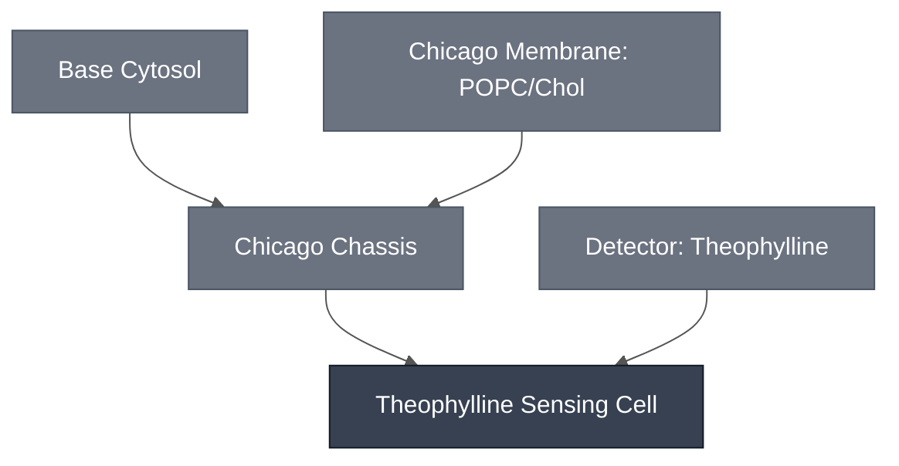

# Overview

The Theophylline Sensing Cell is the [Chicago Chassis](../chicago-chassis/spec.md), a 9:1 POPC:cholesterol membrane encapsulating Base Cytosol, loaded with the [Theophylline Sensing Module](../detector-theophylline/spec.md), a theophylline-responsive riboswitch driving downstream effector gene expression.

:::{attention} 🚧 Draft
This page is a work in progress and not yet ready for use.
:::

This Sensing Cell composes into the multiplexed [Chicago Cascade](../chicago-cascade/spec.md).
# Reference Composition

:::::{tab-set}

<!-- gen:composition-diagram -->
::::{tab-item} Module Dependencies

::::
<!-- /gen:composition-diagram -->

::::{tab-item} DNA

:::{table}
| **Name** | **Length (bp)** | **File** | **Supply route** |
| --- | --- | --- | --- |
| Theophylline riboswitch reporter construct | not documented | — | Expressed in the Sensing Cell |
| β-galactosidase (LacZ) | not applicable | — | Purified enzyme, not expressed |
:::

:::{attention} Constructs not in `nucleus-eng/DNA`
@Editor: no sequence file is confirmed for these constructs. Confirm with the Chicago Node.
:::

See [Detector: Theophylline](../detector-theophylline/spec.md) for the design.

::::

::::{tab-item} Cytosol

The inner solution is [Base Cytosol](../base-cytosol/spec.md) at reaction concentration, per [Chicago Chassis](../chicago-chassis/spec.md), with DNA added encoding the theophylline riboswitch upstream of PLA1.

:::{table} Combined synthetic cell reaction, one level deep.
:label: comp-theo-sensing-cell-cytosol

| Module | Working concentration | Notes |
| --- | --- | --- |
| [Chicago Chassis](../chicago-chassis/spec.md) | Base Cytosol at reaction concentration, in a 9:1 POPC:cholesterol synthetic cell membrane | Transcription, translation, and encapsulation. |
| [Theophylline Sensing Module](../detector-theophylline/spec.md) | Not established for the PLA1-linked construct | The bulk-cytosol validation construct `pT7-theophylline-LacZ` (`pMN066`) runs at 5 nM final DNA in a 1x reaction ([`chicago-theophylline-lacz`](https://devnotes.nucleus.engineering/articles/019e0431-5045-7f14-a4f9-d3795e22bcdd)), but carries a different downstream gene, so that figure is cited for scale only. |

:::

:::{attention} Construct not yet identified
The PLA1-linked riboswitch construct used in the Chicago integration status material is a separate design from `pT7-theophylline-LacZ` (`pMN066`), the bulk-cytosol validation construct documented on the [Theophylline Sensing Module](../detector-theophylline/spec.md) page. It is not yet named or present in `nucleus-eng/DNA`. Do not link a placeholder or assume the LacZ-reporter construct's sequence applies here — flag for follow-up so the PLA1-linked construct can be identified and submitted to `nucleus-eng/DNA`.
:::

::::

::::{tab-item} Membrane

:::{table}
:label: comp-theov-membrane

| Component   | Target Percentage (%) |
| ----------- | ---------------------- |
| POPC        | ~90 (9:1 ratio)         |
| Cholesterol | ~10 (9:1 ratio)         |

:::

Same 9:1 POPC:cholesterol synthetic cell membrane as [Chicago Chassis](../chicago-chassis/spec.md). See that page for the note on how this differs from the default [Base Membrane](../membrane-popc-chol/spec.md) ratio.

::::

:::::

# Expected Behavior

Per the Chicago integration status material, this Sensing Cell produces PLA1 upon detection of 1 mM theophylline. This result has not yet been independently confirmed by a primary devnote — cite the Chicago integration status material and treat as pending confirmation, consistent with the "PLA1-linked cascade design" discussion on the [Theophylline Sensing Module](../detector-theophylline/spec.md) page.

Separately, the bulk-cytosol devnote behind the Theophylline Sensing Module ([`chicago-theophylline-lacz`](https://devnotes.nucleus.engineering/articles/019e0431-5045-7f14-a4f9-d3795e22bcdd)) demonstrates the riboswitch itself converts CPRG faster in the presence of 1.5 mM theophylline than without it, using the LacZ-reporter construct rather than the PLA1-linked construct used here. That result supports the riboswitch's general compatibility with Nucleus Cytosol; it is not a validation of this Sensing Cell's specific PLA1 output.

A later bulk-reaction replication found the riboswitch leaky in the LacZ-reporter configuration: without theophylline it still drove LacZ to Abs₅₇₀ ≈ 3.0 AU by 3.5 h, against ≈ 3.9 AU by 1.7 h at 1 mM or 2 mM. Whether the same leakiness applies to the PLA1-linked construct used in this Sensing Cell has not been separately tested — flagged as an open question rather than assumed.

# Requirements

Requires pT7 transcription and translation (e.g. [Base Cytosol](../base-cytosol/spec.md)), supplied here by the [Chicago Chassis](../chicago-chassis/spec.md).

Requires theophylline to cross the membrane and reach the encapsulated riboswitch; the reported result uses 1 mM theophylline in the outer solution.

Per the [Theophylline Sensing Module](../detector-theophylline/spec.md) page, this Sensing Cell must not be co-encapsulated with the aTc Sensing Cell. The mechanism behind that requirement is not established. See [Theophylline Sensing Module § Requirements](../detector-theophylline/spec.md#requirements) for the evidence, including a primary figure that runs against the usual inhibition explanation. This page does not restate it.

# Implementations

Not used in a documented Implementation.

# Processes

- [Colorimetric Readout](../../processes/colorimetric-readout/main.md) — the CPRG conversion that produces the visible signal
- [Alginate Hydrogel Embedding](../../processes/embed-alginate-hydrogel/main.md) — the Chicago hydrogel format

# Constituent Modules

- [Chicago Chassis](../chicago-chassis/spec.md)
- [Theophylline Sensing Module](../detector-theophylline/spec.md) (PLA1-linked configuration — see Reference Composition above for how this differs from that page's bulk-cytosol validation construct)

# Credits

Developed by [Maram Naji](https://orcid.org/0000-0003-1409-4194) (Chicago Node, Lucks Lab) and the Chicago Node (Kamat Lab and Liu Lab).
