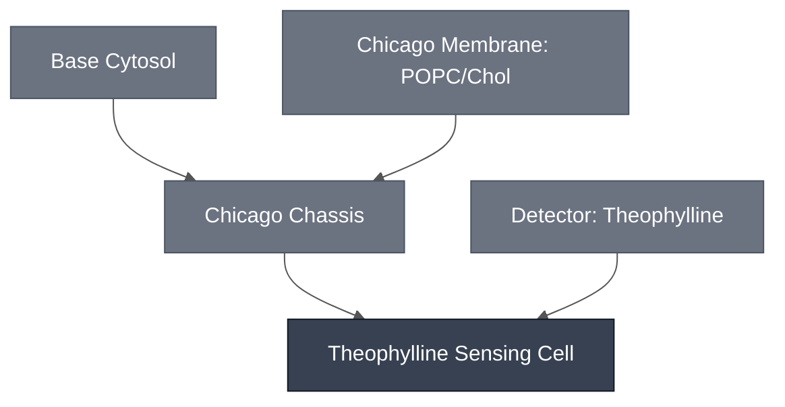

# Overview

The Theophylline Sensing Cell is the [Chicago Chassis](../chicago-chassis/spec.md), a 9:1 POPC:cholesterol membrane encapsulating Base Cytosol, loaded with the [Theophylline Sensing Module](../detector-theophylline/spec.md), a theophylline-responsive riboswitch driving downstream effector gene expression.

:::{attention} Canceled — not part of the DevCells demo
The theophylline riboswitch expresses its effector without theophylline present, so it does not discriminate. It was cut from the demo, and its constructs are recorded as no longer in use. This specification is kept for reference and is not maintained.
:::

# Reference Composition

:::::{tab-set}

<!-- gen:composition-diagram -->
::::{tab-item} Module Dependencies

::::
<!-- /gen:composition-diagram -->

::::{tab-item} DNA

:::{table}
| **Name** | **Length (bp)** | **File** | **Supply route** |
| --- | --- | --- | --- |
| Theophylline riboswitch reporter construct | not documented | — | Expressed in the Sensing Cell |
:::

:::{attention} Constructs not in `nucleus-eng/DNA`
@Editor(chicago): no sequence file is confirmed for these constructs. Confirm with the Chicago Node.
:::

See [Detector: Theophylline](../detector-theophylline/spec.md) for the design.

::::

::::{tab-item} Cytosol

The inner solution is [Base Cytosol](../base-cytosol/spec.md) at reaction concentration, per [Chicago Chassis](../chicago-chassis/spec.md), with DNA added encoding the theophylline riboswitch upstream of an effector gene.

:::{table} Combined synthetic cell reaction, one level deep.
:label: comp-theo-sensing-cell-cytosol

| Module | Working concentration | Notes |
| --- | --- | --- |
| [Chicago Chassis](../chicago-chassis/spec.md) | Base Cytosol at reaction concentration, in a 9:1 POPC:cholesterol synthetic cell membrane | Transcription, translation, and encapsulation. |
| [Theophylline Sensing Module](../detector-theophylline/spec.md) | Riboswitch construct at 5 nM final DNA | The riboswitch drives whichever effector gene sits downstream of it. No effector is specified here — see the note below. |

:::

:::{attention} Construct not yet in `nucleus-eng/DNA`
No riboswitch construct for this Module has a sequence file in [`nucleus-eng/DNA`](https://github.com/nucleus-eng/DNA), including `pT7-theophylline-LacZ` (`pMN066`), the one the results below used — the same gap is recorded on [Theophylline Sensing Module](../detector-theophylline/spec.md). Do not link a placeholder or add a length until a construct is submitted and its length verified against the source file.
:::

:::{important} The effector is not specified, and must not be LacZ
This Module detects theophylline and expresses whatever gene sits downstream of the riboswitch. Which gene that is belongs to the system composing it.

One choice is ruled out: theophylline is reported to interfere with LacZ activity, so a LacZ readout cannot be specified here — see [Requirements](#theophylline-sensing-cell-requirements). [XylE / C23DO](../reporter-xyle/spec.md) reads out through catechol instead and is the orthogonal alternative, which also leaves [PLA1](../effector-pla1/spec.md) available as the effector, driving lysis into a XylE readout rather than a LacZ one.

Every result below was nonetheless produced with `pT7-theophylline-LacZ`, the one characterized construct, which is the pairing the constraint warns against.
:::

::::

::::{tab-item} Membrane

:::{table} Synthetic cell membrane — [Chicago Membrane: POPC/Chol](../membrane-popc-chol-chicago/spec.md).
:label: comp-theov-membrane

| Component | Target percentage (%) |
| --- | --- |
| POPC | 89.9 |
| Cholesterol | 10 |
| Liss-Rhod PE | 0.1 |

:::

The same membrane as [Chicago Chassis](../chicago-chassis/spec.md).

::::

::::{tab-item} Outer Solution

:::{table} Outer solution.
:label: comp-theo-sensing-cell-outer

| Component | Working concentration |
| --- | --- |
| Theophylline | 1 mM |
:::

Theophylline crosses the membrane to reach the encapsulated riboswitch. 

::::

:::::

# Expected Behavior

The Theophylline Sensing Cell drives expression of an effector gene downstream of the riboswitch on detection of theophylline in the outer solution at 1 mM. 

## Cytosols

In bulk Base Cytosol, LacZ expressed from the riboswitch construct converts CPRG to chlorophenol red faster with 1.5 mM theophylline than without, read by absorbance at 570 nm — see [Colorimetric Readout](../../processes/colorimetric-readout/main.md) and the [`chicago-theophylline-lacz`](https://devnotes.nucleus.engineering/articles/019e0431-5045-7f14-a4f9-d3795e22bcdd) devnote. That establishes the riboswitch works in Nucleus Cytosol.

**Expect leak.** A later bulk replication found the riboswitch expressing its effector without theophylline at close to the induced level: Abs₅₇₀ ≈ 3.0 by 3.5 h undosed, against ≈ 3.9 by 1.7 h at 1 mM or 2 mM. Dose separates from no-dose in rate rather than in endpoint.

## Cells

:::{warning} Not yet validated
No synthetic cell result for this Sensing Cell is on record. Both results above are bulk Base Cytosol, so encapsulation is expected to work by construction from [Chicago Chassis](../chicago-chassis/spec.md) rather than demonstrated.
:::

(theophylline-sensing-cell-requirements)=
# Requirements

Requires pT7 transcription and translation (e.g. [Base Cytosol](../base-cytosol/spec.md)), supplied here by the [Chicago Chassis](../chicago-chassis/spec.md).

Requires theophylline to cross the membrane and reach the encapsulated riboswitch; the reported result uses 1 mM theophylline in the outer solution.

Must not use [LacZ / CPRG](../reporter-lacz/spec.md) as its reporter: theophylline is reported to interfere with LacZ activity. See [LacZ Reporter Module § Requirements](../reporter-lacz/spec.md#reporter-lacz-requirements) for the constraint and the state of the evidence behind it.

:::{warning} Only characterized with incompatible LacZ reporter!
Note that the only characterized construct, `pT7-theophylline-LacZ`, is exactly that pairing, so every result on this page was produced with the reporter the constraint rules out. That is part of why the leak above is hard to attribute — it could be riboswitch leak, or theophylline acting on LacZ. A XylE readout would separate the two, and none has been run. Confirm with the Chicago Node before building on either reading.
:::

# Implementations

Not used in a documented Implementation. The [Chicago DevCell](../../implementations/chicago-devcell/main.md) dropped the theophylline sensor before the demo was built.

# Processes

- [Colorimetric Readout](../../processes/colorimetric-readout/main.md) — the CPRG conversion that produces the visible signal
- [Alginate Hydrogel Embedding](../../processes/embed-alginate-hydrogel/main.md) — the Chicago hydrogel format

# Constituent Modules

- [Chicago Chassis](../chicago-chassis/spec.md)
- [Theophylline Sensing Module](../detector-theophylline/spec.md)

# Credits

Developed by [Maram Naji](https://orcid.org/0000-0003-1409-4194) (Chicago Node, Lucks Lab) and the Chicago Node (Kamat Lab and Liu Lab).

:::{attention} Credits are draft
Contributor attribution on this page has not been confirmed with the Node. Assign each credit explicitly before this page is merged to `main`.
:::
