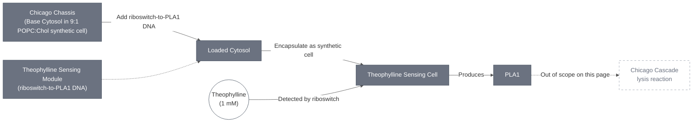
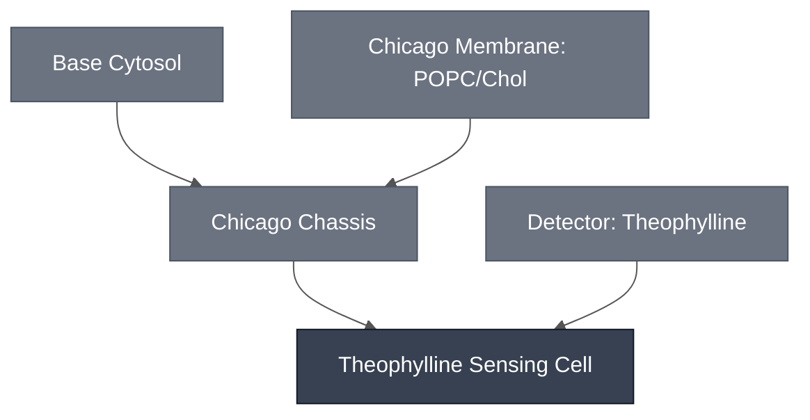

# Overview

The Theophylline Sensing Cell is the [Chicago Chassis](../chicago-chassis/spec.md) loaded with the [Theophylline Sensing Module](../detector-theophylline/spec.md): a 9:1 POPC:cholesterol synthetic cell encapsulating Base Cytosol and DNA encoding the theophylline-responsive riboswitch, here controlling PLA1 expression rather than the LacZ reporter used in the Theophylline Sensing Module's bulk-cytosol validation. Detection of theophylline drives PLA1 production, which is the trigger step for the downstream Chicago Cascade lysis reaction (out of scope for this page — see Implementations).

:::{attention} 🚧 Draft
This page is a work in progress and not yet ready for use.
:::

:::{attention} Removed from the Chicago demo; retained as a DevStudio replication target
Chicago is now focusing on the aTc and pH sensors, and its Integration Assessment Framework lists "Two sensors (aTC/pH)" (14 Aug 2026 deck, slides 2 and 34); the team flagged "theophylline sensor removed from Chicago demo" as a diagram correction (2026-08-14 meeting notes). The module remains queued under "Replicating Modules in Bulk Reactions" for DevStudio (slide 28), so it is out of the demo but not out of the program.

The underlying riboswitch is described as "very wonky and unpredictable", and is **leaky** in bulk: without theophylline it still drove LacZ to Abs₅₇₀ ≈ 3.0 AU by 3.5 h, versus ≈3.9 AU by 1.7 h with 1 mM or 2 mM (slide 28). Full discussion is on the [Theophylline Sensing Module](../detector-theophylline/spec.md) spec. Do not treat this page as a validated, ready-to-use Module.
:::

This page describes the Chassis + Module integration step itself. It does not cover this Sensing Cell's integration into the multiplexed Chicago Cascade — see [Chicago Cascade](../chicago-cascade/spec.md), and that page's Requirements section for the co-encapsulation constraint against the aTc Sensing Module.

This diagram shows the composed mechanism only: the Chicago Chassis loaded with the Theophylline Sensing Module's riboswitch-to-PLA1 DNA, encapsulated as a synthetic cell, then producing PLA1 on theophylline detection. It stops at PLA1 output — the downstream Chicago Cascade lysis reaction is a separate, out-of-scope step (see Overview above).

# Reference Composition

:::::{tab-set}

<!-- gen:composition-diagram -->
::::{tab-item} Module Dependencies

::::
<!-- /gen:composition-diagram -->

::::{tab-item} Cytosol

The inner solution is [Base Cytosol](../base-cytosol/spec.md) at reaction concentration, per [Chicago Chassis](../chicago-chassis/spec.md), with DNA added encoding the theophylline riboswitch upstream of PLA1.

The table below is a one-level-deep aggregate: it states what each Module contributes to the combined Sensing Cell recipe, without re-expanding either Module's own internal composition (see each linked spec for that detail).

:::{table} Sensing Cell composition (Cytosol) — aggregated from Modules
:label: comp-theo-sensing-cell-cytosol

| Module | Contributes | Working concentration / fraction in the Sensing Cell recipe |
| --- | --- | --- |
| [Chicago Chassis](../chicago-chassis/spec.md) | Base Cytosol reaction mix (see that page and [Base Cytosol](../base-cytosol/spec.md) for the internal recipe) | 1x reaction concentration — the chassis cytosol is not diluted to add the sensing DNA |
| [Theophylline Sensing Module](../detector-theophylline/spec.md) | DNA encoding the theophylline riboswitch upstream of PLA1 | Not documented for the PLA1-linked construct actually used in this Sensing Cell (see gap flag below). For scale only: the bulk-cytosol validation construct — `pT7-theophylline-LacZ` (`pMN066`), a different downstream gene — runs at 5 nM final DNA in a 1x cytosol reaction, per the `chicago-theophylline-lacz` devnote. That figure is cited for scale only; it is not confirmed to apply to the PLA1-linked construct. |

:::

:::{attention} Construct not yet identified
The PLA1-linked riboswitch construct used in the Chicago integration status material is a separate design from `pT7-theophylline-LacZ` (`pMN066`), the bulk-cytosol validation construct documented on the [Theophylline Sensing Module](../detector-theophylline/spec.md) page. It is not yet named or present in `nucleus-eng/DNA`. Do not link a placeholder or assume the LacZ-reporter construct's sequence applies here — flag for follow-up so the PLA1-linked construct can be identified and submitted to `nucleus-eng/DNA`.
:::

::::

::::{tab-item} Membrane

:::{table}
:label: comp-theov-membrane

| Component   | Target Percentage (%) |
| ----------- | ---------------------- |
| POPC        | ~90 (9:1 ratio)         |
| Cholesterol | ~10 (9:1 ratio)         |

:::

Same 9:1 POPC:cholesterol synthetic cell membrane as [Chicago Chassis](../chicago-chassis/spec.md). See that page for the note on how this differs from the default [Base Membrane](../membrane-popc-chol/spec.md) ratio.

::::

:::::

# Expected Behavior

Per the Chicago integration status material, this Sensing Cell produces PLA1 upon detection of 1 mM theophylline. This result has not yet been independently confirmed by a primary devnote — cite the Chicago integration status material and treat as pending confirmation, consistent with the "PLA1-linked cascade design" discussion on the [Theophylline Sensing Module](../detector-theophylline/spec.md) page.

Separately, the bulk-cytosol devnote behind the Theophylline Sensing Module (`chicago-theophylline-lacz`) demonstrates the riboswitch itself converts CPRG faster in the presence of 1.5 mM theophylline than without it, using the LacZ-reporter construct rather than the PLA1-linked construct used here. That result supports the riboswitch's general compatibility with Nucleus Cytosol; it is not a validation of this Sensing Cell's specific PLA1 output.

As noted above, a later bulk-reaction replication (2026-08-14 status deck, p. 28) found the riboswitch leaky in the LacZ-reporter configuration, expressing reporter without theophylline at levels close to the 1 mM to 2 mM theophylline condition. Whether the same leakiness applies to the PLA1-linked construct used in this Sensing Cell has not been separately tested — flagged as an open question rather than assumed.

# Requirements

Requires pT7 transcription and translation (e.g. [Base Cytosol](../base-cytosol/spec.md)), supplied here by the [Chicago Chassis](../chicago-chassis/spec.md).

Requires theophylline to cross the membrane and reach the encapsulated riboswitch; the reported result uses 1 mM theophylline in the outer solution.

Per the [Theophylline Sensing Module](../detector-theophylline/spec.md) page, this Sensing Cell must not be co-encapsulated with the aTc Sensing Cell. The requirement is settled; the mechanism behind it is not. See [Theophylline Sensing Module § Requirements](../detector-theophylline/spec.md#requirements) for the evidence, including a primary figure that runs against the usual inhibition explanation. This page does not restate it.

# Implementations

No Implementation page exists yet for this Sensing Cell. The downstream merge into the multiplexed [Chicago Cascade](../chicago-cascade/spec.md) is tracked on that page. This page covers the Chassis + Module integration only.

:::{attention} A superseded "hydrogel cross-contamination" explanation has been removed
An earlier revision cited hydrogel cross-contamination between co-located cells as the blocker for the Chicago Cascade merge. That explanation was never backed by a primary source and has been superseded by the co-encapsulation constraint documented on the [Theophylline Sensing Module](../detector-theophylline/spec.md#requirements). Recorded here rather than dropped silently.
:::

# Constituent Modules

- [Chicago Chassis](../chicago-chassis/spec.md)
- [Theophylline Sensing Module](../detector-theophylline/spec.md) (PLA1-linked configuration — see Reference Composition above for how this differs from that page's bulk-cytosol validation construct)

# Credits

Developed by [Maram Naji](https://orcid.org/0000-0003-1409-4194) (Chicago Node, Lucks Lab) — bulk-cytosol riboswitch validation (`chicago-theophylline-lacz` devnote).

Developed by the Chicago Node (Kamat Lab and Liu Lab) — the PLA1-linked sensing cell integration.
