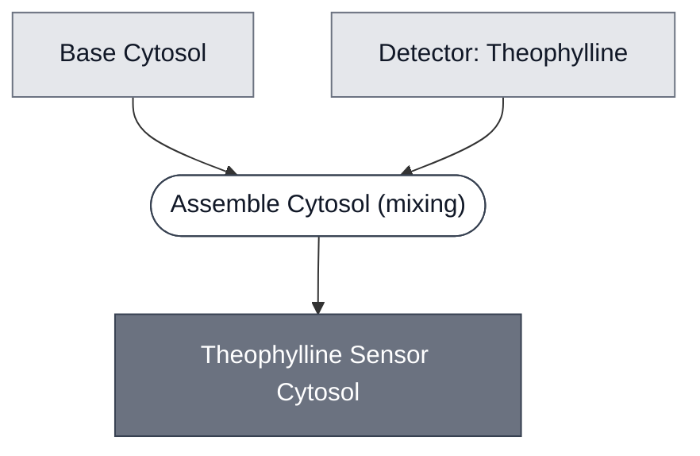

# Overview

<!-- gen:position -->
**Position.** Refines [`sensor-cytosol`](../sensor-cytosol/spec.md). Refined by nothing on this branch.
<!-- /gen:position -->

[Base Cytosol](../base-cytosol/spec.md) mixed with
[Detector: Theophylline](../detector-theophylline/spec.md). A member of
[Sensor Cytosol](../sensor-cytosol/spec.md).

**This page exists because four Modules named this intermediate and nothing defined it.** It was
produced by [Theophylline Sensing Cell](../theophylline-sensing-cell/spec.md) with `page: null`,
and that page's own source said so first.

:::{attention} Canceled — not part of the DevCells demo
The theophylline riboswitch expresses its effector without theophylline present, so it does not
discriminate. It was cut from the demo, and its constructs are recorded as no longer in use.
This specification is kept for reference and is not maintained.
:::

# Reference Composition

:::::{tab-set}

<!-- gen:composition-diagram -->
::::{tab-item} Module Dependencies

::::
<!-- /gen:composition-diagram -->

::::{tab-item} Cytosol

[Base Cytosol](../base-cytosol/spec.md) at reaction concentration. The same base the aTc and pH sensor cytosols use. The AHL one uses [S30 Lysate](../s30-lysate/spec.md) instead, which is why [Cytosol](../cytosol/spec.md) exists as a class.

:::{table} The base, at the figures its detector's page records.
| Component | Working concentration | Notes |
| --- | --- | --- |
| [Base Cytosol](../base-cytosol/spec.md) | 1x | S-Mix 1x, P-Mix 1.80 mg/mL, ribosomes 1.8 µM, tRNA 3.5 mg/mL, RNase inhibitor 2000 U/mL |
:::

**These figures come from [Detector: Theophylline](../detector-theophylline/spec.md)'s own reaction**, because no run of this intermediate alone is on record. That is the same imputation the LacZ reporter page carries and it is recorded rather than presented as measurement.

::::

::::{tab-item} DNA

[Detector: Theophylline](../detector-theophylline/spec.md), a translational riboswitch whose aptamer sits in the 5-prime UTR.

:::{table} The sensing template.
| Component | Working concentration | Notes |
| --- | --- | --- |
| Sensor DNA | 5 nM final | from a 49.55 nM stock. `pT7-theophylline-LacZ` (`pMN066`), not in `nucleus-eng/DNA` |
:::

**No effector template is specified**, and that is a gap in this Module rather than a property of its class. The riboswitch drives whichever effector gene sits downstream and no page names one, so this is a sensing reaction with no output wired to it.

::::

:::::

**One step, `mixing`, copied from its parent rather than derived.**
[Theophylline Sensing Cell](../theophylline-sensing-cell/spec.md) declares `assemble-cytosol` as
`mixing` over Base Cytosol and Detector: Theophylline, producing this id. This page records that
step and adds nothing, so the two sources cannot disagree about what this intermediate is.

**No effector, and that is why the membership ruling matters.** The other three members of
[Sensor Cytosol](../sensor-cytosol/spec.md) each mix in [Effector: PLA1](../effector-pla1/spec.md).
This one carries none, because the riboswitch drives whichever effector gene sits downstream and
no page specifies one. **A sensing reaction with no output wired to it is still a sensor
cytosol**, which is what makes the class invariant a detector rather than a detector plus an
effector.

# Requirements

Requires an effector gene downstream of the riboswitch. None is specified, which is a gap in
this Module rather than a property of its class.

# Constituent Modules

- [Base Cytosol](../base-cytosol/spec.md) — the base
- [Detector: Theophylline](../detector-theophylline/spec.md) — the riboswitch

# Processes

See the composition source.

# Credits

:::{attention} Credits are draft
Contributor attribution on this page has not been confirmed with the Node. Assign each credit
explicitly before this page is merged to `main`.
:::
