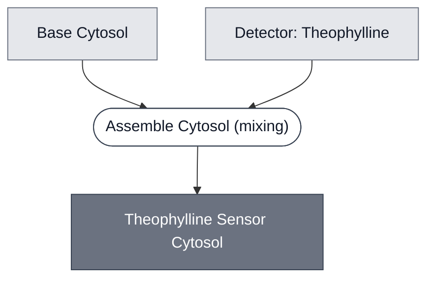

# Overview

<!-- gen:position -->
**Position.** Refines [`sensor-cytosol`](../sensor-cytosol/spec.md). Refined by nothing on this branch.
<!-- /gen:position -->

[Base Cytosol](../base-cytosol/spec.md) mixed with
[Detector: Theophylline](../detector-theophylline/spec.md). A member of
[Sensor Cytosol](../sensor-cytosol/spec.md).

:::{attention} Canceled — not part of the DevCells demo
The theophylline riboswitch expresses its effector without theophylline present, so it does not discriminate. It is not part of the DevCells demo, and its constructs are no longer in use.
:::

# Reference Composition

:::::{tab-set}

<!-- gen:composition-diagram -->
::::{tab-item} Module Dependencies

```mermaid
flowchart TD
    BASE_CYTOSOL["Base Cytosol"]
    DETECTOR_THEOPHYLLINE["Detector: Theophylline"]

    P1_ASSEMBLE_CYTOSOL_0(["Assemble Cytosol (mixing)"])
    THEOPHYLLINE_SENSOR_CYTOSOL["Theophylline Sensor Cytosol"]

    BASE_CYTOSOL --> P1_ASSEMBLE_CYTOSOL_0
    DETECTOR_THEOPHYLLINE --> P1_ASSEMBLE_CYTOSOL_0
    P1_ASSEMBLE_CYTOSOL_0 --> THEOPHYLLINE_SENSOR_CYTOSOL


    classDef leaf     fill:#e5e7eb,stroke:#6b7280,color:#111827;
    classDef composed fill:#6b7280,stroke:#374151,color:#ffffff;
    classDef process  fill:#ffffff,stroke:#374151,color:#111827;
    class BASE_CYTOSOL,DETECTOR_THEOPHYLLINE leaf;
    class THEOPHYLLINE_SENSOR_CYTOSOL composed;
    class P1_ASSEMBLE_CYTOSOL_0 process;

    click BASE_CYTOSOL "/docs/modules/base-cytosol/spec"
    click DETECTOR_THEOPHYLLINE "/docs/modules/detector-theophylline/spec"
    click P1_ASSEMBLE_CYTOSOL_0 "/docs/processes/assemble-cytosol/assemble-cytosol-main"
    click THEOPHYLLINE_SENSOR_CYTOSOL "/docs/modules/theophylline-sensor-cytosol/spec"
```

::::
<!-- /gen:composition-diagram -->

::::{tab-item} Cytosol

[Base Cytosol](../base-cytosol/spec.md) at reaction concentration. The aTc and pH sensor cytosols use the same base. The 3OC6-HSL one uses [S30 Lysate](../s30-lysate/spec.md) instead.

:::{table} The base, at the figures its detector's page records.
| Component | Working concentration | Notes |
| --- | --- | --- |
| [Base Cytosol](../base-cytosol/spec.md) | 1x | S-Mix 1x, P-Mix 1.80 mg/mL, ribosomes 1.8 µM, tRNA 3.5 mg/mL, RNase inhibitor 2000 U/mL |
:::

**These figures are taken from [Detector: Theophylline](../detector-theophylline/spec.md)'s own reaction**, because this intermediate has not been run alone.

::::

::::{tab-item} DNA

[Detector: Theophylline](../detector-theophylline/spec.md), a translational riboswitch whose aptamer sits in the 5-prime UTR.

:::{table} The sensing template.
| Component | Working concentration | Notes |
| --- | --- | --- |
| Sensor DNA | 5 nM final | from a 49.55 nM stock. `pT7-theophylline-LacZ` (`pMN066`), not in `nucleus-eng/DNA` |
:::

**No effector template is specified.** The riboswitch drives whichever effector gene sits downstream, and no page names one, so this is a sensing reaction with no output wired to it.

::::

:::::

**This member carries no effector.** The other three members of [Sensor Cytosol](../sensor-cytosol/spec.md) each mix in [Lysis: PLA1](../effector-pla1/spec.md). This one carries none, because the riboswitch drives whichever effector gene sits downstream and no page specifies one. A sensing reaction with no output wired to it is still a sensor cytosol: the class invariant is a detector, not a detector plus an effector.

# Requirements

Requires an effector gene downstream of the riboswitch. None is specified.

# Constituent Modules

- [Base Cytosol](../base-cytosol/spec.md) — the base
- [Detector: Theophylline](../detector-theophylline/spec.md) — the riboswitch

# Processes

[Assemble Cytosol](../../processes/assemble-cytosol/assemble-cytosol-main.md) mixes [Base Cytosol](../base-cytosol/spec.md) with [Detector: Theophylline](../detector-theophylline/spec.md).

# Credits

:::{attention} Credits are draft
Contributor attribution on this page has not been confirmed with the Node. Assign each credit
explicitly before this page is merged to `main`.
:::
