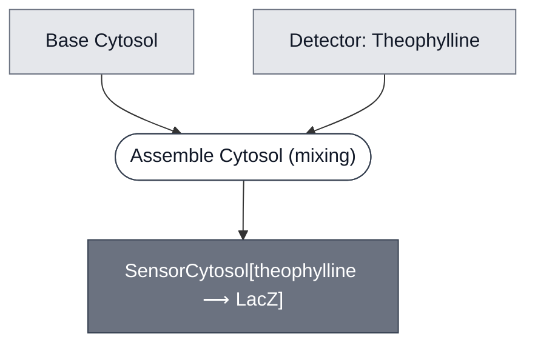

# Overview

<!-- gen:position -->
**Position.** Refines [Sensor Cytosol](../sensor-cytosol/spec.md). Refined by nothing on this branch.
<!-- /gen:position -->

[Base Cytosol](../base-cytosol/spec.md) mixed with
[Detector: Theophylline](../detector-theophylline/spec.md). A member of
[Sensor Cytosol](../sensor-cytosol/spec.md).

:::{attention} Canceled — not part of the DevCells demo
The theophylline riboswitch expresses its effector without theophylline present, so it does not discriminate. It is not part of the DevCells demo, and its constructs are no longer in use.
:::

# Reference Composition

:::::{tab-set}

<!-- gen:composition-diagram -->
::::{tab-item} Module Dependencies

```mermaid
flowchart TD
    BASE_CYTOSOL["Base Cytosol"]
    DETECTOR_THEOPHYLLINE["Detector: Theophylline"]

    P1_ASSEMBLE_CYTOSOL_0(["Assemble Cytosol (mixing)"])
    THEOPHYLLINE_SENSOR_CYTOSOL["SensorCytosol[theophylline ⟶ LacZ]"]

    BASE_CYTOSOL --> P1_ASSEMBLE_CYTOSOL_0
    DETECTOR_THEOPHYLLINE --> P1_ASSEMBLE_CYTOSOL_0
    P1_ASSEMBLE_CYTOSOL_0 --> THEOPHYLLINE_SENSOR_CYTOSOL


    classDef leaf     fill:#e5e7eb,stroke:#6b7280,color:#111827;
    classDef composed fill:#6b7280,stroke:#374151,color:#ffffff;
    classDef process  fill:#ffffff,stroke:#374151,color:#111827;
    class BASE_CYTOSOL,DETECTOR_THEOPHYLLINE leaf;
    class THEOPHYLLINE_SENSOR_CYTOSOL composed;
    class P1_ASSEMBLE_CYTOSOL_0 process;

    click BASE_CYTOSOL "/docs/modules/base-cytosol/spec"
    click DETECTOR_THEOPHYLLINE "/docs/modules/detector-theophylline/spec"
    click P1_ASSEMBLE_CYTOSOL_0 "/docs/processes/assemble-cytosol/assemble-cytosol-main"
    click THEOPHYLLINE_SENSOR_CYTOSOL "/docs/modules/theophylline-sensor-cytosol/spec"
```

::::
<!-- /gen:composition-diagram -->

::::{tab-item} Cytosol

[Base Cytosol](../base-cytosol/spec.md) at reaction concentration. The aTc and pH sensor cytosols use the same base. The 3OC6-HSL one uses [S30 Lysate](../s30-lysate/spec.md) instead.

:::{table} The base, at the figures its detector's page records.
| Component | Working concentration | Notes |
| --- | --- | --- |
| [Base Cytosol](../base-cytosol/spec.md) | 1x | S-Mix 1x, P-Mix 1.80 mg/mL, ribosomes 1.8 µM, tRNA 3.5 mg/mL, RNase inhibitor 2000 U/mL |
:::

**These figures are taken from [Detector: Theophylline](../detector-theophylline/spec.md)'s own reaction**, because this intermediate has not been run alone.

::::

::::{tab-item} DNA

[Detector: Theophylline](../detector-theophylline/spec.md), a translational riboswitch whose aptamer sits in the 5-prime UTR.

:::{table} The sensing template.
| Component | Working concentration | Notes |
| --- | --- | --- |
| Sensor DNA | 5 nM final | from a 49.55 nM stock. `pT7-theophylline-LacZ` (`pMN066`), not in `nucleus-eng/DNA` |
:::

**What sits downstream of the riboswitch is LacZ, and it is a reporter rather than an effector.** The one construct on record, `pT7-theophylline-LacZ` above, fuses the enzyme directly to the riboswitch, so detection produces color and not lysis. **No effector template is specified**, and none is needed for the Module to function as specified.

::::

:::::

**This member carries no effector, and it is the only one that does not.** The other three members of [Sensor Cytosol](../sensor-cytosol/spec.md) each mix in [Lysis: PLA1](../effector-pla1/spec.md), because all three share a colorimetric readout that lysis releases. This one reaches color without lysing anything: the riboswitch expresses [LacZ](../reporter-lacz/spec.md) directly. A sensing reaction that drives a reporter and no effector is still a sensor cytosol, because the class invariant is a detector, not a detector plus an effector.

# Requirements

Requires a gene downstream of the riboswitch for detection to produce anything. The one construct on record puts LacZ there, which is the pairing [Detector: Theophylline](../detector-theophylline/spec.md#detector-theophylline-requirements) and [LacZ Reporter Module](../reporter-lacz/spec.md#reporter-lacz-requirements) both carry a MUST NOT against. Every result on this page was produced with it, and the MUST NOT stands.

# Processes

[Assemble Cytosol](../../processes/assemble-cytosol/assemble-cytosol-main.md) mixes [Base Cytosol](../base-cytosol/spec.md) with [Detector: Theophylline](../detector-theophylline/spec.md).

# Constituent Modules

- [Base Cytosol](../base-cytosol/spec.md) — the base
- [Detector: Theophylline](../detector-theophylline/spec.md) — the riboswitch

# Credits

:::{attention} Credits are draft
Contributor attribution on this page has not been confirmed with the Node. Assign each credit
explicitly before this page is merged to `main`.
:::
