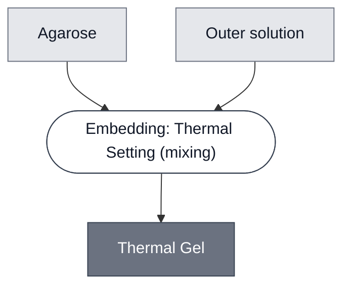

# Overview

<!-- gen:position -->
**Position.** Refines [`gel`](../gel/spec.md). Refined by [`gel-lga`](../gel-lga/spec.md), [`gel-ulga`](../gel-ulga/spec.md).
<!-- /gen:position -->

A class: a gel that sets when it cools.

Every member has two temperatures that matter. It sets as it cools through its gelling range, and the set gel turns liquid again above its melting temperature. Each member states its own.

:::{attention} 🚧 Draft
This page is a work in progress and not yet ready for use.
:::

# Reference Composition

:::::{tab-set}

<!-- gen:composition-diagram -->
::::{tab-item} Module Dependencies

::::
<!-- /gen:composition-diagram -->

::::{tab-item} Gel

:::{table} What each member sets, and in what.
| Member | Polymer | Outer solution |
| --- | --- | --- |
| [Gel: ULGA](../gel-ulga/spec.md) | ULGA (ultra-low-gelling-temperature agarose) | [Outer Solution: Glutamate-HEPES-Glucose](../outer-solution-glutamate/spec.md) |
| [Gel: LGA](../gel-lga/spec.md) | LGA (low-gelling-temperature agarose) | an [Outer Solution](../outer-solution/spec.md) |
:::

::::

:::::

# Expected Behavior

A thermal gel is liquid while it is held above its gelling range, and sets when it is cooled through it. Once set, it stays set until it is warmed past its melting temperature, which is higher. So a payload goes in while the gel is liquid, above the top of the range, and the gel is then cooled to set.

# Requirements

Requires that whatever is embedded tolerates the temperature at which the gel is still liquid. That limit belongs to the payload, and its own page states it.

# Constituent Modules

- Agarose — the polymer, a different grade in each member
- [Outer Solution](../outer-solution/spec.md) — the phase the agarose dissolves into and becomes

# Processes

- [Embedding: Thermal Setting](../../processes/embed-thermal-setting/main.md) — holds the gel above its gelling range while the payload goes in, then sets it by cooling.

# Credits

:::{attention} Credits are draft
Contributor attribution on this page has not been confirmed with the Node. Assign each credit explicitly before this page is merged to `main`.
:::
