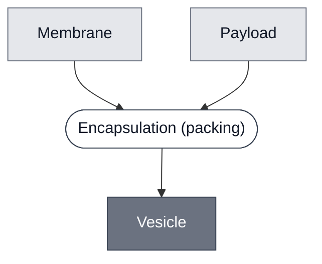

# Overview

<!-- gen:position -->
**Position.** Refines nothing declared. Refined by [`guv`](../guv/spec.md), [`liposome`](../liposome/spec.md), [`luv`](../luv/spec.md), [`substrate-carrier`](../substrate-carrier/spec.md), [`suv`](../suv/spec.md).
<!-- /gen:position -->

A lipid bilayer closed around an aqueous interior. **This is the general term**, and two independent axes narrow it: **size and lamellarity** give [GUV](../guv/spec.md), [SUV](../suv/spec.md) and [LUV](../luv/spec.md); **material** gives [Liposome](../liposome/spec.md), whose sibling would be a polymersome.

**The two axes do not nest.** A GUV may be a liposome or a polymersome, so neither axis is a parent of the other and a member may take one parent from each.

**Every vesicle documented here is a liposome**, so the material axis has one value today and does no work yet.

:::{attention} 🚧 Draft
This page is a work in progress and not yet ready for use.
:::

# Reference Composition

**A membrane around a payload, and nothing more.** Every narrowing below this — which route makes it, what size it is, what the bilayer is made of — belongs to a child. Members differ in both the membrane and the interior.

:::::{tab-set}

<!-- gen:composition-diagram -->
::::{tab-item} Module Dependencies

::::
<!-- /gen:composition-diagram -->

::::{tab-item} Membrane

This class does not fix the bilayer. Which lipids, and in what ratio, belongs to a member of [Membrane](../membrane/spec.md), and which member belongs to a child of this class.

:::{table} The bilayer, unnarrowed at this level.
:label: comp-vesicle-membrane

| Component | Target percentage (%) |
| --- | --- |
| not fixed here | — |
:::

::::

:::::

# Expected Behavior

A vesicle holds its interior apart from the outside until something breaches the bilayer. **The class says nothing about what that is** — lysis, a pore, or no breach at all.

# Requirements

Requires a membrane that closes, and an interior to close around. **Whether forming the boundary and holding something in it are one operation or two is unsettled**, which is why this class declares no parent.

# Processes

- [Encapsulation](../../processes/encapsulate/main.md) — the abstract operation. Each size class names one of its three routes

# Constituent Modules

- [Membrane](../membrane/spec.md) — the bilayer that closes
- **Payload** — what it closes around, and it has no class page: a cytosol, a substrate or a dye, depending on the member

# Credits

:::{attention} Credits are draft
Contributor attribution on this page has not been confirmed with the Node. Assign each credit explicitly before this page is merged to `main`.
:::
