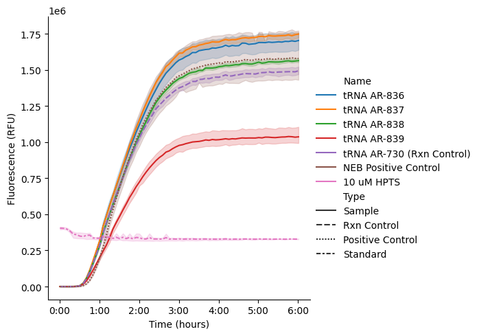
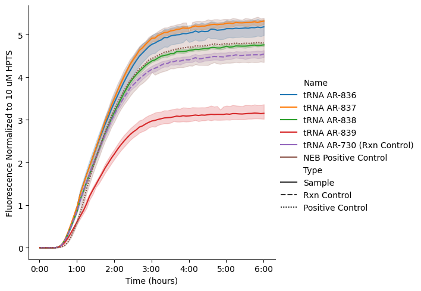
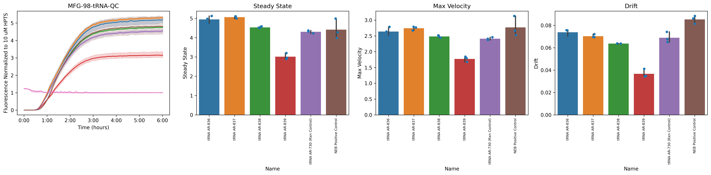

# How to analyze plate reader kinetics

:::{attention}
:class: simple
This tutorial applies to CDK version >=0.6.0. For older versions, see the tutorial [here](guides/platereader-tutorial/).
:::

## Overview
This guide explains how to analyze time-series fluorescence data from plate reader expression experiments using the open-source Nucleus Cell Development Kit (CDK). Here, we'll cover how to load, normalize, visualize, and fit your data (see [DevNote](https://devnotes.nucleus.engineering/articles/Newman-20260421)), as well as describe the resultin summary statistics.

The CDK is available [on PyPi](https://pypi.org/project/nucleus-cdk/) for install on your own computer (requires Python 3.11+ and the `poetry` package).

<!-- This tutorial walks through analyzing time-series data from plate reader experiments using the `cdk` platereader module. We'll cover loading data, picking the read you care about, plotting raw curves, normalizing to a standard, fitting kinetic parameters, and visualizing results.

The companion notebook `platereader.ipynb` runs the same code without the explanations — use it as a clean working template once you're comfortable with the steps here. We also describe more in depth on the kinetics analysis of plate reader experiments in a [kinetics DevNote](https://devnotes.nucleus.engineering/articles/Newman-20260421)

## Table of Contents
1. [Setup](#setup)
2. [Load Data](#load-data)
3. [Plot Raw Curves](#plot-curves)
4. [Normalize Data](#normalize)
5. [Kinetic Analysis](#kinetic-analysis)
6. [Summary Plots](#summary)


### Note for those that care about the code (ignore if not!)

The API is object-oriented. Two objects do almost all the work:

- **`PlateReaderResult`** — what loading returns. A list-like container of one or more *blocks*, one per read on the plate (e.g. two gains, or two ex/em spectra).
- **`PlateReaderData`** — a single block. It behaves like a DataFrame (you can index and slice it) but also carries methods that return *new* `PlateReaderData` objects: `.plot()`, `.normalize()`, `.blank()`, `.fit_kinetics()`, and more. Transforms are immutable and chainable.

Fitting kinetics returns a **`Kinetics`** object with its own `.summary`, `.plot()`, and `.plot_summary()`.

---
-->


## 1. Setup

First, import the necessary libraries. The `platereader` module from the CDK contains specialized functions for loading plate reader data, performing kinetic analysis, and visualization. By convention, we import `platereader` as `pr`. 

```python
%load_ext autoreload
%autoreload 2

import pandas as pd
import seaborn as sns
import matplotlib.pyplot as plt

# Import the cdk platereader module
from cdk.instruments import platereader as pr
```

---

## 2. Load Data

Load your plate reader output and merge it with the platemap (see [DevNote](https://devnotes.nucleus.engineering/articles/Bhasin-20260421)) that describes your experimental conditions.

- `data_file`: path to the output file from a plate reader experiment. Currently only **BioTek** plate readers are supported.
- `platemap_file`: path to a platemap CSV mapping each `Well` to its experimental conditions. See the [platemap tutorial](https://docs.nucleus.engineering/guides/platemap-tutorial/) for the expected format.
- 
<!-- `load_platereader_data()` parses the file, integrates the platemap, and returns a **`PlateReaderResult`** — a collection of blocks corresponding to the reads made by the plate reader. -->

Call `load_platereader_data()` to parse the file:

```python
# Specify file paths
data_file = "path/to/data.txt"
platemap_file = "path/to/platemap.csv"

# Load data
result = pr.load_platereader_data(
    data_file=data_file,
    platemap_file=platemap_file,
    platereader="biotek"
)
```

The output is a `PlateReaderResult` object: a list-like collection of `PlateReaderData` blocks. If you did more than one read on the plate (multiple gains, or different ex/em spectra), each read is a separate block. Print `result` to see what's inside:

```python
print(result)
```

    PlateReaderResult with the following 2 blocks:
    0: (1533, 54) kinetic read with reads: GFP-G70:485,528 (Fluorescence) (Plate 'Plate 1')
    1: (1533, 54) kinetic read with reads: GFP-Gext:485,528 (Fluorescence) (Plate 'Plate 1')


 The output lists all of the blocks in the data file. For each block, you can see its index, the type of experiment stored (here, kinetic), the dimensions of the underlying DataFrame, the reads recorded and their measurement modalities, and the ID of the plate used.

Here, there are two reads of a single plate with different gains and the same excitation/emission spectra. To work with a single read, choose its index (e.g., the `GFP-Gext` read is block index `1`):


```python
desired_index = 1
data = result[desired_index]
```

You can see the underlying data with `data.view()` (which returns a Pandas DataFrame):


```python
# Show the first five rows:
data.view().info()
```

```python
<class 'pandas.core.frame.DataFrame'>
RangeIndex: 1533 entries, 0 to 1532
Data columns (total 42 columns):
 #   Column                      Non-Null Count  Dtype          
---  ------                      --------------  -----          
 0   Date                        1533 non-null   datetime64[ns] 
 1   Experiment                  1533 non-null   object         
 2   Well                        1533 non-null   object         
 3   Name                        1533 non-null   object         
 4   Type                        1533 non-null   object         
 5   Time                        1533 non-null   timedelta64[ns]
 6   Data                        1533 non-null   int64          
 7   Data_normalized             1533 non-null   float64        
 8   Read                        1533 non-null   object         
 9   Read Name                   1533 non-null   object         
 10  Reader Type                 1533 non-null   object         
 11  Reader ID                   1533 non-null   object         
 12  Plate Type                  1533 non-null   object         
 13  Plate ID                    1533 non-null   object         
 14  Start Time                  1533 non-null   datetime64[ns] 
 15  Read Modality               1533 non-null   object         
 16  Gain                        1533 non-null   object         
 17  Excitation Wavelength (nm)  1533 non-null   int64          
 18  Excitation Bandwidth (nm)   1533 non-null   object         
 19  Excitation Optics           1533 non-null   object         
 20  Emission Wavelength (nm)    1533 non-null   int64          
 21  Emission Bandwidth (nm)     1533 non-null   int64          
 22  Emission Optics             1533 non-null   object         
 23  Read Geometry               1533 non-null   object         
 24  Read Height (mm)            1533 non-null   object         
 25  PMix ID                     1314 non-null   object         
 26  [PMix] (mg/mL)              0 non-null      float64        
 27  Ribosome ID                 0 non-null      float64        
 28  [Ribosome] (uM)             0 non-null      float64        
 29  SMS ID                      1314 non-null   object         
 30  tRNA ID                     1095 non-null   object         
 31  [tRNA] (ug/uL)              1095 non-null   float64        
 32  DNA ID                      1314 non-null   object         
 33  [DNA] (ng/uL)               1314 non-null   float64        
 34  PMix Vol (uL)               1314 non-null   float64        
 35  Ribosome Vol (uL)           0 non-null      float64        
 36  SMS Vol (uL)                1314 non-null   float64        
 37  tRNA Vol (uL)               1314 non-null   float64        
 38  DNA Vol (uL)                1314 non-null   float64        
 39  RNase Inhib Vol (uL)        1314 non-null   float64        
 40  Water vol (uL)              1314 non-null   float64        
 41  Rxn Volume (uL)             1314 non-null   float64        
dtypes: datetime64[ns](2), float64(14), int64(4), object(21), timedelta64[ns](1)
memory usage: 503.1+ KB
```

The dataset contains information from the platemap and metadata extracted from the plate reader's output, in [long format](https://devnotes.nucleus.engineering/articles/Bhasin-20260421#representation). Each row represents a single measurement, where:
- `Time` represents the time point of the measurement relative to the start of the experiment, 
- `Read` is the label of the read applied by the plate reader configuration, and 
- `Data` is the raw value of the measurement. 

:::{note}
By default, a "standard" subset of metadata is shown by `data.view()`. To see the full set of metadata extracted from the plate reader output file, use `data.view('full')`.
:::

---

## 3. Plot Raw Curves

First, visualize your data. You can do this by calling `data.plot()`. <!-- The method is format-aware: for a kinetic (time-series) block it plots fluorescence over time.--> By default, one curve is plotted for each distinct `Name` in the platemap. The band shows a [bootstrapped 95% confidence interval of the mean](https://seaborn.pydata.org/tutorial/error_bars.html#confidence-interval-error-bars) across wells with that `Name`.

Passing `style='Type'` assigns different line styles for the different sample types that appear in your platemap (`Sample`, `Standard`, `Blank`, etc. as defined in the [platemap standard](https://devnotes.nucleus.engineering/articles/Bhasin-20260421#required-columns)). Line styles by type makes it easy to spot controls, catch outliers, failed reactions, or unexpected behavior before fitting dat.

:::{hint} Familiar with Seaborn?
<!-- :class: dropdown -->
You can pass the usual keyword arguments for a `lineplot` through, such as `style` and `hue`, and you can even add faceting with `row` and `column`. Use any column names seen in `data.view()`.
:::


```python
data.plot(style='Type')
```
    

    

We can see that our Samples show typical behavior and that the standard (here, HPTS) is stable, thus we can safely normalize our data.


---

## 4. Normalize Data

Instead of performing your analyses on the raw units output by the plate reader, we recommend first normalizing to a standard so values are comparable across experiments and instruments. 

The function `data.normalize('<standard name>')` takes the time average of each well labeled as a Standard at the end of the run (1 hour by default), then divides all data by that mean.

The name you pass as an argument to `data.normalize()` must match the standard's `Name` column from your platemap. You can check the name of your standards this way:


```python
platemap = data.platemap
standards = platemap[platemap['Type']=='Standard']
standards['Name'].unique()
```


    array(['10 uM HPTS'], dtype=object)


Then, call `data.normalize()`:
```python
data = data.normalize('10 uM HPTS')
```

NOTE: you need to save the output of this transformation — it does not happen in-place!

Now replot to see your normalized data. We exclude the standard from the plot using `exclude_types=['Standard']`:


```python
g = data.plot(style='Type', exclude_types=['Standard'])
# To save the output:
# g.savefig('after-normalization.png',dpi=300)
```


    


The plot y-axis label will automatically update to indicate that your data have been normalized and will indicate the name of the standard used.

:::{tip}
If you want to change the time window over which the end-of-run average is calculated, pass a `window` argument:


```python
data = data.normalize('10 uM HPTS', window=pd.Timedelta("2.5h"))
```
:::

---

## 5. Kinetic Analysis

Now we're ready to do our kinetic analysis.

:::{seealso}
See our [DevNote](https://devnotes.nucleus.engineering/articles/Newman-20260421) on kinetic analysis for more details!
:::

`data.fit_kinetics()` fits a **sigmoid-with-drift** curve to each well (grouped by unique well identifiers: `Experiment`, `Well`, `Read`, and `Reader ID` by default) and extracts interpretable kinetic parameters.

The model is:

$$
  y(t) = \frac{L}{1 + e^{-k(t - \tau_{v_\text{max}})}} + b\,(t - \tau_\text{drift})
$$

with parameters:

- $L$: steady-state level (asymptote)
- $k$: growth rate (steepness)
- $\tau_{v_\text{max}}$: inflection point (time of maximum velocity)
- $b$: drift rate (linear signal change after steady-state)
- $\tau_\text{drift}$: drift onset time

See the [DevNote](https://devnotes.nucleus.engineering/articles/Newman-20260421) on kinetic analysis for more details.

**Metrics extracted:**

  - **Max Velocity**: maximum rate of fluorescence increase (slope at inflection point)
  - **Lag Time**: time to reach the exponential phase
  - **Steady State**: final fluorescence level
  - **Completion Time**: time to reach 95% of the asymptote
  - **Drift**: rate of signal decay or increase after steady-state
  - **R²**: goodness of fit; "Good Fit" is `True` if $R^2 \geq 0.95$


Run the kinetic analysis:
```python
kinetics = data.fit_kinetics()
```

`fit_kinetics()` returns a `Kinetics` object. Its `.summary` property is a tidy table of the fitted parameters and quality metrics per group (all-null columns dropped):

```python
kinetics.summary
```

| |Well|Name|Max Velocity|Max Velocity Time|Lag Time|Steady State|Completion Time|Completion Threshold|Drift|Fit Function|R^2|Good Fit|Normalized to|
|---|---|---|---|---|---|---|---|---|---|---|---|---|---|
|0|B2|tRNA AR-836|2.49|0 days 01:33:15|0 days 00:33:09|4.74|0 days 03:01:44|0.95|0.07|sigmoid_drift|1.00|True|10 uM HPTS|
|1|B4|tRNA AR-837|2.67|0 days 01:33:35|0 days 00:34:38|4.99|0 days 03:00:24|0.95|0.07|sigmoid_drift|1.00|True|10 uM HPTS|
|2|B6|tRNA AR-838|2.44|0 days 01:32:35|0 days 00:34:21|4.50|0 days 02:58:17|0.95|0.06|sigmoid_drift|1.00|True|10 uM HPTS|
|3|B8|tRNA AR-839|1.68|0 days 01:32:00|0 days 00:37:35|2.89|0 days 02:52:07|0.95|0.03|sigmoid_drift|1.00|True|10 uM HPTS|
|4|B10|tRNA AR-730 (Rxn Control)|2.37|0 days 01:30:01|0 days 00:33:50|4.22|0 days 02:52:45|0.95|0.07|sigmoid_drift|1.00|True|10 uM HPTS|
|5|B12|NEB Positive Control|2.66|0 days 01:35:50|0 days 00:45:09|4.27|0 days 02:50:26|0.95|0.09|sigmoid_drift|1.00|True|10 uM HPTS|
|6|D2|tRNA AR-836|2.64|0 days 01:31:44|0 days 00:32:12|4.97|0 days 02:59:23|0.95|0.08|sigmoid_drift|1.00|True|10 uM HPTS|
|7|D4|tRNA AR-837|2.79|0 days 01:32:13|0 days 00:34:27|5.10|0 days 02:57:16|0.95|0.07|sigmoid_drift|1.00|True|10 uM HPTS|
|8|D6|tRNA AR-838|2.52|0 days 01:32:00|0 days 00:34:31|4.58|0 days 02:56:37|0.95|0.06|sigmoid_drift|1.00|True|10 uM HPTS|
|9|D8|tRNA AR-839|1.84|0 days 01:30:32|0 days 00:35:41|3.20|0 days 02:51:17|0.95|0.04|sigmoid_drift|1.00|True|10 uM HPTS|
|10|D10|tRNA AR-730 (Rxn Control)|2.41|0 days 01:28:51|0 days 00:32:20|4.31|0 days 02:52:03|0.95|0.07|sigmoid_drift|1.00|True|10 uM HPTS|
|11|D12|NEB Positive Control|3.13|0 days 01:34:33|0 days 00:44:14|4.99|0 days 02:48:38|0.95|0.09|sigmoid_drift|1.00|True|10 uM HPTS|
|12|F2|tRNA AR-836|2.79|0 days 01:30:12|0 days 00:32:10|5.12|0 days 02:55:38|0.95|0.08|sigmoid_drift|1.00|True|10 uM HPTS|
|13|F4|tRNA AR-837|2.77|0 days 01:31:33|0 days 00:33:22|5.10|0 days 02:57:12|0.95|0.07|sigmoid_drift|1.00|True|10 uM HPTS|
|14|F6|tRNA AR-838|2.49|0 days 01:30:49|0 days 00:33:35|4.51|0 days 02:55:05|0.95|0.06|sigmoid_drift|1.00|True|10 uM HPTS|
|15|F8|tRNA AR-839|1.79|0 days 01:28:45|0 days 00:36:41|2.95|0 days 02:45:25|0.95|0.03|sigmoid_drift|1.00|True|10 uM HPTS|
|16|F10|tRNA AR-730 (Rxn Control)|2.46|0 days 01:28:12|0 days 00:32:05|4.37|0 days 02:50:49|0.95|0.07|sigmoid_drift|1.00|True|10 uM HPTS|
|17|F12|NEB Positive Control|2.52|0 days 01:33:54|0 days 00:44:03|3.98|0 days 02:47:18|0.95|0.08|sigmoid_drift|1.00|True|10 uM HPTS|

### Visualizing fits
The function `kinetics.plot()` overlays each fitted curve on its raw data so you can confirm the fits are reasonable (high R², smooth curves). 

::::{tab-set}
:::{tab-item} Across replicates
By default, `kinetics.plot()` facets by `Name`, where traces of replicate wells of each condition are shown in a single panel with an average fit overlaid:

```python
g = kinetics.plot()
```

:::
:::{tab-item} Individual wells
To show the fits to individual replicates separately, facet on `Well`:


```python
g = kinetics.plot(col="Well")
```

    
:::


---

## 6. Summary Plots

`kinetics.plot_summary()` produces a multi-panel figure comparing kinetic parameters across conditions: per-experiment time series, in addition to bar plots of steady-state, max velocity, and drift with error bars across technical replicates.

```python
g = kinetics.plot_summary()
# To save:
# g.savefig("data_summary.png", dpi=300)
```
 


:::{hint}
You can control what's displayed in this plot via three keyword arguments:
- `experiment_split`: which variable to group plots on (default: `Name`, but you could use a platemap feature like `DNA ID`)
- `ys_to_plot`: which variable(s) to plot as bar plots (default: `['Steady State', 'Max Velocity', 'Drift']`)
- `plot_time_series`: `True` to show the time series plot 
:::

---

## Tips and Troubleshooting

- **Overflow errors:** Wells with `OVRFLW` or `NaN` values are automatically excluded from fitting
- **Poor fits (low R²):** Inspect raw curves for anomalies (bubbles, evaporation, pipetting errors)
- **Drift:** Sometimes seen in kinetics curves; the default `sigmoid_drift` model accounts for it
- **Multiple replicates:** Always include technical replicates and report error bars
- **Comparing conditions:** Normalize or blank data consistently across all samples

