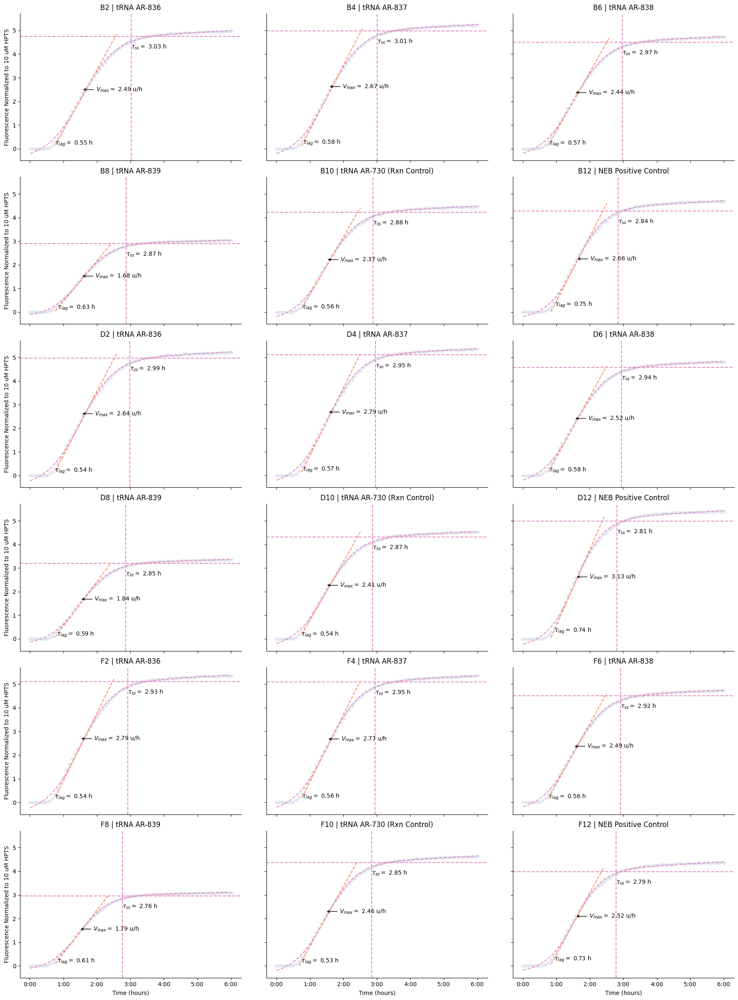
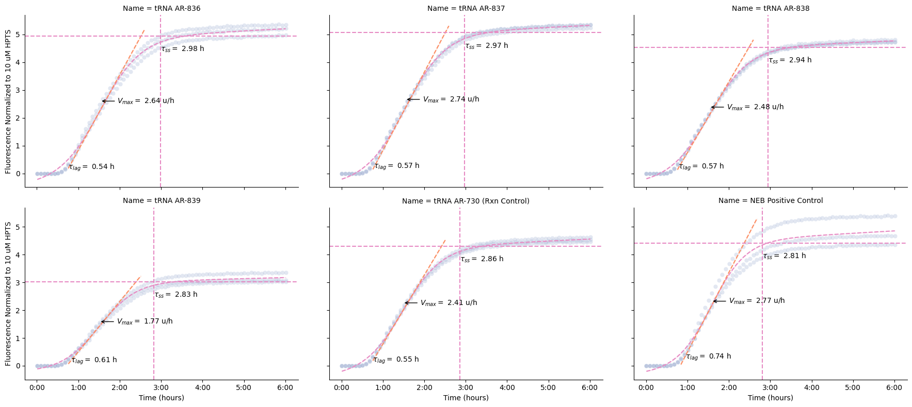

# How to analyze Cytosol kinetics

:::{attention}
:class: simple
This tutorial applies to CDK version >=0.6.0. For older versions, see the tutorial [here](guides/platereader-tutorial/).
:::

## Overview
This tutorial guides you through analyzing time-series fluorescence data from Cytosol cell-free expression experiments using the open-source Nucleus Cell Development Kit (CDK). We’ll cover data loading, normalization, visualization, kinetic parameter fitting (see [DevNote](https://devnotes.nucleus.engineering/articles/Newman-20260421)), and summary statistics.

\[Do we need this?\] The CDK is preinstalled in Nucleus Hub. See [instructions](https://pypi.org/project/nucleus-cdk/) for installing on your own computer (requires Python 3.11+ and the `poetry` package).

<!-- This tutorial walks through analyzing time-series data from plate reader experiments using the `cdk` platereader module. We'll cover loading data, picking the read you care about, plotting raw curves, normalizing to a standard, fitting kinetic parameters, and visualizing results.

The companion notebook `platereader.ipynb` runs the same code without the explanations — use it as a clean working template once you're comfortable with the steps here. We also describe more in depth on the kinetics analysis of plate reader experiments in a [kinetics DevNote](https://devnotes.nucleus.engineering/articles/Newman-20260421)

## Table of Contents
1. [Setup](#setup)
2. [Load Data](#load-data)
3. [Plot Raw Curves](#plot-curves)
4. [Normalize Data](#normalize)
5. [Kinetic Analysis](#kinetic-analysis)
6. [Summary Plots](#summary)


### Note for those that care about the code (ignore if not!)

The API is object-oriented. Two objects do almost all the work:

- **`PlateReaderResult`** — what loading returns. A list-like container of one or more *blocks*, one per read on the plate (e.g. two gains, or two ex/em spectra).
- **`PlateReaderData`** — a single block. It behaves like a DataFrame (you can index and slice it) but also carries methods that return *new* `PlateReaderData` objects: `.plot()`, `.normalize()`, `.blank()`, `.fit_kinetics()`, and more. Transforms are immutable and chainable.

Fitting kinetics returns a **`Kinetics`** object with its own `.summary`, `.plot()`, and `.plot_summary()`.

---
-->


## 1. Setup

First, import the necessary libraries, including the `platereader` module from the CDK that contains specialized functions for loading plate reader data, performing kinetic analysis, and visualization. We alias it to `pr`. 

```python
%load_ext autoreload
%autoreload 2

import pandas as pd
import seaborn as sns
import matplotlib.pyplot as plt

# Import the cdk platereader module
from cdk.instruments import platereader as pr
```

---

## 2. Load Data

Load your plate reader output and merge it with the platemap (see [DevNote](https://devnotes.nucleus.engineering/articles/Bhasin-20260421)) that describes your experimental conditions.

- `data_file`: path to the output file from a plate reader experiment. Currently only **BioTek** plate readers are supported.
- `platemap_file`: path to a platemap CSV mapping each `Well` to its experimental conditions. See the [platemap tutorial](https://docs.nucleus.engineering/guides/platemap-tutorial/) for the expected format.
<!-- `load_platereader_data()` parses the file, integrates the platemap, and returns a **`PlateReaderResult`** — a collection of blocks corresponding to the reads made by the plate reader. -->

Call `load_platereader_data()` to parse the file:

```python
# Specify file paths
data_file = "path/to/data.txt"
platemap_file = "path/to/platemap.csv"

# Load data
result = pr.load_platereader_data(
    data_file=data_file,
    platemap_file=platemap_file,
    platereader="biotek"
)
```

The output is a `PlateReaderResult` object: a list-like collection of `PlateReaderData` blocks. If you did more than one read on the plate (multiple gains, or different ex/em spectra), each read is a separate block. Print `result` to see what's inside:

```python
print(result)
```

    PlateReaderResult with the following 2 blocks:
    0: (1533, 54) kinetic read with reads: GFP-G70:485,528 (Fluorescence) (Plate 'Plate 1')
    1: (1533, 54) kinetic read with reads: GFP-Gext:485,528 (Fluorescence) (Plate 'Plate 1')


 The output lists all of the blocks in the data file. For each block, you can see the _index_ of the block, the dimensions of the underlying DataFrame, the type of the block (here, kinetic), the reads present in the block and their modalities, and the ID of the plate that block came from.

Here there were two reads with different gains but the same excitation/emission spectrum, on one plate. To work with a single read, index into the result to pull out that block. If we want the `GFP-Gext` read, that's block index `1`:


```python
desired_index = 1
data = result[desired_index]
```

You can see the underlying data with `data.view()` (which returns a Pandas DataFrame):


```python
# Show the first five rows:
data.view().head()
```


<div>
<style scoped>
    .dataframe tbody tr th:only-of-type {
        vertical-align: middle;
    }

    .dataframe tbody tr th {
        vertical-align: top;
    }

    .dataframe thead th {
        text-align: right;
    }
</style>
<table border="1" class="dataframe">
  <thead>
    <tr style="text-align: right;">
      <th></th>
      <th>Date</th>
      <th>Experiment</th>
      <th>Well</th>
      <th>Name</th>
      <th>Type</th>
      <th>Time</th>
      <th>Data</th>
      <th>Read</th>
      <th>Read Name</th>
      <th>Reader Type</th>
      <th>Reader ID</th>
      <th>Plate Type</th>
      <th>Plate ID</th>
      <th>Start Time</th>
      <th>Read Modality</th>
      <th>Gain</th>
      <th>Excitation Wavelength (nm)</th>
      <th>Excitation Bandwidth (nm)</th>
      <th>Excitation Optics</th>
      <th>Emission Wavelength (nm)</th>
      <th>Emission Bandwidth (nm)</th>
      <th>Emission Optics</th>
      <th>Read Geometry</th>
      <th>Read Height (mm)</th>
      <th>PMix ID</th>
      <th>[PMix] (mg/mL)</th>
      <th>Ribosome ID</th>
      <th>[Ribosome] (uM)</th>
      <th>SMS ID</th>
      <th>tRNA ID</th>
      <th>[tRNA] (ug/uL)</th>
      <th>DNA ID</th>
      <th>[DNA] (ng/uL)</th>
      <th>PMix Vol (uL)</th>
      <th>Ribosome Vol (uL)</th>
      <th>SMS Vol (uL)</th>
      <th>tRNA Vol (uL)</th>
      <th>DNA Vol (uL)</th>
      <th>RNase Inhib Vol (uL)</th>
      <th>Water vol (uL)</th>
      <th>Rxn Volume (uL)</th>
    </tr>
  </thead>
  <tbody>
    <tr>
      <th>0</th>
      <td>2025-11-11</td>
      <td>MFG-98-tRNA-QC</td>
      <td>B2</td>
      <td>tRNA AR-836</td>
      <td>Sample</td>
      <td>0 days 00:00:33</td>
      <td>245</td>
      <td>GFP-Gext:485,528</td>
      <td>GFP-Gext</td>
      <td>Cytation5</td>
      <td>1705168</td>
      <td>Greiner 384 SV NoBind AutoMap</td>
      <td>Plate 1</td>
      <td>2025-11-11 12:24:04</td>
      <td>Fluorescence</td>
      <td>extended</td>
      <td>485</td>
      <td>20</td>
      <td>monochromator</td>
      <td>528</td>
      <td>20</td>
      <td>monochromator</td>
      <td>Top</td>
      <td>10.5 mm</td>
      <td>NEB Sol B</td>
      <td>NaN</td>
      <td>NaN</td>
      <td>NaN</td>
      <td>SMS-08</td>
      <td>AR-836</td>
      <td>35.0</td>
      <td>AR-805</td>
      <td>120.0</td>
      <td>3.0</td>
      <td>NaN</td>
      <td>3.0</td>
      <td>1.0</td>
      <td>0.5</td>
      <td>0.5</td>
      <td>2.0</td>
      <td>10.0</td>
    </tr>
    <tr>
      <th>1</th>
      <td>2025-11-11</td>
      <td>MFG-98-tRNA-QC</td>
      <td>B2</td>
      <td>tRNA AR-836</td>
      <td>Sample</td>
      <td>0 days 00:05:33</td>
      <td>254</td>
      <td>GFP-Gext:485,528</td>
      <td>GFP-Gext</td>
      <td>Cytation5</td>
      <td>1705168</td>
      <td>Greiner 384 SV NoBind AutoMap</td>
      <td>Plate 1</td>
      <td>2025-11-11 12:24:04</td>
      <td>Fluorescence</td>
      <td>extended</td>
      <td>485</td>
      <td>20</td>
      <td>monochromator</td>
      <td>528</td>
      <td>20</td>
      <td>monochromator</td>
      <td>Top</td>
      <td>10.5 mm</td>
      <td>NEB Sol B</td>
      <td>NaN</td>
      <td>NaN</td>
      <td>NaN</td>
      <td>SMS-08</td>
      <td>AR-836</td>
      <td>35.0</td>
      <td>AR-805</td>
      <td>120.0</td>
      <td>3.0</td>
      <td>NaN</td>
      <td>3.0</td>
      <td>1.0</td>
      <td>0.5</td>
      <td>0.5</td>
      <td>2.0</td>
      <td>10.0</td>
    </tr>
    <tr>
      <th>2</th>
      <td>2025-11-11</td>
      <td>MFG-98-tRNA-QC</td>
      <td>B2</td>
      <td>tRNA AR-836</td>
      <td>Sample</td>
      <td>0 days 00:10:33</td>
      <td>249</td>
      <td>GFP-Gext:485,528</td>
      <td>GFP-Gext</td>
      <td>Cytation5</td>
      <td>1705168</td>
      <td>Greiner 384 SV NoBind AutoMap</td>
      <td>Plate 1</td>
      <td>2025-11-11 12:24:04</td>
      <td>Fluorescence</td>
      <td>extended</td>
      <td>485</td>
      <td>20</td>
      <td>monochromator</td>
      <td>528</td>
      <td>20</td>
      <td>monochromator</td>
      <td>Top</td>
      <td>10.5 mm</td>
      <td>NEB Sol B</td>
      <td>NaN</td>
      <td>NaN</td>
      <td>NaN</td>
      <td>SMS-08</td>
      <td>AR-836</td>
      <td>35.0</td>
      <td>AR-805</td>
      <td>120.0</td>
      <td>3.0</td>
      <td>NaN</td>
      <td>3.0</td>
      <td>1.0</td>
      <td>0.5</td>
      <td>0.5</td>
      <td>2.0</td>
      <td>10.0</td>
    </tr>
    <tr>
      <th>3</th>
      <td>2025-11-11</td>
      <td>MFG-98-tRNA-QC</td>
      <td>B2</td>
      <td>tRNA AR-836</td>
      <td>Sample</td>
      <td>0 days 00:15:33</td>
      <td>230</td>
      <td>GFP-Gext:485,528</td>
      <td>GFP-Gext</td>
      <td>Cytation5</td>
      <td>1705168</td>
      <td>Greiner 384 SV NoBind AutoMap</td>
      <td>Plate 1</td>
      <td>2025-11-11 12:24:04</td>
      <td>Fluorescence</td>
      <td>extended</td>
      <td>485</td>
      <td>20</td>
      <td>monochromator</td>
      <td>528</td>
      <td>20</td>
      <td>monochromator</td>
      <td>Top</td>
      <td>10.5 mm</td>
      <td>NEB Sol B</td>
      <td>NaN</td>
      <td>NaN</td>
      <td>NaN</td>
      <td>SMS-08</td>
      <td>AR-836</td>
      <td>35.0</td>
      <td>AR-805</td>
      <td>120.0</td>
      <td>3.0</td>
      <td>NaN</td>
      <td>3.0</td>
      <td>1.0</td>
      <td>0.5</td>
      <td>0.5</td>
      <td>2.0</td>
      <td>10.0</td>
    </tr>
    <tr>
      <th>4</th>
      <td>2025-11-11</td>
      <td>MFG-98-tRNA-QC</td>
      <td>B2</td>
      <td>tRNA AR-836</td>
      <td>Sample</td>
      <td>0 days 00:20:33</td>
      <td>265</td>
      <td>GFP-Gext:485,528</td>
      <td>GFP-Gext</td>
      <td>Cytation5</td>
      <td>1705168</td>
      <td>Greiner 384 SV NoBind AutoMap</td>
      <td>Plate 1</td>
      <td>2025-11-11 12:24:04</td>
      <td>Fluorescence</td>
      <td>extended</td>
      <td>485</td>
      <td>20</td>
      <td>monochromator</td>
      <td>528</td>
      <td>20</td>
      <td>monochromator</td>
      <td>Top</td>
      <td>10.5 mm</td>
      <td>NEB Sol B</td>
      <td>NaN</td>
      <td>NaN</td>
      <td>NaN</td>
      <td>SMS-08</td>
      <td>AR-836</td>
      <td>35.0</td>
      <td>AR-805</td>
      <td>120.0</td>
      <td>3.0</td>
      <td>NaN</td>
      <td>3.0</td>
      <td>1.0</td>
      <td>0.5</td>
      <td>0.5</td>
      <td>2.0</td>
      <td>10.0</td>
    </tr>
  </tbody>
</table>
</div>

The dataset contains information from the platemap and metadata extracted from the plate reader's output, in [long format](https://devnotes.nucleus.engineering/articles/Bhasin-20260421#representation). Each row represents a single measurement, where:
- `Time` represents the time point of the measurement relative to the start of the experiment, 
- `Read` is the label of the read applied by the plate reader configuration, and 
- `Data` is the raw value of the measurement. 

:::{note}
By default, a "standard" subset of metadata is shown by `data.view()`. To see the full set of metadata extracted from the plate reader output file, use `data.view('full')`.
:::

---

## 3. Plot Raw Curves

Before going on, visualize the data. You can do this by calling `data.plot()`. <!-- The method is format-aware: for a kinetic (time-series) block it plots fluorescence over time.--> By default, one curve is plotted for each distinct `Name` value in the platemap; the band shows a bootstrapped 95% confidence interval across wells with that `Name`.

Passing `style='Type'` uses different line styles for the different well types that appear in your platemap (`Sample`, `Standard`, `Blank`, etc. as defined in the [platemap standard](https://devnotes.nucleus.engineering/articles/Bhasin-20260421#required-columns)), which makes it easy to spot controls. This helps you catch outliers, failed reactions, or unexpected kinetics before fitting.

:::{hint} Familiar with Seaborn?
<!-- :class: dropdown -->
You can pass the usual keyword arguments for a `lineplot` through, such as `style` and `hue`, and you can even add faceting with `row` and `column`. Use any column names seen in `data.view()`.
:::


```python
data.plot(style='Type')
```
    

    


We can see that the standard (here, HPTS) is stable and can be safely used for normalization.


---

## 4. Normalize Data

Instead of performing your analyses on the raw units output by the plate reader, we recommend you normalize to a (fluorescence) standard, so values are better comparable across experiments and instruments. 

The function `data.normalize('<standard name>')` takes the time average of each well containing the named standard over a time window at the end of the run (1 hour by default), then divides all data by the mean of that window-average across all standard wells.

The name you pass as an argument to `data.normalize()` must match the standard's `Name` column from your platemap. \[Could remove:\] You can check the standards on your plate this way:


```python
platemap = data.platemap
standards = platemap[platemap['Type']=='Standard']
standards['Name'].unique()
```


    array(['10 uM HPTS'], dtype=object)


Then, call `data.normalize()`:
```python
data = data.normalize('10 uM HPTS')
```

You need to save the output of this transformation — it does not happen in-place!

Now replot your curves to see them normalized. We exclude the standard from the plot using `exclude_types=` since it's now flat at ~1:


```python
g = data.plot(style='Type', exclude_types=['Standard'])
# To save the output:
# g.savefig('after-normalization.png',dpi=300)
```


    

    
The plot y-axis label will automatically update to indicate that your data have been normalized and will indicate the name of the standard used.

:::{tip}
If you want to change the time window over which the end-of-run average is calculated, pass a `window` argument:


```python
data = data.normalize('10 uM HPTS', window=pd.Timedelta("2.5h"))
```
:::

---

## 5. Kinetic Analysis

Now we're ready to do our kinetic analysis.

:::{seealso}
See our [DevNote](https://devnotes.nucleus.engineering/articles/Newman-20260421) on kinetic analysis for more details!
:::

`data.fit_kinetics()` fits a **sigmoid-with-drift** curve to each well (grouped by unique well identifiers: `Experiment`, `Well`, `Read`, and `Reader ID` by default) and extracts interpretable kinetic parameters.

The model is:

$$
  y(t) = \frac{L}{1 + e^{-k(t - \tau_{v_\text{max}})}} + b\,(t - \tau_\text{drift})
$$

with parameters:

- $L$: steady-state level (asymptote)
- $k$: growth rate (steepness)
- $\tau_{v_\text{max}}$: inflection point (time of maximum velocity)
- $b$: drift rate (linear signal change after steady-state)
- $\tau_\text{drift}$: drift onset time

See the [DevNote](https://devnotes.nucleus.engineering/articles/Newman-20260421) on kinetic analysis for more details.

**Metrics extracted:**

  - **Max Velocity**: maximum rate of fluorescence increase (slope at inflection point)
  - **Lag Time**: time to reach the exponential phase
  - **Steady State**: final fluorescence level
  - **Completion Time**: time to reach 95% of the asymptote
  - **Drift**: rate of signal decay or increase after steady-state
  - **R²**: goodness of fit; "Good Fit" is `True` if $R^2 \geq 0.95$

:::{note} More details on key metrics
:class: dropdown
\[This was moved from the bottom of the tutorial notebook, maybe could be folded in with the above or removed?\]

- **Maximum Velocity**
  - The steepest slope of the fluorescence curve (at the inflection point)
  - Units: RFU per second
  - Reflects the peak rate of protein synthesis
  - Sensitive to enzyme activity, substrate availability, and reaction conditions

- **Lag Time**
  - Time before exponential fluorescence increase begins
  - May reflect time for ribosome assembly or initial translation steps
  - Shorter lag times suggest faster reaction initiation

- **Steady-State Level**
  - The final fluorescence value reached by the reaction
  - Represents the total amount of protein produced
  - Higher values indicate greater expression yield

- **Drift**
  - Rate of fluorescence change after reaching steady-state
  - Positive drift: continued synthesis or aggregation
  - Negative drift: photobleaching, protein degradation, or quenching
  - Units: RFU per second

- **R² Value**
  - Goodness of fit (0 to 1, higher is better)
  - R² > 0.98 indicates excellent fit
  - Poor fits may indicate noisy data, overflow errors, or non-sigmoid kinetics
:::


Run the kinetic analysis:
```python
kinetics = data.fit_kinetics()
```

`fit_kinetics()` returns a `Kinetics` object. Its `.summary` property is a tidy table of the fitted parameters and quality metrics per group (all-null columns dropped):


```python
kinetics.summary
```


<div>
<style scoped>
    .dataframe tbody tr th:only-of-type {
        vertical-align: middle;
    }

    .dataframe tbody tr th {
        vertical-align: top;
    }

    .dataframe thead th {
        text-align: right;
    }
</style>
<table border="1" class="dataframe">
  <thead>
    <tr style="text-align: right;">
      <th></th>
      <th>Well</th>
      <th>Name</th>
      <th>Max Velocity</th>
      <th>Max Velocity Time</th>
      <th>Lag Time</th>
      <th>Steady State</th>
      <th>Completion Time</th>
      <th>Completion Threshold</th>
      <th>Drift</th>
      <th>Fit Function</th>
      <th>R^2</th>
      <th>Good Fit</th>
      <th>Normalized to</th>
    </tr>
  </thead>
  <tbody>
    <tr>
      <th>0</th>
      <td>B2</td>
      <td>tRNA AR-836</td>
      <td>2.49</td>
      <td>0 days 01:33:15</td>
      <td>0 days 00:33:09</td>
      <td>4.74</td>
      <td>0 days 03:01:44</td>
      <td>0.95</td>
      <td>0.07</td>
      <td>sigmoid_drift</td>
      <td>1.00</td>
      <td>True</td>
      <td>10 uM HPTS</td>
    </tr>
    <tr>
      <th>1</th>
      <td>B4</td>
      <td>tRNA AR-837</td>
      <td>2.67</td>
      <td>0 days 01:33:35</td>
      <td>0 days 00:34:38</td>
      <td>4.99</td>
      <td>0 days 03:00:24</td>
      <td>0.95</td>
      <td>0.07</td>
      <td>sigmoid_drift</td>
      <td>1.00</td>
      <td>True</td>
      <td>10 uM HPTS</td>
    </tr>
    <tr>
      <th>2</th>
      <td>B6</td>
      <td>tRNA AR-838</td>
      <td>2.44</td>
      <td>0 days 01:32:35</td>
      <td>0 days 00:34:21</td>
      <td>4.50</td>
      <td>0 days 02:58:17</td>
      <td>0.95</td>
      <td>0.06</td>
      <td>sigmoid_drift</td>
      <td>1.00</td>
      <td>True</td>
      <td>10 uM HPTS</td>
    </tr>
    <tr>
      <th>3</th>
      <td>B8</td>
      <td>tRNA AR-839</td>
      <td>1.68</td>
      <td>0 days 01:32:00</td>
      <td>0 days 00:37:35</td>
      <td>2.89</td>
      <td>0 days 02:52:07</td>
      <td>0.95</td>
      <td>0.03</td>
      <td>sigmoid_drift</td>
      <td>1.00</td>
      <td>True</td>
      <td>10 uM HPTS</td>
    </tr>
    <tr>
      <th>4</th>
      <td>B10</td>
      <td>tRNA AR-730 (Rxn Control)</td>
      <td>2.37</td>
      <td>0 days 01:30:01</td>
      <td>0 days 00:33:50</td>
      <td>4.22</td>
      <td>0 days 02:52:45</td>
      <td>0.95</td>
      <td>0.07</td>
      <td>sigmoid_drift</td>
      <td>1.00</td>
      <td>True</td>
      <td>10 uM HPTS</td>
    </tr>
    <tr>
      <th>5</th>
      <td>B12</td>
      <td>NEB Positive Control</td>
      <td>2.66</td>
      <td>0 days 01:35:50</td>
      <td>0 days 00:45:09</td>
      <td>4.27</td>
      <td>0 days 02:50:26</td>
      <td>0.95</td>
      <td>0.09</td>
      <td>sigmoid_drift</td>
      <td>1.00</td>
      <td>True</td>
      <td>10 uM HPTS</td>
    </tr>
    <tr>
      <th>6</th>
      <td>D2</td>
      <td>tRNA AR-836</td>
      <td>2.64</td>
      <td>0 days 01:31:44</td>
      <td>0 days 00:32:12</td>
      <td>4.97</td>
      <td>0 days 02:59:23</td>
      <td>0.95</td>
      <td>0.08</td>
      <td>sigmoid_drift</td>
      <td>1.00</td>
      <td>True</td>
      <td>10 uM HPTS</td>
    </tr>
    <tr>
      <th>7</th>
      <td>D4</td>
      <td>tRNA AR-837</td>
      <td>2.79</td>
      <td>0 days 01:32:13</td>
      <td>0 days 00:34:27</td>
      <td>5.10</td>
      <td>0 days 02:57:16</td>
      <td>0.95</td>
      <td>0.07</td>
      <td>sigmoid_drift</td>
      <td>1.00</td>
      <td>True</td>
      <td>10 uM HPTS</td>
    </tr>
    <tr>
      <th>8</th>
      <td>D6</td>
      <td>tRNA AR-838</td>
      <td>2.52</td>
      <td>0 days 01:32:00</td>
      <td>0 days 00:34:31</td>
      <td>4.58</td>
      <td>0 days 02:56:37</td>
      <td>0.95</td>
      <td>0.06</td>
      <td>sigmoid_drift</td>
      <td>1.00</td>
      <td>True</td>
      <td>10 uM HPTS</td>
    </tr>
    <tr>
      <th>9</th>
      <td>D8</td>
      <td>tRNA AR-839</td>
      <td>1.84</td>
      <td>0 days 01:30:32</td>
      <td>0 days 00:35:41</td>
      <td>3.20</td>
      <td>0 days 02:51:17</td>
      <td>0.95</td>
      <td>0.04</td>
      <td>sigmoid_drift</td>
      <td>1.00</td>
      <td>True</td>
      <td>10 uM HPTS</td>
    </tr>
    <tr>
      <th>10</th>
      <td>D10</td>
      <td>tRNA AR-730 (Rxn Control)</td>
      <td>2.41</td>
      <td>0 days 01:28:51</td>
      <td>0 days 00:32:20</td>
      <td>4.31</td>
      <td>0 days 02:52:03</td>
      <td>0.95</td>
      <td>0.07</td>
      <td>sigmoid_drift</td>
      <td>1.00</td>
      <td>True</td>
      <td>10 uM HPTS</td>
    </tr>
    <tr>
      <th>11</th>
      <td>D12</td>
      <td>NEB Positive Control</td>
      <td>3.13</td>
      <td>0 days 01:34:33</td>
      <td>0 days 00:44:14</td>
      <td>4.99</td>
      <td>0 days 02:48:38</td>
      <td>0.95</td>
      <td>0.09</td>
      <td>sigmoid_drift</td>
      <td>1.00</td>
      <td>True</td>
      <td>10 uM HPTS</td>
    </tr>
    <tr>
      <th>12</th>
      <td>F2</td>
      <td>tRNA AR-836</td>
      <td>2.79</td>
      <td>0 days 01:30:12</td>
      <td>0 days 00:32:10</td>
      <td>5.12</td>
      <td>0 days 02:55:38</td>
      <td>0.95</td>
      <td>0.08</td>
      <td>sigmoid_drift</td>
      <td>1.00</td>
      <td>True</td>
      <td>10 uM HPTS</td>
    </tr>
    <tr>
      <th>13</th>
      <td>F4</td>
      <td>tRNA AR-837</td>
      <td>2.77</td>
      <td>0 days 01:31:33</td>
      <td>0 days 00:33:22</td>
      <td>5.10</td>
      <td>0 days 02:57:12</td>
      <td>0.95</td>
      <td>0.07</td>
      <td>sigmoid_drift</td>
      <td>1.00</td>
      <td>True</td>
      <td>10 uM HPTS</td>
    </tr>
    <tr>
      <th>14</th>
      <td>F6</td>
      <td>tRNA AR-838</td>
      <td>2.49</td>
      <td>0 days 01:30:49</td>
      <td>0 days 00:33:35</td>
      <td>4.51</td>
      <td>0 days 02:55:05</td>
      <td>0.95</td>
      <td>0.06</td>
      <td>sigmoid_drift</td>
      <td>1.00</td>
      <td>True</td>
      <td>10 uM HPTS</td>
    </tr>
    <tr>
      <th>15</th>
      <td>F8</td>
      <td>tRNA AR-839</td>
      <td>1.79</td>
      <td>0 days 01:28:45</td>
      <td>0 days 00:36:41</td>
      <td>2.95</td>
      <td>0 days 02:45:25</td>
      <td>0.95</td>
      <td>0.03</td>
      <td>sigmoid_drift</td>
      <td>1.00</td>
      <td>True</td>
      <td>10 uM HPTS</td>
    </tr>
    <tr>
      <th>16</th>
      <td>F10</td>
      <td>tRNA AR-730 (Rxn Control)</td>
      <td>2.46</td>
      <td>0 days 01:28:12</td>
      <td>0 days 00:32:05</td>
      <td>4.37</td>
      <td>0 days 02:50:49</td>
      <td>0.95</td>
      <td>0.07</td>
      <td>sigmoid_drift</td>
      <td>1.00</td>
      <td>True</td>
      <td>10 uM HPTS</td>
    </tr>
    <tr>
      <th>17</th>
      <td>F12</td>
      <td>NEB Positive Control</td>
      <td>2.52</td>
      <td>0 days 01:33:54</td>
      <td>0 days 00:44:03</td>
      <td>3.98</td>
      <td>0 days 02:47:18</td>
      <td>0.95</td>
      <td>0.08</td>
      <td>sigmoid_drift</td>
      <td>1.00</td>
      <td>True</td>
      <td>10 uM HPTS</td>
    </tr>
  </tbody>
</table>
</div>

### Visualizing fits
The function `kinetics.plot()` overlays each fitted curve on its raw data so you can confirm the fits are reasonable (high R², smooth curves). 

::::{tab-set}
:::{tab-item} Across replicates
By default, `kinetics.plot()` facets by `Name`, where traces of replicate wells of each condition are shown in a single panel with an average fit overlaid:

```python
g = kinetics.plot()
```

:::
:::{tab-item} Individual wells
To show the fits to individual replicates separately, facet on `Well`:


```python
g = kinetics.plot(col="Well")
```

    
:::


---

## 6. Summary Plots

`kinetics.plot_summary()` produces a multi-panel figure comparing kinetic parameters across conditions: per-experiment time series alongside bar plots of steady-state, max velocity, and drift, with error bars across technical replicates.

```python
g = kinetics.plot_summary()
# To save:
# g.savefig("data_summary.png", dpi=300)
```
 


:::{hint}
You can control what's displayed in this plot via three keyword arguments:
- `experiment_split`: which variable to group plots on (default: `Name`, but you could use a platemap feature like `DNA ID`)
- `ys_to_plot`: which variable(s) to plot as bar plots (default: `['Steady State', 'Max Velocity', 'Drift']`)
- `plot_time_series`: `True` to show the time series plot 
:::

---

## Tips and Troubleshooting

- **Overflow errors:** Wells with `OVRFLW` or `NaN` values are automatically excluded from fitting
- **Poor fits (low R²):** Inspect raw curves for anomalies (bubbles, evaporation, pipetting errors)
- **Drift:** Sometimes seen in kinetics curves; the default `sigmoid_drift` model accounts for it
- **Multiple replicates:** Always include technical replicates and report error bars
- **Comparing conditions:** Normalize or blank data consistently across all samples

